Shape Module 定义粒子生成时所在的 volume 或 surface，以及粒子初始速度的方向，大小由 Start Speed 定义。

Shape 定义生成 volume 的形状，其他属性根据 Shape 不同而不同。

所有 Shapes 除了 Mesh 都有定义其大小（dimensions）的属性，例如 Radius。

选择的 Shape 布局影响粒子生成所在的区域，还决定了粒子的初始方向。例如 Sphere 朝着所有方向随机发生粒子，粒子速度方向从 Sphere 中心指向粒子所在的位置，Cone 发射一个分散的粒子流，Mesh 在 surface 的 normal 方向上发射粒子。

# Sphere，HemiSphere

- Radius
- Radius Thickness

  定义 Sphere 的一个壳层，粒子只从这个壳层发射。

  发射粒子的壳层 volume 的百分比。0 表示粒子只从 sphere 表面发射，1 表示粒子从 sphere 整个 volume 发射。

- Arc

  控制 XY 平面上的弧度，只有这个弧度内的 Volume 内才发射粒子。

  - Mode 粒子发射模式
    - Random：在 Arc 上随机发射。没有 speed，不需要旋转，每次发射粒子在 volume 上随机旋转一个位置即有效。
    - Loop：在 Arc 上循环发射，到底 end 重新开始下一个循环。
    - PingPong：在 Arc 上往复循环。
    - Burst Spread：上面三种 mode 都是控制 Burst Over Time 发射模式的，即粒子随时间逐渐生成，这个模式控制立即 Burst 的粒子，即粒子一下子全部发射出来。因为一下子发射出来，不需要 speed，只需要 spread 控制分布。spread = 0 表示没有 interval，所有粒子均匀分配在 arc 上一起发射。spread = 0.1 表示将 arc 分成 10 等份，所有粒子平均分配在 10 条线上发射。spread = 0.2 则为 5 条线。
  - Spread：0-1 之间的数，控制发射粒子的角度间隔。0 表示没有间隔，按照 Speed 的旋转，Speed 将粒子旋转到哪个位置，就从哪个位置发射。否则，Spread 大于 0 表示每隔多少弧度才发射粒子。例如 0.1 表示将 arc 分为 10 等份，只在这些位置上发射粒子，最终就会看到只有 10 条线。如果为 0.2 就会看到 5 条线，0.25 就会看到 4 条线。

    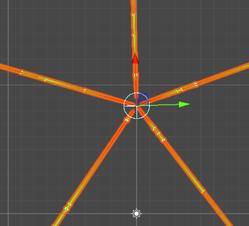

    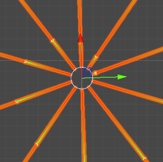

  - Speed：旋转发射粒子的速度。0 表示不旋转发射粒子，0.1 表示 10 秒旋转发射一周，0.5 表示 2 秒旋转发射一周，1 表示 1 秒旋转发射一周，2 表示 0.5 秒旋转发射一周。注意，如果 Spread > 0，在只能在 Interval 上发射粒子，如果 Speed 当前旋转的位置不在 Interval 上，可能四舍五入到最近的 Interval 或者取整到下一个 Interval 上。

- Texture

  Texture 即可以用于为粒子采样颜色（tint），也可以用来指定可以生成粒子的区域（哪些区域可以生成粒子，哪些区域 discard）。

  当指定一个 Texture 时，就好像将这个 Texture 作为纹理贴到 Shape 上，就好像普通的 Sphere、Cube、Quad Mesh 一样，将这个 Texture 作为纹理。然后，当生成粒子时，就采样它所在的点的像素值，这个像素值颜色值既可以作为粒子的颜色，也可以用来判断是否生成粒子。

  为了显示粒子的生成位置，所有粒子的速度都设置为 0.

  

  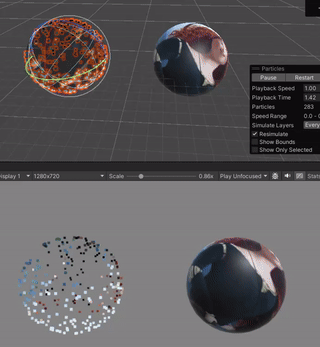

  - Clip Channel：RGBA 哪个通道用来决定是否 discard 粒子
  - Clip Threshold：当生成粒子所在的位置的 texture 颜色值的 Clip Channel 通道低于这个阈值时，就丢弃这个粒子
  - Color affects Particles：将粒子颜色乘以所在位置的 texture 颜色
  - Alpha affects Particles：将粒子颜色的 alpha 乘以所在位置的 texture 像素的 alpha
  - Bilinear Filtering：当读取纹理时，合并周围4个像素的采样值，得到一个更平滑的像素值，免去 texture dimensions 的干扰

  下面示例用纹理的颜色应用到粒子的颜色上：

  

  下面的示例，用 R 通道 clip 粒子的生成，当粒子采样到 Texture 颜色值的 R 通道小于 0.5，就丢弃这个粒子，可见中间的区域没有粒子生成：

  

  下面两个示例一样，但是使用了一个更普通的纹理：

  

  

  Texture 过滤的粒子不会补充，直接丢弃。比如，指定每秒生成 10 个粒子，如果又粒子被 discard 了，不会补发使得满足保证每秒生成 10 个粒子，最终生成的粒子数可能小于 10 个粒子。Burst 粒子也一样。

- Position：Volumn 默认原点在 Particle System 的位置，Position 用来在 Local 空间偏移 Volumn 一定位置
- Rotation：旋转 Volumn
- Scale：缩放 Volumn 大小，注意不会缩放粒子大小

- Align to Direction

  旋转粒子的朝向，使得粒子面向它的初始运动方向。Start Rotation 是基于这个朝向基础上再次应用的旋转。

  不开启 Align to Direction

  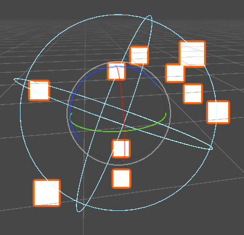

  开启 Align to Direction

  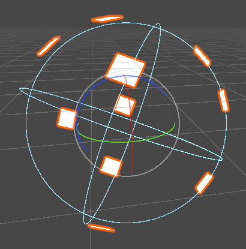

  粒子的朝向 = 粒子当前速度方向。

  粒子的朝向指的是粒子的渲染面方向。

  Align to Direction 常见于：Billboard 模式和 Stretched Billboard

  同时开启 Render Mode = Stretched Billboard 和 Align to Direction，效果会变成 粒子沿运动方向被“拉长”，非常适合 子弹拖尾、火焰喷射、速度感特效。

- Randomize Direction
  
  将粒子方向和一个随机方向混合。当设置为 0，完全没有效果。当设置为 1，粒子的方向完全随机。

- Spherize Direction

  将粒子方向和球面方向混合，把粒子的运动方向向“拉向从中心向外的方向”。它用于粒子的“初始发射方向”，在两种方向之间做插值：当前方向 <-> 从中心向外的方向（球面法线）。
  - 0：不做任何改变，粒子按原来的方向飞（shape 决定）
  - 1：每个粒子完全变成“从中心向外”运动，即沿着“球面法线方向”发射
  - 中间值：例如 0.5，最终方向 = lerp(原方向，法线方向，0.5)

  Spherize Direction 只对非 Sphere Shape 有用，因为 Sphere Shape 粒子本身就是从法线方向飞出去的。

  原始方向 = 喷枪喷射方向，Spherize = 给它加“向外膨胀力”

- Randomize Position

  随机移动粒子位置一定位置，最大到指定的数值。它是一个半径，圆心在粒子的生成位置，在这个半径的球内随机偏移粒子的位置。

# Cone

- Angle 角度设置 Cone 的顶角（张开的程度）。0 产生一个圆柱体，90 产生一个平坦的圆盘
- Radius 设置 Cone 底盘的半径
- Radisu Thickness 设置 Cone 的壳层厚度，粒子在这个壳层 volume 中生成。0 厚度使粒子只在 Cone 表层生成。1 厚度则在整个 volume 中生成

  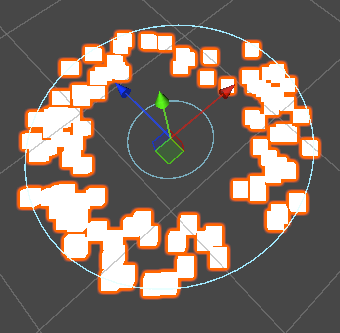

- Cone 的高度由 Start Speed 定义，Start Speed 越大，Cone 越高。StartSpeed = 0，Cone 变成一个平面圆盘。

  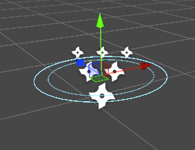

- Arc 定义 XY 平面上的弧度，这个弧度内的 Volume 生成粒子

  Scene View 中没有显示 Arc 的辅助线，但是实际上是有 Arc 的。

  Arc=90:

  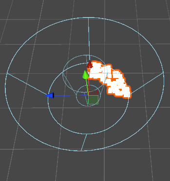

  Arc=180:

  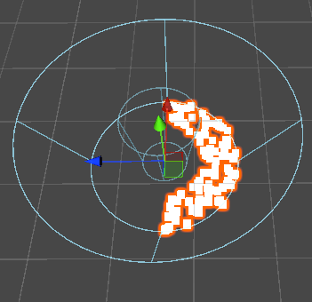

  Arc=270:

  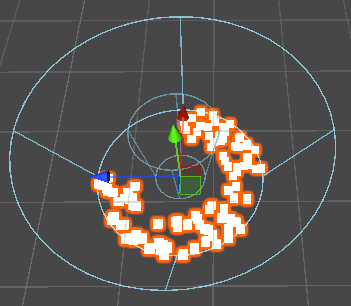

  Spread 和 Speed：

  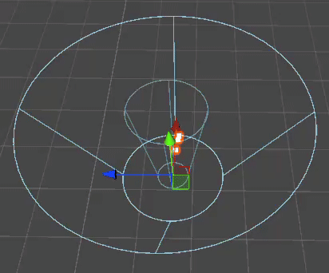

- Emit From

  粒子从哪里发射

  - Base：粒子从 Cone 底盘生成

    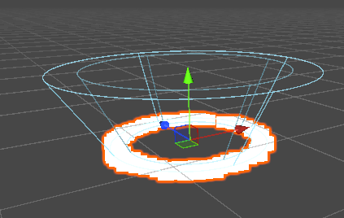

  - Volume：粒子在壳层 Volume 中生成

    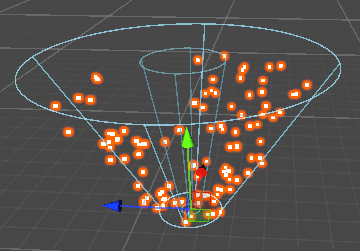

- Texture

  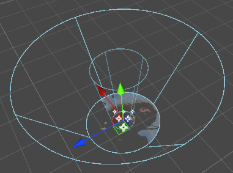

# Donut

粒子在 Donut 壳层 Volume 中生成：

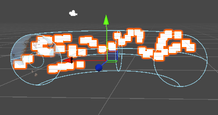

- Radius：中心线半径

- Donut Radius：横截面半径

- Thickness

  横截面的壳层厚度：

  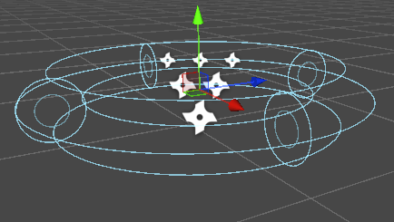

- Arc

  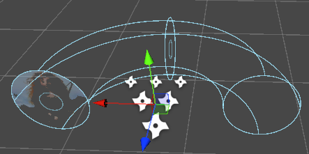

  Spread 和 Speed：

  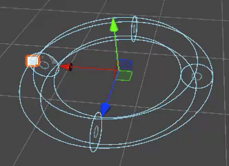

- Texture

  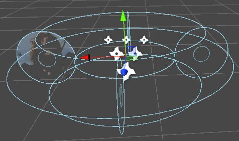

# Box

- Emit From

  - Volume：在 Box Volume 生成粒子
  
  - Shell 和 Edge

    - Box Thickness 定义 Box 的壳层（没有 Scene View 指示线）

    - Shell 在壳层生成粒子
    - Edge 在壳层的 Edge 生成粒子

    Thickness = 0，只在 Box 的 edge 上生成粒子：

    

    Thickness = 0.2，Edge 变成 0.2 Thickness 的 Volume：

    

Box 没有其他参数设置 dimension，只需要使用 position、rotation、scale 调整 Box 的形状。

- Rectangle

  Quad，和 Box 一样，没有其他参数调整 dimension，只需要 position、rotation、scale。

  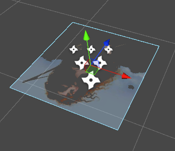

  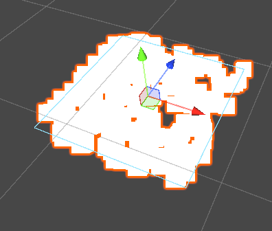

- Edge

  比 Rectangle 更简单，就是一个线段。

  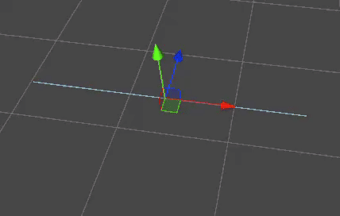

  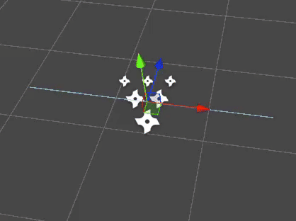

- Circle

  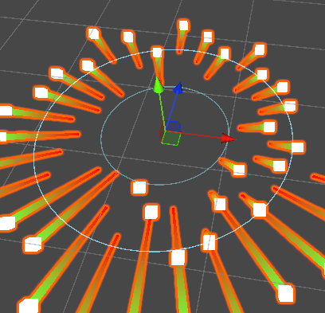

  简单的2d circle，只有一个 Radius 和 Radius Thickness 定义发射粒子的区域。

# Mesh/MeshRenderer, SkinnedMeshRenderer, Sprite/SpriteRenderer

基于游戏资源、资源示例的形状。

每种资源有三种 Type：

- Vextex：只在 Vertex 的位置发射粒子
- Edge：在 Mesh/Sprite Edge 的位置发射粒子
- Triangle：在 Mesh/Sprite 的表面发射粒子

所有粒子默认都在模型的表面沿着法向量发射粒子，Normal Offset 可以指定沿着 Normal 的偏移。

Mesh、Sprite 指定一个游戏资源，MeshRenderer、SpriteRenderer 指定一个场景内的资源实例。

对于 Mesh、Sprite，Shape 就在 ParticleSystem 的位置上，就好像给它挂载了一个 MeshRenderer 或 SpriteRenderer 一样。

对于 MeshRenderer、SpriteRenderer，在引用的实例的位置上发射粒子，不是在 ParticleSystem 的位置上。
