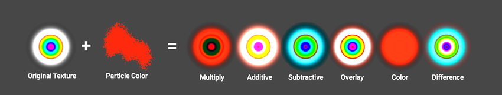

# Standard Particle Shaders

Unity 标准 Particle Shaders 是内置的 shaders，可以用于渲染大量 Particle System 效果。这些 shaders 提供各种 Standard Shader 不支持的 particle-specific features。

## Properties

Standard Particle Shaders 具有和 Standard Shader 相同的属性集合（或那些属性的一个子集，依赖于具体 shader）。

### Blending Options

所有 Standard Particle Shaders 都具有 Blending Options，可以以不同的方式混合（blend）particles 和它们周围的 objects。

- Rendering Mode

  Standard Particle Shaders 可以有以下 Rendering Mode 选项，这控制来自 shader 的 color 值（像素颜色）如何与 background color（颜色缓冲区中的像素颜色）合并：

  - Additive：将 background 和 particle 的最终颜色累加在一起（R+R，B+B，G+G，忽略 alpha）。这可以用于 glow effects，例如 fire 或 magic spells。
  - Subtractive：从 background 颜色中减去 particle 的最终颜色，这会相对 background darkens particles 的颜色。这可以用于 foggy（雾化）效果，例如 steam 或 thick black smoke。
  - Modulate（调节）：将 particle 的最终颜色乘以 background color（RxR，BxB，GxG，忽略 alpha）。这可以用于 portals 和 light-rays。

- Color Mode

  Standard Particle Shader 的颜色有两部分构成：albedo texture 和 albedo color。

  这个选项控制 albedo 纹理如何与 particle color 合并：

  - Multiply

    将 particle albedo 颜色与 particle texture 颜色相乘，作为 particle 的最终颜色。

  - Additive

    保留 hot spot，例如 particle texture 的白色部分，同时将 particle albedo 颜色加到 particle texture 的 darker pixels 上。

  - Subtractive

    从 particle texture 颜色中减去 particle albedo 颜色。

  - Overlay

    为 original color 给出更多的对比度，并将 particle albedo 颜色加到 gray values 上。这类似 Additive，但是保留 original colors（如果 texture 的颜色不是灰色，则保持，否则加上 albedo 颜色？）。

  - Color

    使用 particle texture 的 alpha channel 和 particle 自己的 albedo color。这可以用于 overwriting 具有相同颜色 particles，同时保持它们的 original shape（shape 由 alpha 决定）。

  - Difference

    从 texutre 中减去 particle albedo color，或反之（bool 操作），以得到一个正值。

  

### Main Options

- Flip-Book Mode

  小人书效果。渲染 flip-books 为独立的帧，或 blend 这些帧给出更加平滑的动画。

  设置：

  - Simple：渲染一个 flip-book 中的 frames 为一些列独立的帧
  - Blended：Blend flip-book 中的 frames，以更平滑的效果渲染 flip-book

- Two Sided

  渲染 particle 的正反面。否则，Unity 将只渲染正面（朝向 Camera 的一面）。

- Enable Soft Particles

  当粒子非常接近 objects 表面（写入 depth buffer 的深度）时，fade out particles。当粒子和不透明物体 intersect 时，这可以用于避免 hard edges。例如，通过开启 soft particles，可以使 particle system 在不透明物体的表面发射，而不产生与 surface 表面生硬的 intersections。

- Enable Camera Fading

  当粒子非常接近 camera 时，fade out particles。

  - Near fade：接近 camera 近平面时 fade
  - Fear fade：接近 camera 远平面时 fade
 
- Enable Distortion

  使 particles 执行与绘制在它下面的 objects 的假折射。Distortion 非常适合创建火焰的热浪效果。但是这个效果非常昂贵，因为它需要捕获当前 frame 到一个 texture 中。

## Standard Particles Surface Shader

表面 Particle Shader 具有和 Standard Shader 类似的功能，但是尤其适合粒子。和 Standard Shader 类似，它支持基于物理的着色（Physically Based Shading）。它不包含不适用于动态粒子的功能，例如 lightmapping。

## Standard Particles Unlit Shader

无光照 Particle Shader 时更简单的 shader，比 Surface Particle Shader 更快。它支持所有的通用粒子控制，例如 flipbook blending 和 distortion，但是不执行任何光照计算。

