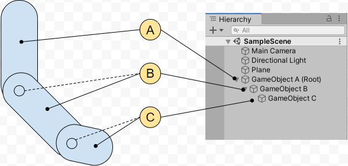

# Articulations(关节连接)

Physics Articulation 是以逻辑树组织的 Articulation Bodies，其中每个 parent-child 关系相互地反映受约束的相对运动。

Physics Articulation 的主要目的是为工业和商业非游戏应用程序提供涉及 joints 的真实的物理行为。例如，模拟机器人手臂和动力学 chains 时，它比常规的 joint 更容易更精确。

可以通过 ArticulationBody(关节体) 配置 articulations。

## Articulation Setup 对比 常规 Joints

绝大多数基本场景（例如将两个 physical bodies 通过关节连接在一起）中，可以使用一个 Articulation 或 常规 joints。

| Unity 组件 | Articulation Setup | Setup with regular joint |
| -- | -- | -- |
| Hierarchy | GameObject + Articulation Body | GameObject + RigidBody + Joint |
| Relationship | GameObjects 有一个层级关系（parent-child）。物理引擎使用 Unity transform hierarchy 来表达 parent-child 关系 | GameObject 不需要有层级关系。更高级场景中，你可以自由模拟 kinematic loops |
| Physical bodies | 两个 GameObjects 都有 Articulation Body 组件，它定义了 physical body 属性（以及其他属性）| 两个 GameObject 都有一个 Rigidbody 组件，它定义了 physical body 属性 |
| Joint | Child GameObject 的 Articulation Body 保存了 Joint 属性，那里你可以选择 joint 类型 | 只有一个 GameObject 挂载 Joint 组件。Joint 属性依赖于添加的 Joint 组件的类型 |
||||

然而，整体结果行为在两种情况下并不是相同的，尤其是如果你扩展这个原理（principle）到多个 phsicla bodies 和 joints 的情形。

如果你尝试使用常规 joints 来建模 kinematic chains（例如 rag doll，robotic arm，或者具有并行 hingles 的机械），物理引擎可能遇到无法解析（模拟）的情形，并使特定约束留在不满足的状态。这可能导致抖动和不真实的运动。不仅 joints 看起来很奇怪，甚至不可能使用它们来模拟真实的设备，阻止了为工业设计构建模型或原型的努力。

## 在 Unity 中构建一个关节 Articulation

要在 Unity 中构造一个物理关节 physics articulation，必须为这个关节中每个 GameObject 添加一个 Articulation Body 组件。每个 Articulation Body 组件允许你在一个地方配置：

- 相应 GameObject 的 physical body 属性。基本上，是它的质量和它相应物理环境的方式
- 连接 GameObject 到其 parent GameObject 的类型和属性（除了 articulation 的 root，因为它没有 parent GameObject）

下面的例子显式一个包含 3 个 physical bodies 和 2 个 joints 的物理关节：



要构建此关节：

1. 创建一个包含 3 个 GameObject 的 Hierarchy
2. 为每个 GameObject 添加一个 Articulation Body 组件
3. 配置每个 Articulation Body 组件
   - A（root）：只能为 GameObject A 定义 physical body 属性，不定义关节属性（因为它没有要连接的 parent）
   - B：定义 GameObject B 的 physical body 属性；定义连接 GameObject A 的 joint 的类型和属性
   - C：定义 GameObject C 的 physical body 属性；定义连接 GameObject B 的 joint 的类型和属性

根据定义，一个关节只能由一个 root，并且不允许有 Kinematic Loops（常规 Joints 支持 Kinematic Loops，即 Rigidbody A 用一个 Joint 约束 B，B 用另一个 Joint 约束 A）。

限制：如果想构建很长的 articulation chains，必须知道 Unity 支持最大长度 64 GameObjects 的 hierarchy。

## Articulation Joint types 和 degrees of freedom（自由度）

有四种可以选择和配置的关节类型：

- Fixed Joint：在 bodies 之间，设置一个 rigid（固定的），不可破坏的（unbreakable）和不可伸缩（unstretchable）的连接
- Prismatic（棱柱的） Joint：阻止所有运动，除了沿着特定 axis 滑动
- Revolute（旋转的） Joint：允许绕着特定 axis 的旋转（类似 hinge）
- Spherical（球形的） Joint：解剖学关节，允许两个 swings(摆动) 和一个 twist（扭转）

根据设计，一个关节中所有 locked 的 degrees of freedom 都是 unbreakable 和 unstretchable 的。为此，物理引擎使用 reduced coordinate space，bodies 只有 unlocked motion axes 的坐标。作为对比，常规迭代式 joint，物理引擎强制 maximal coordinate space，只在 solver 在一组迭代之后保证满足约束。

## Articulation Body 组件引用

Articulation Bodies 允许你使用 GameObjects Hierarchy 构建诸如机器人手臂、或 kinematic chains 之类的 physics articulations。

它们帮助你得到用于工业应用的模拟物理行为。

### 属性

Articulation Body 允许你在一个单一组件中定义类似在 Rigidbody 和 Regular Joint 定义的属性。这些属性依赖于 GameObject 在 Hierarchy 中的位置：

- 对于关节 Root GameObject，只可以设置 physical body 属性
- 对于任何非 root 的 GameObject，同时设置 physical body 属性和 joint 属性（joint 连接到其 parent）

### Physical Body 属性

Articulation 关节之所以能比 Joint + Rigidbody 更精确更不容易违反约束，是因为它不支持 Kinematic Loops 约束，只能由 parent 约束 child，这样只有单向约束的系统永远比相互约束的系统简单。

- Mass：定义 Articulation Body 的质量（默认千克）
- Immovable：定义关节体是否可以移动。只可以为 root GameObject 设置这个属性。例如，这个属性用于使 robotic hands 的 base body 不可移动。物理引擎独立于其他所有约束解析它，并保证它不会违反约束
- Use Gravity：重力是否影响 Articulation Body

### Joint anchor 属性

- Compute Parent Anchor

  开启这个属性，使 parent-relative anchor 匹配当前 Articulation Body 的 anchor。如果关闭这个属性，可以分别设置 Parent Anchor Position 和 Parent Anchor Rotation。 

- Anchor Position

  Anchor 的 position 坐标，相对于当前 Articulation Body

- Anchor Rotation

  Anchor 的 rotation 坐标，相对于当前 Articulation Body

- Parent Anchor Position

  Parent Anchor 的 position 坐标，相对于 parent Articulation Body。这个属性只在关闭 Compute Parent Anchor 时出现。

- Parent Anchor Rotation

  Parent Anchor 的 rotation 坐标，相对于 parent Articulation Body。这个属性只在关闭 Compute Parent Anchor 时出现。

- Snap Anchor to closest contact

  计算 Articulation Body 表面上距离 parent Articulation Body 的 center of mass 的最近的点，并将它设置为 anchor。

  如果 Compute Parent Anchor 开启，Unity 还相应地更新 parent anchor。

### Joint type selection 和 joint 属性

选择连接当前 Articulation Body 到 parent Articulation Body 的 joint 的类型，并定义其常见和具体属性。

- Articulation Joint Type

  连接当前 Articulation Body 到 Parent Articulation Body 的 joint 类型。注意所有 joints 类型都有以下共有属性，然后每个 joint 还有各自特定的属性。

  - Fixed：设置 bodies 之间固定、不可破坏、不可伸缩的 link。Fixed articulation joint 没有更多属性。
  - Prismatic：除了沿特定 axis 滑动，阻止所有运动（移动+旋转）。
  - Revolute：允许绕着特定 axis 旋转（就像 hinge）。
  - Spherical：解刨学关节，允许两个 swings 和一个 twist。

- Linear Damping

  控制 linear 运动衰减的因子。

- Angular Damping

  控制旋转运动衰减的因子。

- Joint Friction

  joint 因为摩擦力导致的能量损失因子。

#### Prismatic joint 额外属性

- Axis：指示 prismatic joint 约束运动的 axis，相对于 parent anchor，因为是 parent 约束 child
- Motion：指示沿着指定 axis 的运动约束类型
  - Free：允许 Articulation Body 沿着选择的 parent anchor 的 Axis 自由移动
  - Limited：根据 Drive 属性中的 Lower Limit 和 Upper Limit 约束 Articulation Body 沿着 Axis 的移动
- X/Y/Z Drive：挂载到 Joint 的线性马达。注意因为只有一个 axis，这里只有一个 section，即只配置一个马达。

#### Revolute joint 额外属性

- Motion：指定绕着 parent anchor x 轴的旋转约束类型
  - Free：Articulation Body 绕着 parent anchor 的 x 轴自有旋转
  - Limited：根据 X Drive 的 Lower Limit 和 Upper Limit 约束旋转
- X Drive：驱动旋转的马达

#### Spherical joint 额外属性

相对于 parent anchor 的三个坐标轴：绕着 X 轴 twist，绕着 Y/Z 轴旋转（摇摆）。

- Swing Y：指定绕着 Y 轴的旋转约束

  - Free：允许 Articulation Body 自由地绕着 parent anchor 坐标系的 Y 轴旋转
  - Limited：根据 Y Drive 的 Lower Limit 和 Upper Limit 约束旋转的角度
  - Locked：完全锁定 Articulation Body 绕着 parent anchor 的 Y 轴的旋转。注意不可以同时锁定超过两个自由度
- Swing Z：指定绕着 Z 轴的旋转，Free/Limited/Locked
- Twist：指定绕着 X 轴的旋转，Free/Limited/Locked
- Y Drive, Z Drive, X Drive：分别驱动绕 Parent Anchor 的 Y 轴、Z 轴、X 轴旋转的马达。

## Joint Drive 属性（马达属性）

无论是线性运动关节，还是旋转运动关节，都可以指定一个马达来驱动 physical body。所有这些马达都以相同的工作原理运行，只是驱动的属性不同（无论哪种属性，都只不过是一个 float 值）。因此只有一种马达类型。

- Lower Limit：这个 limit 限制低于哪个值，joint 就开始阻止 body 移动或旋转（根据 joint 的类型）。只有你设置相关的 Motion，Swing，Twist 属性为 Limited 时，才可以定义这个属性。
- Upper Limit：这个 limit 限制超过哪个值，joint 就开始阻止 body 移动或旋转（根据 joint 的类型）。只有你设置相关的 Motion，Swing，Twist 属性为 Limited 时，才可以定义这个属性。
- Stiffness：弹簧拉伸、压缩的弹力系数
- Damping：弹簧震荡停下来的阻尼系数
- Force Limit：drive（马达）可以产生的最大 force 或 torque
- Target：drive 目标要达到的 target（position 或 rotation）
- Target velocity：drive 目标要达到的 target velocity（线性速度或角速度）

Stiffness 和 Damping 是 Unity 物理关节中用于控制弹性运动的核心参数，二者共同决定了关节连接的物体在受力后的运动特性。

Stiffness 是弹簧的强度参数，表示关节对物体偏离目标位置（或限制范围）的抵抗能力。数值越大，弹簧弹力越强，物体越难被拉离目标位置。运动时的弹性越明显（类似硬弹簧）。数值越小，弹簧力越弱，物体越容易被拉伸或压缩，运动时的弹性越弱（类似软弹簧）。

弹簧力的大小由 Stiffness、物体偏离目标位置 deltaX 共同决定，即 弹簧力=Stiffness x deltaX。

- 在Spring Joint（弹簧关节）中，Stiffness控制弹簧的“硬度”：高Stiffness值会让物体难以被拉远，类似橡皮筋的“紧绷感”；低Stiffness值则会让物体更容易拉伸，类似松紧带的“松弛感”。
- 在Hinge Joint（铰链关节）的弹簧模式中，Stiffness控制关节回到目标角度的“强度”：例如模拟门的弹簧闭合时，高Stiffness会让门快速关闭，低Stiffness则会让门缓慢闭合。

Damping（阻尼）是减缓弹性振动的阻力参数，表示关节对物体运动速度的抑制能力。数值越大，物体运动时的振动衰减越快，能快速稳定到目标位置（类似粘滞阻力）；数值越小，振动衰减越慢，物体会持续来回晃动（类似无阻力弹簧）。

阻尼力与物体的运动速度（v）成正比，公式为：​​阻尼力 = Damping × v​​（v为物体沿弹簧方向的瞬时速度）。

- 在Spring Joint中，Damping控制弹簧振动的衰减速度：高Damping值会让物体被拉离目标位置后快速停止晃动（如弹簧秤的指针快速回零），低Damping值则会让物体持续晃动很久（如秋千的缓慢摆动）
- 在Hinge Joint的弹簧模式中，Damping控制关节摆动的衰减：例如模拟摆锤时，高Damping会让摆锤快速停止摆动，低Damping则会让摆锤持续摆动很久

二者协同作用：

Stiffness和Damping的组合决定了关节运动的“质感”：

- ​​高Stiffness + 高Damping​​：物体运动时回弹慢，晃动幅度小，快速稳定（如重型弹簧的门，关闭时缓慢且无晃动）。
- ​​高Stiffness + 低Damping​​：物体难以拉离目标位置，但会快速回弹，持续晃动（如橡皮筋，拉伸后快速回弹并晃动很久）。
- ​​低Stiffness + 高Damping​​：物体容易拉伸，快速稳定，但弹性弱（如松弛的绳子，拉伸后快速回弹但无明显晃动）。
- ​​低Stiffness + 低Damping​​：物体容易拉伸，持续晃动，弹性弱（如湿漉漉的绳子，拉伸后缓慢晃动很久）。

Stiffness 控制弹簧的弹力大小，决定了弹簧有多难被拉伸和压缩，以及当物体离开 rest 位置将物体拉回的速度。当没有任何阻力（阻尼）时，弹簧不会将物体来回到 rest 位置就停止，而是无限地在 rest 周围震荡。反之有阻尼的时候，弹簧会在 rest 位置逐渐衰减震荡（消耗弹性能量），直到弹簧停下来。Damping 就是控制阻尼力的大小。阻尼力越大，震荡越快衰减，弹簧越快停下来；阻尼力越小，震荡衰减越慢，弹簧越难停下来。

在Unity物理引擎中，马达（Motor）是一种通过施加驱动力实现物体运动控制的组件，其核心作用是让物体​​趋向目标状态​​（位置或速度）。Target（目标位置）与Target Velocity（目标速度）是马达控制物体运动的两种关键目标参数，二者的关系及作用逻辑可通过​​驱动力的计算公式​​和​​组件属性​​明确。

- Target（目标位置）​​：马达希望物体达到的​​空间位置或角度​​（如Configurable Joint的Target Position、Hinge Joint的Target Position），是物体运动的“终点”参考。
- ​​Target Velocity（目标速度）​​：马达希望物体维持的​​运动速度​​（如Hinge Joint的Target Velocity、Configurable Joint的Target Angular Velocity），是物体运动的“恒定速率”参考。
- ​​Force（最大力）​​：马达施加的​​最大驱动力​​（如Hinge Joint的force、Configurable Joint的X Drive.Maximum Force），限制马达推动物体的能力上限。
- ​​Spring（弹簧刚度）​​：驱动力与​​当前状态与目标状态的差值​​的比例系数（如Configurable Joint的X Drive.Position Spring），决定物体“回弹”的强度。
- ​​Damper（阻尼）​​：驱动力与​​当前速度和目标速度的差值​​的比例系数（如Configurable Joint的X Drive.Position Damper），决定物体速度“稳定”的速度。

Target与Target Velocity的本质区别在于​​控制目标的不同​​：
- Target用于​​位置/角度控制​​：马达通过施加力，让物体的位置或角度逐渐趋近于Target（如弹簧门关闭时，Target Position设为0度，物体会向0度移动）。
- Target Velocity用于​​速度控制​​：马达通过施加力，让物体的速度逐渐趋近于Target Velocity（如旋转门运行时，Target Velocity设为90度/秒，物体会维持该转速）。

二者的联系在于​​均需通过驱动力实现​​：无论是位置还是速度控制，马达都会根据当前状态与目标状态的差值，计算并施加驱动力（不超过Force限制），使物体向目标状态靠近。

- 位置控制（Target）的驱动力​

  当马达通过Target控制物体位置时（如Configurable Joint的线性/角度驱动），驱动力由​​弹簧力​​和​​阻尼力​​组成，公式为：

  ```
  ​​驱动力 = Spring × (Target Position - Current Position) + Damper × (Target Velocity - Current Velocity)​​
  ```

  - Spring × (Target Position - Current Position)：弹簧力，推动物体向Target Position移动，差值越大，力越大（类似弹簧的“弹性”）。
  - Damper × (Target Velocity - Current Velocity)：阻尼力，抑制物体速度波动，使物体快速稳定到Target Velocity（类似阻尼器的“减震”）。

  Configurable Joint的线性驱动中，X Drive的Position Spring和Position Damper分别对应公式中的Spring和Damper，通过调整这两个参数，可实现物体向Target Position的平稳移动。

- 速度控制（Target Velocity）的驱动力

  当马达通过Target Velocity控制物体速度时（如Hinge Joint的角速度马达、Configurable Joint的线速度马达），驱动力仅由​​速度差值​​决定，公式为：

  ```驱动力 = Spring × (Target Velocity - Current Velocity)​​```

  - 此时Spring参数相当于“速度刚度”，差值越大，马达施加的力越大，推动物体向Target Velocity靠近。
  - 若Target Velocity为正值，物体正向加速；若为负值，物体反向加速（如火箭推进器的Target Velocity设为-3米/秒，物体会向前飞行）。

  例如，Hinge Joint的角速度马达中，Target Velocity设为90度/秒，force设为1000，马达会施加不超过1000的力，让物体转速趋近于90度/秒。

综上，Unity物理引擎中马达的Target与Target Velocity分别对应​​位置/角度控制​​和​​速度控制​​，二者的驱动力均通过​​弹簧力​​和​​阻尼力​​（位置控制）或​​速度差值​​（速度控制）计算，最终通过Force参数限制最大力，确保物体运动符合预期。

注意这里机制原理是一个反馈控制系统，根据当前状态和目标期望（target/target-velocity）计算应该施加的力，然后应用到物体上，物体当前状态改变，称为新的当前状态，然后基于新的当前状态和目标期望重新计算应该施加的力。

Target 和 Target Velocity 不是马达最终会维持的稳定值，而是一个指示参数，实际稳定值依赖于其值和当前状态。Target 和 Target Velocity 也是运行时可以动态改变的。

## 配置 articulation joints

### Joint drive effect

任何 drive（驱动马达）都是一个隐式地 1D spring（弹簧），目标是将当前驱动参数驱动到 target，方式是应用下面公式计算的力或力矩（force/torque）：

```
Effect(force/torque) = stiffness * (targetPosition - drivePosition) + damping * (targetVelocity - driveVelocity)
```

挂载到一个线性自由度的 drive 产生力，挂载到一个旋转自由度的 drive 产生力矩。可以在 Joint Drive 中为公式的每个参数设置值，为 joint 中任何涉及的 axis 精细调整想要的 effect（force/torque）。

注意 effect 公式包含两个独立的你可以平衡的 terms，甚至可以取消。例如：

- 如果设置 stiffness 为 0，可以得到一个只期望达到指定速度的 drive
- 如果设置 damping 为 0，可以得到一个期望达到指定目标位置而不尝试达到任何特定速度的马达（即达到 target position 即可，不管速度如何）。此时，一旦到达 target position，drive 不会尝试最终停止，因为计算的输出 force 或 torque 不为 0，最终效果物体在 target position 附近震荡

### Joint anchors

每个 Joint 有两个 Anchor。关节就是约束两个 physical body 的 anchor 点，而不是 center of mass。

- Anchor：相对于当前 Articulation Body
- Parent Anchor：相对于 parent Articulation Body

默认，Unity 自动计算 Parent Anchor 来匹配 Anchor 的 pose。即 Child 设置了自己的 Anchor 后，Unity 自动根据这个 anchor 的世界位置计算它在 Parent 坐标系的位置，然后将它设置为 Parent Anchor。这样自动计算总是让 Parent Anchor 和 Child Anchor 重合。

如果关闭了 Compute Parent Anchor，则可以手动设置 Parent Anchor。这样设置的 Parent Anchor 可能与 Child Anchor 重合，但是一旦进入 Play Mode 开始运行后，会立即约束两个 Anchor。例如 Fixed Joint，会立即将 Child 和 Parent 的 Anchor 重合在一起。

当前，Unity Editor 将 anchor 显示为一个缩放的 transform gizmos handles 工具，来区分 GameObject 的 gizmos handles 工具。

要改变 anchors 的位置，既可以在 Inspector 中编辑 Joint anchor 的属性，也可以直接在 Scene View 中移动和旋转 transform tools。

当创建了一个新的 Articulation Body 时，Unity 将 anchors 放在各自 bodies 的 local zero。但是当连接的 bodies 有挂载的 collider 时，local zero 不是一个理想的默认位置。因为joint 可能会尝试将 bodies 彼此推挤到一起（collider 重叠）。Snap Anchor to Closest contact 按钮可以帮助你为 anchor 设置一个更合理的默认位置，它将 anchor 设置到距离 center of mass 最近的 collider 表面上的一点。

### Joint degrees of freedom and limits

注意：当前，Scene View 允许可视化 joint limits，但是不能可视化编辑它们。

#### Fixed Joint

Fixed Joint 没有任何自由度，因此 Scene View 不显示任何 Gizmos。

#### Prismatic Joint

Prismatic Joint 实践中就是沿着 parent anchor 坐标系一个特定轴的滑动器 slider。Axis 只能是基本坐标轴 X/Y/Z，但是你可以旋转 parent anchor 坐标系得到世界空间中的任意坐标轴。

你可以设置 prismatic joint 具有 free 或 limited 移动。

注意：不可以锁定一个 prismatic joint，否则这将会移除它仅有的自由度，使它变成一个退化的 joint。

当设置 prismatic joint 的 Motion 为 Limited，Scene View 显示 markers 来展示 translation limits：

- 小红块 marker 表示 lower limit
- 小绿块 marker 表示 upper limit
- 白色虚线显示 limit 之间允许的 translation

Motion 为 Free 时，不显示任何 Marker。

#### Revolute Joint

Revolute joint 基本上就是一个 hinge，具有一个绕着 parent anchor X 轴（仅 X 轴，要得到任意方向的坐标轴，旋转 parent anchor axis）的自由度。你可以旋转 parent anchor 坐标系得到世界空间中的任意坐标轴。

Hinge 就是两个物体各自的 anchor 锚定（重叠）在同一点，然后两个物体可以绕着这个锚点旋转的关节。

可以设置 revolute joint 为 free 或 limited rotation。

注意：不可以锁定 revolute joint，否则这会移除它仅有的自由度，使它变成一个退化的 joint。

当 Motion = Free，Scene View 显示一个红色圆盘，表示绕着 parent anchor X 轴的旋转面：

- 小红块 marker 表示 lower limit
- 小绿块 marker 表示 upper limit
- 红色圆圈区块表示 limits 之间允许旋转的 rotation 角度
- parent anchor 的 Z 轴表示 limit angles 的参考 zero 角度

要编辑这些值，只能子啊 Inspector 中修改相应的属性，不能在 Scene View 中可视化修改。

#### Spherical Joint

Spherical Joint 使一个解剖学关节，最适合模拟人类四肢关节。

这个 Joint 可以有最多 3 个自由度。每个自由度都可以 free，limited，locked。

注意：不可以同时锁定所有的自由度，否则会移除它所有的自由度，变成一个退化关节。还有，不可以同时锁定两个 swing 自由度（仅剩下 twist 自由度）来模拟一个 revolute（hinge）关节。因为这个模拟与 revolute joint 的效果不同，并且更加消耗性能。

类似 revolute joint：

- Scene View 以颜色圆盘显示 free rotations，以颜色 circle sectors 显示 limited rotations。每个颜色（red，green，blue）表示绕着这个颜色的坐标轴的旋转
- 小红块、小绿块分别表示 lower 和 upper limits


