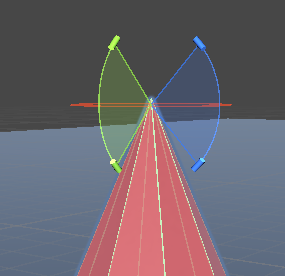
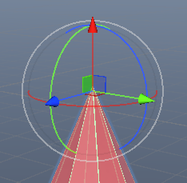

# Customize movement constraint with Configurable Joints

关节的设置很难通过物理计算设置，不仅因为这样很困难，而且物理引擎的关节只是模拟，不是严格遵循现实世界中的物理规则，另外游戏中对关节的行为可能有非现实的要求。因此设置关节，不要通过计算，而是通过调整各种属性，来达到最终想要的效果。

Configurable Joint 在每个独立的轴上，既可以约束线性运动，也可以约束旋转运动。

X/Y/Z Motion 用于约束线性运动，X/Y/Z Rotation 用于约束旋转运动。默认，这些轴对应 object 的 local axes，通过 Axis 属性定义。要基于 global axis 约束物体运动，启用 Configured In World Space。

每个轴上的运动可以设置 3 种约束：

- Locked：限制所有运动，Joint 根本无法移动。例如在 global y 轴上 locked 的 object 不能上下移动
- Limited：可以定义 limits，object 在 limits 之间可以自由运动。例如，可以约束一个炮塔的射击弧度，通过为 Y 轴旋转设定一个特定的角度范围
- Free：允许 axis 上的任意运动

要限制 linear 运动，使用 Linear Limit 属性，它定义了 joint 从其原点（沿着每个坐标轴分别测量）可以移动的最大距离。

要限制 rotation，使用 Angular Limit 属性。可以为每个轴指定不同的 limit values。还可以为 x 轴的旋转角度单独定义 upper 和 lower limits。而另外两个轴（YZ）使用同一个角度，应用于原点两边的任意一边（锥形体）。

## 在 joint limits 上添加 bounce（弹性碰撞）

可以在 joint limits 上模拟弹性表面，当 joint 运动碰撞到这个 limt，产生弹性碰撞。默认 joint 在它到达 limit 时停止运动。然而，一个这样的 non-elastic 碰撞在现实世界中很少见，为 constrained joint 添加一些 bounce 会看起更真实。

要使 constrained object 在到达 limit 之后反弹，使用 linear 和 angular limits 的 Bounciness 属性。一个较小的值可以产生较为真实自然的碰撞，更高的值可以模拟不常见的弹性边缘，例如台球桌垫。

## 为 joint limits 添加 elasticity（弹性）

当 joint 超出 limts，可以模拟一个 spring 行为，对线性运动，使用 Linear Limit Spring，对旋转运动，使用 Angular X/YZ Limit Spring。当为 Limit Spring 属性值设置大于 0 的值，joint 不会停止在 limit 处，而是超过 limit，然后 spring 施加力将它拉回到 limit position。Limit Spring 的值决定了 force 的强度。默认 spring 在 collision 的反方向拉 joint。只有当 joint 超出 limit 时，施加拉回方向的力，一旦 joint 回到 limit 之内，就不会施加 force，即不会施加向外推的力。当 object 被反方向来回，默认它就会向反方向的 limit 运动，以至于在 两个 limit 之间来回运动。但是设置 Damper 属性，可以在反弹时应用一个阻尼，使得 joint 更平滑地返回 limit。

Limit 只在运动设置为 Limited 时发挥作用，Locked 时 joint 完全锁定不运动，Free 完全没有任何限制。Limit 为 joint 设置了一个 target position，当 object 超出 limit 时，可以设置反弹效果或 spring 效果，它们都是基于 limit 发挥作用的。

# 用 joint 模拟马达（为 Configurable Joint 配置 driving forces）

上面是静态约束，还可以使用 Configurable joint 模拟马达，创建 custom targets，配置驱动力。

Configurable Joint 在每个轴上应用驱动力，通过 axis drive，来应用 motion 和 rotation。

对于 linear 运动，可以分别设置 X Y Z 轴的驱动（X Drive，Y Drive，Z Drive）。

对于 rotation 运动，对 X 单独设置驱动，对 YZ 设置一个驱动（Y Z 轴共享这个驱动设置），X Drive，YZ Drive。

每个 axis drive 有一个 spring 和 damper 选项，来模拟马达产生力。物理系统使用这些值来计算它在那个 axis 上应该应用的 driving force，公式为：

```
force = positionSpring * (targetPosition - position) + positionDamper * (target Velocity - velocity)
```

要在 Configuable Joint 上配置驱动力：

- 选择要马达的驱动力达到期望的 target position 还是 target velocity（尽管可以同时配置，但是没有意义，有意义的马达只能设置其中之一作为驱动目标）。Target 可以是线性的，也可以是旋转的。
- 使用模拟 spring 或 damper 系统的属性（Spring，Damper）来配置驱动力。即马达的驱动力是用和 spring-damper 系统一样的机制来实现的，只是它根据 target position 或 target velocity 实时计算当前应该应用的 force（加速）或 damper（刹车）。

注意你可以在一个 joint 上同时应用一个 linear force 和 rotational force。但是你不应该应用超过一个的 linear force 或 rotational force。如果你应用多个，物理系统会尝试同时解析它们，可能产生非预期的结果。例如，如果你应用一个 rotational force 尝试达到 Target Rotation 和一个 linear force 尝试达到 Target Velocity，你会创建一个 joint，它保持在特定 rotation，并以指定的 linear 速度运动。但是如果你应用两个 rotational forces，一个 Target Rotation，一个 Target Angular Velocity，物理系统会尝试既保持一个指定的 rotation，要保持一个指定的角速度，这是不可能达到的。

## 应用一个 target position

要应用一个 spring-like 的行为（总是尝试将 object 拉回到指定 position 或 rotation），设置一个 target position。可以设置 linear position，rotational position，或二者都设置。

- Target Position 的 XYZ 属性定义 Axis 确定的空间中的 position
- Target Rotation 的 XYZ 属性定义 Axis 确定的空间中的 rotation

你必须分别设置 linear 或 angular axis 驱动力。

重要：为使 Configurable Joint 应用必需的驱动力以到达 target position，任何受影响的 axis 上的 Position Spring 必须不能为 0.

## 应用一个 target velocity

要应用一个连续的 velocity，设置一个 target velocity。你必须设置一个 linear motion velocity，一个 rotational motion velocity，或者二者都有。

要设置一个 target linear velocity，使用 Target Velocity 的 XYZ 属性。这些值为每个 axis 单独设置，单位 m/s。

要设置 target angular velocity，有两个选项：

- 要为每个 axis 单独设置驱动力，设置 Rotational Drive Mode 为 X 和 YZ（X 单独设置，YZ 单独设置共享相同的设置），并使用 Target Angular Velocity 的 X Y Z 值。这些值为每个 axis 单独设置，单位 弧度/秒
- 要配置 rotation，而不设置特定 driving forces，设置 Rotational Drive Mode 为 Slerp Drive。Slerp Drive 使用四元数的球面插值或 slerp 功能来旋转 joint。与其单独设置 axis，slerp 在球面上应用将 object 从当前 orientation 旋转到 target orientation 的最小旋转。

你还必须为分别设置 linear 或 angular axis 驱动。

重要：为使 Configurable Joint 应用必需的 driving force 以达到 target velocity，受影响 axis drive 的 Position Damper 不能设置为 0.

Spring 因子控制到 Target Position 的驱动力（与 current_position - target_position 成正比），Damper 因子控制到 Target Velocity 的驱动力（与 current_velocity - target_velocity）成正比。

注意这里两个因子名为 Spring 和 Damper，跟其本意无关，而是因为它们使用和 Spring-Damper 系统一样的机制。Spring 调整到达 Target Position/Rotation 的驱动力，Damper 调整到达 Target Velocity/Angular Velocity 的驱动力，仅此而已。或者理解为驱动力跟弹簧力的计算使一样的，只是它根据当前 position 和 velocity 实时计算要应用的力（同时游戏中也可以实时改变 targt position 和 target velocity）。

马达驱动 joint 到达 target position 和 target velocity 要施加的力，跟静态限制的 limit spring 要施加的力的计算公式一样，其中 spring 应用为 position 因子，驱动 object 到达 target position，damper 应用为 velocity 因子，驱动 object 到达 target velocity。因此 Spring 调整到达 Target Position 的驱动力，Damper 调整到达 Target Velocity 的驱动力。但是对静态 limit spring，targetVelocity 为 0，使得 velocity 越大，反向 damper 力越大。

即 Joint 静态 Limit Spring 的力的计算公式与马达的计算公式一样，只是前者的 targetVelocity 总是 0，使得 damper 起到阻尼效果（阻止 velocity 离开 0 的能力）。马达的 Damper 也可以理解为，阻止 velocity 离开 target velocity 的能力。

```
force = positionSpring * (targetPosition - position) + positionDamper * (targetVelocity - velocity)
```

## 配置驱动力

对每个你想要应用 force 的 axis，Position Spring 用于配置应用的 Spring Force（驱动 object 到达 target position 的力），Position Damper 用于配置 spring force 的 damping 效果（驱动 object 到达 target velocity 的力）。

试错调整 spring 与 damper 参数，实现所需效果，并在运行时测试以确保所施加的力足以抵消作用于物体的其他外力。这些值不能或很难计算出来，通常应该通过测试调整设置为想要的值。

# Configurable Joint 属性分类

- 锁定
- 自由运动
- Limit
- 线性 Limit，线性 Limit Spring
- XYZ Angular Limit，XYZ Angular Limit Spring
- 线性驱动力，线性 Target Position/Velocity
- 旋转 XYZ 驱动力，旋转 XYZ Target Position/Velocity

带 Angular/Rotation 的属性都是旋转运动，不带的都是线性运动的属性。因为属性太多（尤其是 rotation 将 x 和 yz 分别设置），一定要注意选择好正确的属性（X Drive 控制线性运动，Angular X Drive 控制旋转运动。

Limit 也应用于 Motor。Motor 发挥作用完全取决于施加的 force。因此将 Spring 和 Damper 设置为 0，motor 就不会输出任何 force，可有效地关闭 motor，只使用 Limit Spring。

Limit Spring 和 Motor 使两个独立的控制，同时发挥作用，每个都是一个 Spring-Damper 的系统，只是 Limit Spring 的 TargetVelocity 总是 0，运行时每个计算一个要施加的力，最终的受力是二者的合并。

但是 Limit Spring 和 Motor 的应用场景并不重合，很少需要联合使用，而且联合使用时正确协调二者很复杂，通常只需要使用其中一种。无论哪种（Limit Spring 还是 Motor），将 Spring 和 Damper 设置为 0 都可以有效关闭那个系统，因为输出的力总是 0. 

Limit Spring 和 Motor 可以说是一样的系统，只是暴露的属性不一样：

- 对于 Limit Spring，TargetPosition 就是 Limit，Target Velocity 就是 0
- 对于 Motor，TargetPosition 和 Target Velocity 都可以明确设置
- Limit Spring 可以单独设置 Limit 处的反弹行为
- 二者都用 Spring 和 Damper 属性作为控制力的属性（Spring 控制到 Target Position 的力，Damper 控制到 Target Velocity 的力）

# SphereJoint

ArticulationBody 的 SphereJoint 和 Character Joint 模拟人体关节。这个是个旋转关节（不是移动关节，不能进行线性运动），类似 HingeJoint/RevoluteJoint，但是这两者只能绕着指定的一个轴旋转，而 SphereJoint 可以指定绕着 X/Y/Z 轴都旋转，包含：

- 绕着 X 轴的旋转，称为 twist（扭转）
- 绕着 Y 轴和 Z 轴的旋转，称为 swing（摆动）

这通常用于模拟人体或生物的四肢关节，它们的特点是可以绕 X Y Z 任意轴旋转，但是每个轴都有 limit，尤其是 Y/Z 轴通常都设置 limit，形成一个锥形体，关节就在这个锥形体内摆动。

关节设置中参考的 axis 不是 body transform 的 local axis，而是基于 transform local axis 由  anchor 定义的更 local 的 axis。所说的 X Y Z 轴是 Anchor Axis 的 X Y Z 轴。

SphereJoint limit 是按照左手坐标系定义的角度。以 Y 轴为例，与 Axis 重合时，角度为 0。按照左手坐标系（左手握拳，拇指指向 Y 轴，四指指向的方向就是旋转的正方向），正向旋转为正角度，反向旋转为负角度。

注意使用 Gizmos 可视化设置 limit 时，扇形区域定义的是 AB 绕相应轴的旋转范围，而不是定义上面说的虚拟锥形体的角度范围。例如下面的设置





绿色扇形区域，定义的是绿色的 Y 轴的旋转范围，蓝色扇形区域，定义的是蓝色的 Z 轴的旋转范围。这两个扇形都是水平定义的，但是定义的却是竖直的锥形体，与红色的锥形体方向一致。


