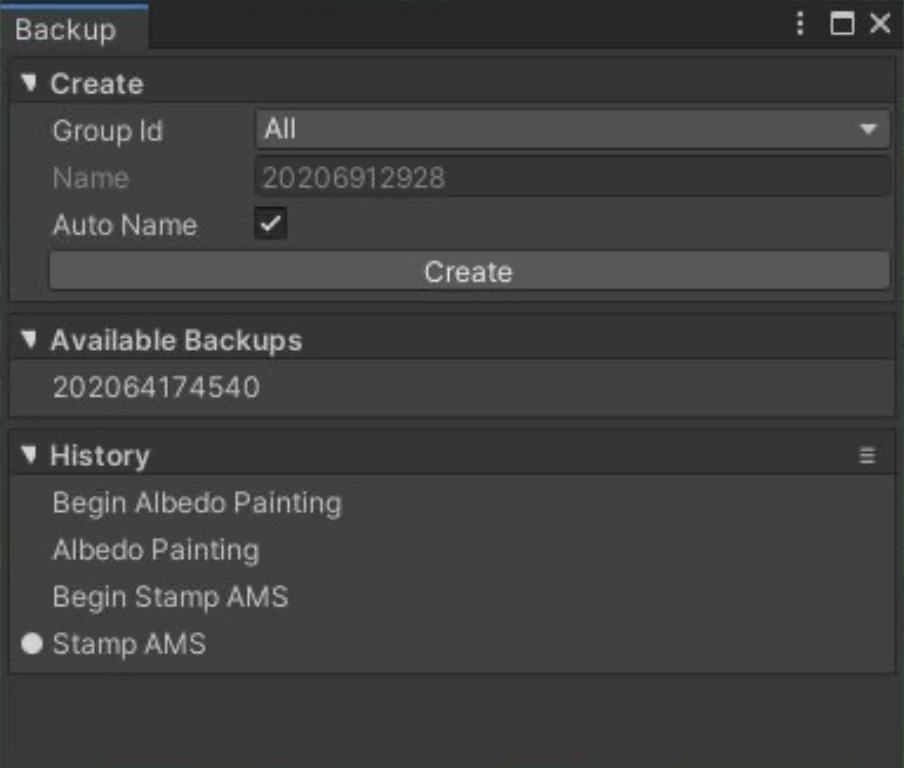

# Backup Tool

Backup 工具提供了一个 robust，non-linear（可以从任何一点恢复）来 store/restore 编辑历史。W indow > Polaris > Tools > Backup​.

有 2 种类型的 backup：

- Long Lives Backup：选择的 group 中的 terrains 将会被全面地 backup 并存储到磁盘上，这意味着所有东西，从 textures 到 foliage 都会被扫描，并且这个 entry 在 editor session 之间保持，或者可以通过网络传输。这个类型被手动创建。
- Short Lives History: 选择的 group 中的 terrains 被部分地 backup，并存储到磁盘上。这个类型被这个 tool 自动创建，只有被 tool 影响的 data channel 被保存，并且不会在 editor sessions 之间保存。

要恢复一个 backup，简单地点击 listed entry。对于更多的 action，例如删除一个 entry，右键单击 entry。

To restore a backup, simply click on the listed entry. For additional action like deleting the entry, right click on it. The small dot (●) 指示最新的 active Backup/History entry.

可以按 Ctrl + Z 和 Ctrl + Y 来执行一个 backup 恢复，就像正常的 Undo/Redo。Backup data 被存储在Griffin Backup​ directory，和 Asset/ 同级目录。
