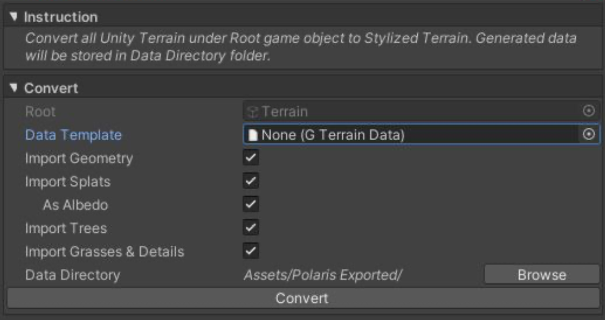

# Convert Unity Terrain To Low Poly

Polaris 提供了一个有用的工具，帮助你容易地从第三方工具例如 Gaia，MapMagic 和 TerrainComposer 迁移，通过将一个 Unity terrain group 转换成 low poly。右键点击 terrain group 的 root game object，从 Unity Terrain 中选择 3D Object > Polaris > Convert：

选择你想要导入什么，在哪里存储转换的数据，然后点击 Convert。

你可以赋值 Polaris Terrain Data 作为一个 converted terrain 的 template，在那里你可以设置 custom properties，例如 texture resolution，vertex color mode 等等，而不是使用默认值。

注意：在转换过程中，将会生成很多文件，依赖于 group 中有多少 terrains，以及它们的复杂性。在转换之前，选择一个新的 empty folder 来存储数据更好。
