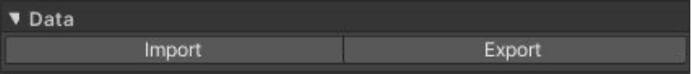
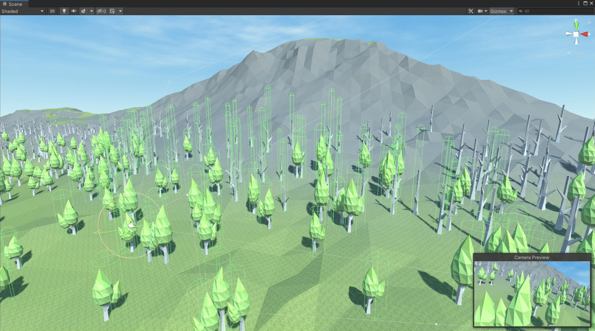

# Create and configure terrain settings

## Create terrain game objects

在 GameObject > 3D Object > Polaris > Terrain Wizard,​ 这将会打开 Wizard 窗口:

确保你在 Create Level tab。

这个 tab 是一步一步的指令，让你创建 terrain game objects，管理和编辑你的 level。从上到下遵循这些步骤来使用这些工具和它们的 workflow。

如果你使用 Universal Render Pipeline，有一个额外的步骤来帮你下载和设置必要的 shaders 和 materials。

要创建新的 terrains，扩展 Create Terrain foldout。参数描述如下：

- Physical：

  - Origin: 新的 terrain grid 的第一个 terrain 的位置
  - Tile Size: 每个 terrain tile 的 world space size（宽度x高度x长度）
  - Tile Count X/Z: X/Z 平面 terrain tiles 的数量

- Material：

  - Render Pipeline：当前使用的 render pipeline。只支持 Builtin 和 Universal
  - Lighting Model: 选择 Lamber（diffuse），Blinn Phong（specular），或 PBR（physical based）。在 URP 中，只支持 PBR 模型
  - Texturing Model: 选择如何应用 texture 到 terrain，gradient lookup，albedo metallic，或者 splat map blending，等等。这些 settings 可能影响其他 terrain tools
  - Splats Model: 如果使用 Splat texturing model，选择应用到 terrain 最多的 splat layers

- Utilities

  - Name Prefix: 一个附加到 terrain 名字前面的字符串。用于一些 level streaming system
  - Group Id: 一个整数，将 terrains 收集到一个 group 中，这会影响缝隙拼接 seam stitching 和 multi-terrains editing

- Data

  - Directory: 一个存储所有生成 assets 的目录。有很多 assets 要被生成，因此一个 Assets/ 的子目录更好

使用你的 value 填充这些参数，然后点击 Create。

## Configure terrain settings

在 Hierarchy 选择一个 terrain，在 Inspector 中你可以看见很多 settings：

Terrain Data 和 Generated Data asset 显示在组件上的顶端。

### Geometry settings：

- Width： local space 中 X-axis 上 terrain 的 size
- Height：local space 中 Y-axis 上 terrain 的 size
- Length：local space 中 Z-axis 上 terrain 的 size
- Height Map Resolutin：height map texture 的像素大小
- Mesh Base Resolutin：geometry mesh 的最小分辨率（基础分辨率）
- Mesh Resolution：geometry mesh vertices 分布最密集的最大分辨率
- Grid Size：terrain mesh 在 X 和 Z axis 上分割的 chunks 数量。全部 chunk 是它们的平方
- LOD Count：要生成的全部 LODs。在编辑时应该为 1，以节省一些处理能力，然后当编辑完成时你可以尝试更大的 value
- Displacement Seed: 一个用于 vertex displacement（移位）的随机数种子 
- Displacement Strength: vertex displace 在 XZ 平面上的 displacement
- Albedo To Vertex Color: 如何从 albedo map 获取 vertex color
- Storage: 选择是否将生成的 mesh 写入 asset，或者在 开启时重新生成以节省一些存储
- Time Sliced: 切换 time-sliced generation。如果开启，如果可能每帧只生成一个 chunk。一些 operations 仍然会同时生成所有 chunks。

### Shading settings:

- Material: 渲染 terrain 的材质
- Albedo Map Resolution: Albedo Map 的像素大小。如果不想使用它，设置它为 1 以节省内存
- Metallic Map Resolution: Metallic Map 的像素大小。如果不想使用它，设置它为 1 以节省内存
- Color By Height, Color By Normal: 基于 vertex height 和 slope 来着色 terrain 的渐变 gradients。只影响 Gradient Lookup shaders
- Color Blend: 基于 vertex 高度插值 gradients 的 blend fraction。只影响 Gradient Lookup shaders
- Splat Prototypes: 一个应用到 surface 上的 terrain textures 集合（asset）。只影响 Splatshaders。
- Splat Control Resolution: splat control maps 的像素大小。如果不想使用它，设置它为 1 以节省内存
- Properties under Advanced section: 这些字段定义 terrain shaders 中实际的属性名并告诉如何绑定到 terrain materials。保留它们为默认值，如果你不使用自定义 shaders

### Render Setting

- Cast Shadow: terrain 是否应该投射 shadow
- Receive Shadow: terrain 是否应该接受 shadow
- Draw Tree: terrain 是否应该绘制 instances
- Enable Instancing: 为渲染 trees 开启 GPU Instancing。注意这个选项需要 tree materials 开启 Enable Instancing，否则它将会 fallback 到 normal rendering。你可能有时在 Scene view 中看见闪烁，关闭 Scene View camera 的 Dynamic Clipping 可以解决这个问题
- Billboard Start: 渲染 trees 为 billboard 的到 camera 的距离。如果 billboard 对这个 tree 不可用，它不会被渲染
- Tree Distance: 渲染 trees 的到 camera 的最大距离
- Cull Volume Bias: 调整这个属性来防止 shadow pop in artifact。这是一个 global value
- Draw Grass: terrain 是否应该绘制 grass instances
- Grass Distance: 渲染 grasses 的到 camera 的最大距离

### Foliage Setting

- Tree Prototypes: 一个用于渲染的 tree prototypes 的集合
- Tree Snap Mode: 选择 snap tree 到 terrain 表面还是 world objects
- Tree Snap Layer Mask: 一个 mask，过滤出 trees 可以 snap on 的 world objects
- Tree Instance Count: terrain 上 tree instances 的总数
- Grass Prototypes: 一个用于渲染的 grass prototypes 的集合
- Grass Snap Mode: 选择 snap grass 到 terrain 表面还是 world objects
- Grass Snap Layer Mask: 一个 maks，过滤出 grass 可以 snap 的 world objects
- Patch Grid Size: 巨额订单干沿着 X-axis 和 Z-axis 的斑块 patches 数量。Patches 总数是这个 value 的平方。更多的 patch 数量需要更多 drawcalls，但是允许一个更密集的 field（原野，草地）
- Interactive Grass: 允许 touch bending grass。使它们可以 react 移动的 objects
- Vector Field Map Resolution: vector field map 的大小，更高的值产生更精确的 grass bending，但是需要更多的性能
- Bend Sensitive: grass react 移动物体的灵敏度
- Restore Sensitive: 当移动的物体离开时 grass 返回到正常位置的灵敏度
- Grass Instance Count: terrain 上 grass instances 的总数

### Data Settings

- Import: 允许从外部导入 数据，例如 Unity Terrain Data，RAW 文件，等等
- Export: 允许你导出数据到 Unity Terrain Data，RAW 文件，等等

## Neighboring Settings

- Auto Connect: 当 scene 中添加一个新 terrain 时，terrain 是否应该被自动连接到它的邻接 terrain
- Group Id: 一个整数，将 scene 中的 terrains 分组到一起。这将影响 terrain tools 如何工作。例如，你可以使 play area 的 Group Id 为 0，而是 background 的 terrain 的 Group Id 为 1，等等
- Top/Bottom/Left/Right Neighbor: 将邻接 terrain 连接到一起，它们的 geometry 会match 到一起

## Create and connect neighbor terrains

可以使用 Terrain Pinning & Neighboring feature 快速递创建和连接邻接的 terrains。选择一个 terrain，扩展它的 Neighboring foldout，可以看见 terrain 旁边的方框，点击它，则一个新的 terrain 将会被添加到 scene 以及 neighboring configuration set。

## Changing terrain material

可以使用 Wizard 改变 terrain 材质。在 terrain Inspector，Shading > CONTEXT (≡) > Set Shader 将会打开 Wizard 窗口

选择你想要的 Lighting Model，Texturing Model，以及 Splat Model，然后点击 Set。

## Setting up Interactive Grass

Setup 过程非常简单。在 Inspector 中选择一个 terrain，在 Foliage foldout 下面，选中 Interactive Grass 开关，然后为其他属性选择合适的 values，例如 Vector Field Map Resolution，Bend Sensitive 和 Restore Sensitive。

接下来，system 需要知道谁是 character 使得它们可以正确地 react。选择你的 character，然后添加一个 GInteractiveGrassAgent 组件，pick 一个合适的 Radius value。你可以添加任意个 agents。

## Setting up Wind Zone

你可以控制整个 scene 中 grass 上的全局 wind 效果，通过添加一个 Wind Zone gameobject。G​ameObject > 3D Object > Polaris > Wind Zone ​创建一个 Wind Zone gameobject。

在 Inspector 中，有一些定义 wind effect 的属性：

- Direction X: X-axis 上的 wind 方向
- Direction Z: X-axis 上的 wind 方向
- Speed: wind blows 的速度 
- Spread: 控制 wind 的 spread/turbulence（扩散/湍流）

## Create Tree Collider

当创建 terrain 时，会自动添加一个 Tree Collider component 为它的 child gameobject。

在内部，Tree Collider 组件存储一个 Capsule Collider 的列表，它会每一帧根据它在 scene 中的位置更新。每个 Tree Collider 将会追踪一个 target，要拥有更多 targets，你可以添加另一个 Tree Collider，通过 GameObject > 3D Object > Polaris > Tree Collider。

要为一个 Tree Prototype 开启 collider，你必须添加一个 Capsule Collider 到它的 Prefab 上。Tree Collider 拥有下面的属性：

- Terrain: 包含 tree instances 信息的 parent terrain
- Target: 追踪的 target，如果为 null，它将追踪 Main Camera
- Distance: 从 tree 到它的 target 的最大距离 

## Create Splat Prototypes Group

要应用 splat textures 到 terrain，你必须创建一个 Splat Prototypes Group asset，并将它赋予 terrain。在 ​Assets > Create > Polaris > Splat Prototypes Group 中创建 asset，并为它赋予一个名字。在 Inspector 选择这个 asset，尝试拖放一个 texture 到 selector box 中，将会出现 prototype：

对于每个 prototype，有一些设置：

- Texture: prototype 的 main texture
- Normal Map: 一个用于 fine detail 的 normal map
- Tile Size: 重复 pattern 的 size（纹理）
- Tile Offset: 重复 pattern 的 offset（纹理）
- Metallic/Smoothness: prototype 的物理属性，只用于 PBR shader

## Create Tree Prototypes Group

要在 terrain 上生成和渲染 trees，你必须创建一个 Tree Prototypes Group asset，并将它赋予 terrain。在 ​Assets > Create > Polaris V2 > Tree Prototypes ​Group 创建一个 asset，并为它赋予一个合适的名字。在 Inspector 中选择这个 asset，尝试拖放一个 prefab 到 selector box 中，将会出现 prototype：

每个 prototype 有一些设置：

- Prefab: 复制数据的 source prefab
- Billboard: 用于将 trees 渲染为 billboard 的 billboard asset
- Pivot Offset: tree position 在 Y-axis 的 Offset
- Base Rotation: 用于修复 tree models mis-align 问题的 rotation offset
- Base Scale: initial size of the tree.
- Layer: 确定那个 camera layer 来渲染 tree
- Keep Prefab Layer: 如果选中，tree 将会在和 source prefab 相同的 layer 上被渲染 
- Cast Shadow/Receive Shadow: 它是否应该投射/接收 shadow
- Billboard Cast/Receive Shadow: 它的 billboard 是否应该 cast/receive shadow

## Create Grass/Detail Prototype Group

要在 terrain 上生成和渲染 grasses/details，你必须创建一个 Grass Prototypes Group asset，并将它赋予 terrain。在 ​Assets > Create > Polaris > Grass Prototypes ​Group 创建一个 asset，并为它赋予一个合适的名字。在 Inspector 中选择这个 asset，尝试拖放一个 prefab 到 selector box 中，将会出现 prototype：

每个 prototype 有一些设置：

- Texture: 表示 grass 的 main texture 
- Shape: 确定用于绘制每个 instance 的 mesh，包括 Quad，Cross，TriCross，自定义 Mesh 和 Detail Object
- Prefab: 用于 details 的 prefab gameobject
- Mesh: 用于 Custom Mesh shape 的 mesh
- Color: 用于这个 prototype 的 Tint color
- Size: grass instance 的物理大小
- Pivot Offset: batching 时，一个小 position offset 上下移动 instance
- Bend Factor: 它如何 react wind 和其他 bending 效果
- Layer: 决定哪个 camera layer 用来渲染 grass instances 
- Align To Surface: 使 grass/detail instance up vector 对齐到 surface 法向量
vector (need re-update to take effect).
- Cast/Receive Shadow: 它是否应该投射/接收阴影
- Billboard: 它是否应该被渲染为 billboard。当 billboard 开启时，Interactive Grass 不能工作

## Create Prefab Prototypes Group

Prefab Prototypes Group 并不绑定到任何特定的 terrain。相反地，它被用于存储 prefab variations，然后之后被其他 terrain tools 使用。在 ​​Assets > Create > Polaris > Prefab Prototype ​Group 创建一个 asset，并为它赋予一个合适的名字。在 Inspector 中选择这个 asset，尝试拖放一个 prefab 到 selector box 中，将会出现 prototype：

## Create Billboard Asset

Polaris 带有一个好用的 Billboard Asset Creator，可以用来 tree 渲染。

Window > Polaris > Tools > Billboard Creator​ 来打开 editor.

Editor 有 3 种 modes：

- Atlas: 预览 billboard atlas
- Normal: 预览 billboard normal map
- Flipbook: 在 cells 之间预览 billboard transition，以及 editing billboard mesh

在右面的 pane，你应该看见一个 section，看起来很像 Inspector 可以设置 billboard asset，这些 settings 在 Unity Docs 中描述得很清楚。

点击 Save 来创建这个 billboard asset 并将它写到 disk。
