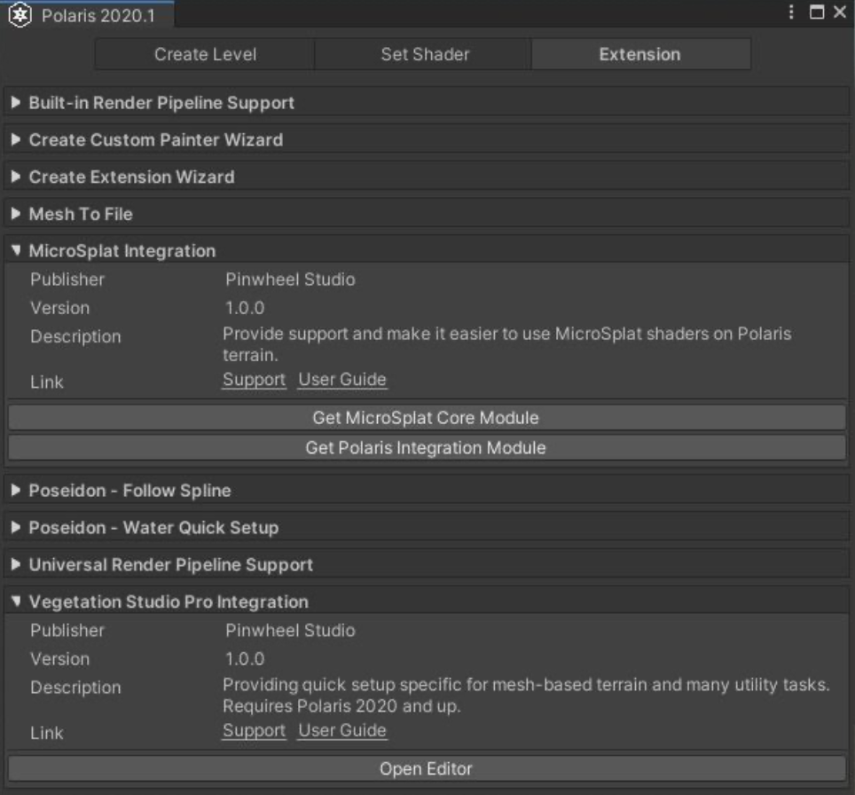

# Extension System

Polaris 提供了一个系统，让你编写 code 来添加 extent/utility tasks，集成你的 asset 等等，并在一个 hub 显示信息。在 Window > Polaris > Tools > Extension​ 打开它。



These extensions can be provided by many publishers, which requires you to import their assets before use.

有很多 publishers 可以提供 extensions，这需要你在使用之前导入它们的 assets

## Verified extensions

有一些 Pinwheel Studio 提供的可用的 extension

Polaris

- Universal Render Pipeline Support​: 添加用于 URP 的 materials 和 shaders  adding materials and shaders for URP

CSharp Wizard

- Create Custom Painter Wizard: 生成梗概代码 skeleton code 用来制作一个自动以 terrain painter
- Create Extension Wizard: 为一个 extension entry 生成梗概代码

Poseidon

- Poseidon - Water Quick Setup: 使用 presets 快速添加 low poly water
- Poseidon - Follow Spline: 沿着 spline 添加 water tiles

Mesh To File

- Terrain To File: 导出 terrain geometry 到 Obj 或 Fbx 文件中

还有一些扩展来集成其他 publisher 的产品：

- MicroSplat Integration: 具有很高保真度和艺术调整的高级 terrain shader。需要 MicroSplat Core Module 和 MicroSplat Polaris Integration Module
- Vegetation Studio Pro Integration: 高级过程化植被放置以及渲染。需要 ​Vegetation Studio Pro​ 和 ​Vegetation Studio Pro Integration Extension.​

## Writing your own extension

要被检测为一个 extension，你的 script 必须被放在一个以 ".GriffinExtension" 结尾的 namespace，建议的 pattern 是 \<Company>.\<Package>.GriffinExtension.

要避免编译错误，你应该将整个 code 文件包装在 #if GRIFFIN && UNITY_EDITOR 和 ​#endif 代码块中, 这意味着它只在 Griffin（Polaris 内部名字）被导入并且 user 工作于 editor 时编译。例如：

```C#
#if GRIFFIN && UNITY_EDITOR

using UnityEngine;
using System.Collections;
using System.Collections.Generic;
using UnityEditor;

namespace Pinwheel.Griffin.GriffinExtension {
    public static class ExampleExtension { 
        //...
    }
}

#endif
```

你还必须定义一些强制函数使 extension 可以工作：

```C#
public static string GetPublisherName() {...}
public static string GetExtensionName() {...}
public static void OpenSupportLink() {...}
```

These functions must have exactly the same name and signature as above, and return the appropriate value to display in the extension info section. If you fail to define them, the extension will not be detected!
There are some optional functions to provide additional information:

```C#
public static string GetDescription() {...}
public static string GetVersion() {...}
public static void OpenUserGuide() {...}
```

The Extension System provide a default GUI for every extension, which display a vertical list of button corresponding to each function in the script, to expose your function to the GUI, append the function name with “Button_” prefix, and it should be static, have void return type and zero parameter. For example:

```C#
public static void Button_OpenConverter() {...}
```

You can create a custom GUI by providing a function as below:

```C#
public static void OnGUI() {...}
```

Your GUI block will be displayed right below the extension info section.
Note:​ You can quickly generate skeleton code for an extension by using the Create Extension
Wizard, after importing ​CSharp Wizard:​


