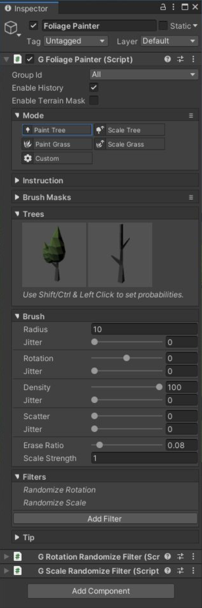
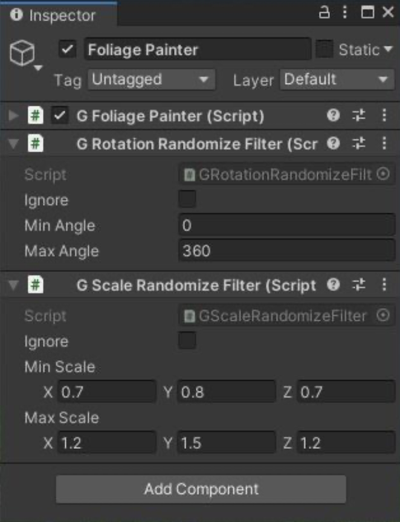

# Foliage Painter

这个工具用来绘制 tree 和 grass instance 到环境中。

​GameObject > 3D Object > Polaris > Tools > Foliage Painter​ 添加一个 Painter 工具。

和 ​Geometry & Texture Painter 类似，这个工具包含一些 painting modes：

- Paint Tree: 绘制或擦除 tree instances.
- Scale Tree: 修改 tree instances 大小.
- Paint Grass: 绘制或擦除 grass instances.
- Scale Grass: 修改 grass instances 大小.
- Custom: 其他自定义功能，由 user code 定义.

为了使 Trees/Grasses selector 显示出来，你必须创建合适的 prototype group assets，并将它赋予 terrain。

Foliage Painter 有一些额外的参数：

- Density: 确定生成多少 instances
- Erase Ratio: 如果你只想在一个 area 中剪除一些 tree instances，而不是完全擦除它们，使用这个 multiplier
- Scale Strength: Scale modes 下 brush 的强度

初始地，painted instances 将会有默认 transform 属性（0 rotation 和 1 scale），这会导致一个重复的 pattern。要添加一些随机性，可以使用一些 filters。要添加一个 filter，点击 Add Filter 按钮，并选择一个。

有几个 filter 类型：

- Height Constraint（高度约束）: 基于高度范围阻止 instance 生成
- Slope Constraint（斜坡约束）: 基于 surface 角度阻止 instance 生成
- Randomize Rotation: 随机旋转 instance
- Randomize Scale: 随机缩放 instance
- Clamp Scale: 通过 clamping scale 防止 instance 太大或太小 

当创建 painter 时，Randomize Rotation 和 Randomize Scale filters 被自动添加。

