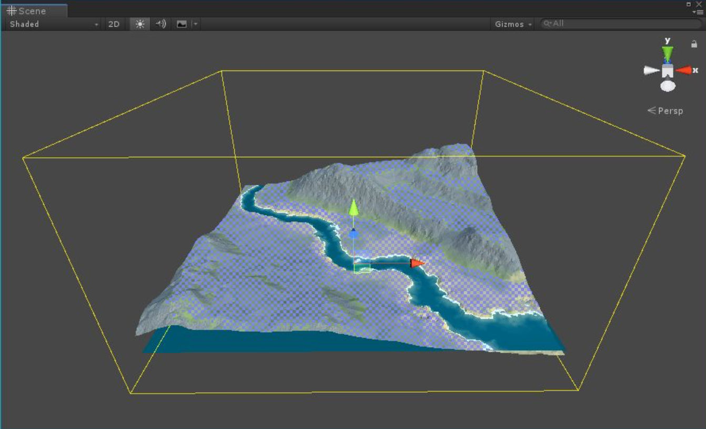

# FOLIAGE STAMPER

类似 Texture Stamper，Foliage Stamper 让你执行过程化 foliage placement，而不是手动绘制。

GameObject > 3D Object > Polaris > Tools > Foliage Stampers​ 创建一个 stamper。

每个 stamp layer 有一些额外属性：

- Visualize Color: 在 terrain surface 上可视化 stamper 的颜色
- Instance Count Per Terrain: 生成的 instances 的数量
- Min Rotation/Max Rotation: 每个生成的 instance 的 rotation 范围
- Min Scale/Max Scale: 每个生成的 instance 的 scale 范围
- Stamp Trees: 确定是否生成 trees
- Tree Index: 确定生成哪个 tree
- Stamp Grasses: 确定是否生成 grasses
- Grass Index: 确定生成哪个 grass
 

尝试这些属性，直到你满意，然后点击 Apply 来 stamp。你可以多次点击 Apply 来添加更多 instances 到 scene 中。
