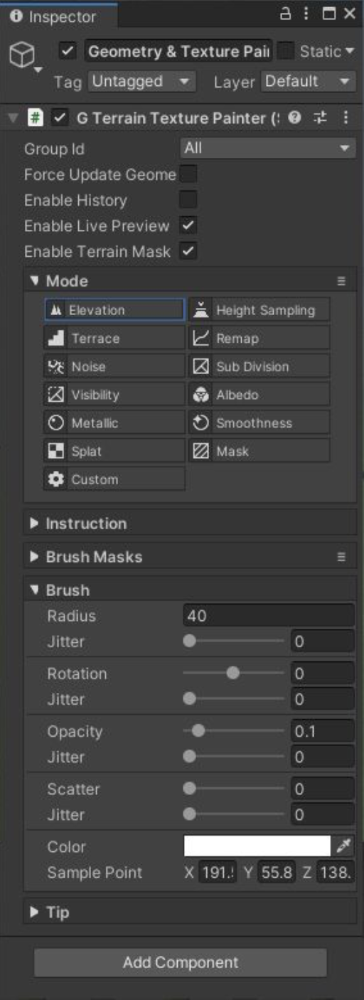

# Geometry & Texture Painter

这个工具用于 sculpt geometry 并应用 color，textures 到 terrain 表面。

GameObject > 3D Object > Polaris > Tools > Geometry - Texture Painter​ 创建一个工具。

这个工具包含一些 painting modes，它们具有相似的参数，并且注意**处理纹理类型的 terrain data**，例如 height map，splat map 等等。要选择 paint mode，点击 Paint Mode dropdown，或者按 F1，F2，... Fx 键。

- Elevation（海拔，高度）: 升高 Raise, 降低 lower，平滑 smooth 高度图 height map
- Height Sampling（高度采样）: 设置 height map value 匹配一个 pre-sampled point
- Terrace（平台，平原）: 在 height map 创建梯田效果
- Remap（再映射）: 使用一个 curve 重新映射 height map value remap
- Noise: 添加小细节到 height map
- Sub Division: 添加更多细节到 surface 上的一个特定区域(更多的三角形)
- Visibility: mask surface 上一个特定区域可见或不可见，用于创建一个洞穴入口
- Albedo: 在 Albedo Map 绘制颜色 
- Metallic: 在 Metallic Map R channel 绘制 Metallic
- Smoothness: 在 Metallic Map A channel 绘制 Smoothness
- Splat: 在 Splat Control Maps 绘制 blend weight
- Mask: 绘制 mask 纹理
- Custom: 其他自定义功能，被 user code 定义

每个 paint mode 将会有不同的 actions 和 hotkeys，查看 Instruction section 了解更多细节。

这些 paint modes 具有类似的参数：

- Force Update Geometry: 强制 terrain 更新它的 geometry，即使 painter 没有修改它的 height map，在你想转换 texture data 到 mesh data 时很有用，例如从 albedo map color 到 vertex color
- Enable History: 确定是否为 painting 存储 undo history entry
- Enable Live Preview: 让你预览 terrain 上 painter 效果，这个选项需要更多计算机资源 
- Enable Terrain Mask: 使用 mask texture R channel 来 lock 特定 terrain 区域，防止其被修改
- Brush Mask: 一个定义 stroke 形状的 texture 
- Splat: 确定那个 splat prototype 被绘制（叠加 stack 的 texture）。只在 Splat & Custom 模式可见
- Radius: brush 的半径
- Rotation: brush 的旋转 
- Opacity: 应用操作的强度
- Scatter（散步）: 随机化 brush 位置的一个 offset 
- Jitter（抖动）: 随机化 brsuh stroke（半径）
- Color: 画刷的颜色 
- Sample Point: 在 Height Sampling mode 下的 pre-sample（预采样）点

当 Scene View 获得焦点，可以使用 +/-，左右方括号，分号/引号 按键平滑地分别改变 brush radius，rotation，和 opacity。

要添加一个自定义 brush mask，简单地将你的 texture 放到 Assets/.../Resources/PolarisBrushes 目录，然后 disable-enable painter 组件使 brushes 被重新加载。

重要：有时在绘制时不能显示结果，这主要是因为不正确的材质设置，即当 painter 工作时，terrain material 没有使用被绘制的材质。例如，在一个 gradient lookup 材质上绘制 splat 不会显示任何东西。

下面是一个 paint mode 列表，以及它们工作的 texture：

| | HeightMap | Albedo Map | Metallic Map | Splat Control Maps | Mask Map |
| --- | --- | --- | --- | --- | --- |
| Elevation | RG |||||
| Height Sampling | RG |||||
| Terrace | RG |||||
| Remap | RG |||||
| Noise | RG |||||
| Sub Division| B |||||
| Visibility | A |||||
| Albedo || RGBA ||||
| Metallic ||| R |||
| Smoothness ||| A|||
| Splats | RG | || RGBA ||
| Mask ||||| RGBA |

## Vertex Color painting

要绘制 vertex color，遵循以下步骤：

1. 确保 terrains 使用 Vertex Color shader variant，你可以在使用 Wizard window 创建 terrains 时选择 variant。如果它们使用一个不同的 variant（Gradient Lookup / Color / Splat），并且你想要切换到 vertex color，则打开 Wizard，然后为 Texturing Model 选择 Vertex Color，点击 Set
2. 在 Geometry foldout 下面，根据你的艺术风格设置 Albedo To Vertex Color 为 Sharp 或 Smooth
3. 选择 Geometry - Texture Painter, 打开 Force Update Geometry​.
4. 选择 A​lbedo m​ode 然后开始绘制

