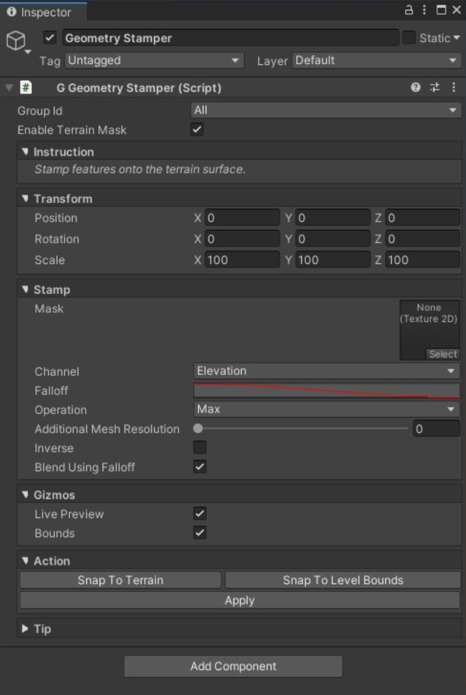
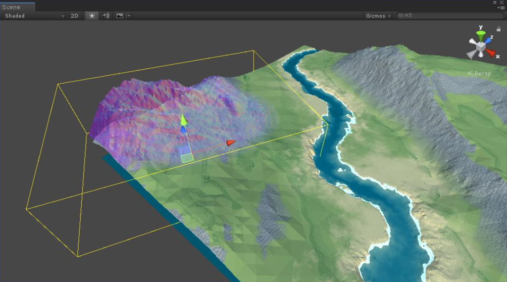

# Geometry Stamper

Prototype Group 是调色板，就是可以在 terrain 上绘制什么。Painter 是画笔，让你可以手动在 terrain 上绘制 Prototypes。Stamper 类似 brush pattern，一次绘制一个模式。

这个工具在 terrain geometry 上 stamp（戳）特征，使用一些特殊的 math 操作来 blend 结果。本质上还是操作 texture data。使用 Object > Polaris > Tools > Geometry Stamper 创建一个 Geometry Stamper。

Geometry Stamper 每个属性的细节：

For Transform:

- Position: scene 中 stamper 的 position
- Rotation: stamper 的 rotation
- Scale: stamper 的大小

For Stamp:

- Mask: 一个 mask 纹理，表示用于 stamp 的 geometry 特征
- Channel: height map 的那个 channel 用于 stamp（高度或可见性）
- Falloff: 从中心向四周 fade stamp mask
- Operation: 应用的 math 操作
- Additional Mesh Resolution: 在 stamp 位置增加细分等级 level of subdivision
- Inverse: 反转 stamp mask color
- Lerp Factor: 线性插值因子，只用于 Lerp operation
- Blend Using Falloff: 使用 Falloff curve 混合 stamp texture 和 origin terrain texture，得到更平滑的 transitions

For Gizmos:

- Live Preview: 是否在 Scene 中绘制实时 preview
- Bounds: 是否在 Scene 中绘制 stamper bounding box

在 Scene View，你可以使用 Transform tool 来 move，rotate，和 scale stamper，或者使用 WER 键切换不同的 modes。

根据你想要做什么，选择合适的操作：

让 result = h，current height = a，stamper height = b

- Add: Additive blending，使用这个 mode 来 raise terrain。结果不会比当前 height 更小。h = max(a, a+b)
- Subtract: 从当前 height 减去 stamper height. 使用这个 model 来降低 terrain。结果不会比 current height 更大。h = min(a, a-b) 
- Reverse Subtract: 从 stamper height 减去 current height。h = min(b, b-a)
- Max: 使用更大的 height h = max(a,b)
- Min: 使用更小的 height h = min(a,b)
- Lerp: 基于 Lerp Factor 从 current height 到 stamper height 进行线性插值。 h = lerp(a, b, Lerp Factor)
- Difference: 使用 current height 和 stamper height 的差值。h = absolute(a - b)

尝试不同的设置，一旦你满意 preview，点击 Apply 并完成。
