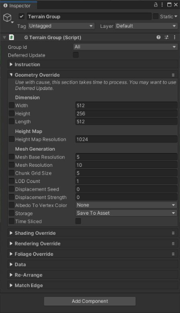

# Group Tool

因为 Polaris 使用 multi-terrains workflow，有时 properties 必须在多个 tiles 上相同才能使它正确工作。一个一个遍历和修改这些属性将会是非常耗时操作。Group Tool 提供一个非常简单和容易的方式在一个 group 中的 tiles 之间有选择的同时覆盖多个 properties。

G​ameObject > 3D Object > Polaris > Tools > Group​ 添加一个新的 Group Tool。

这些属性非常类似 terrain data，以及每个属性左边的一个额外的 checkbox 确定是否覆盖那个属性。

要覆盖一个属性，打开左边的 toggle，然后设置一个 value。

如果你想在重新生成 terrains 之前同时覆盖很多 properties，打开 Defered Update，override 它们，点击 Update。你还可以在选择的 terrain groups 执行一些 operations，例如批量数据 export/import，重新安排 position，或者 match terrain 的边缘。
