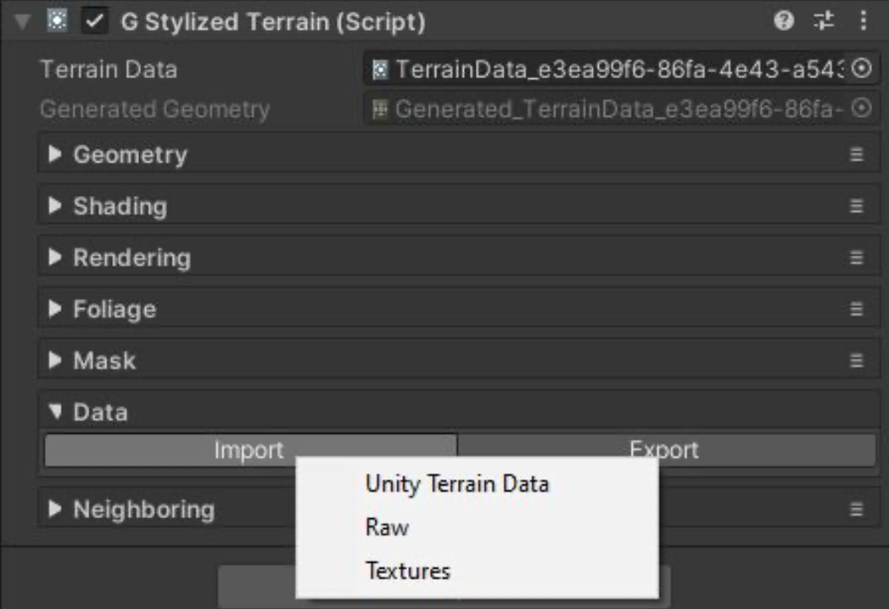

# Import And Export Data

你可以 import/export 数据，通过选择一个 terrain，展开它的 data section，点击 Import/Export 按钮，然后选择一个合适的数据类型；

Currently support:

Import:

- Unity Terrain Data: 可以很容易地从其他工具迁移 migrate，例如 Gaia，MapMagic，TerrainComposer
- Raw: 从 .raw 和 r.16文件导入 height map，通常使用诸如 World Machine 软件创建 
- Textures: 导入 textures 用作它自己内部的数据，用于 painting（画刷） 和 stamping（印戳）

Export:

- Unity Terrain Data: 用于使用其他 terrain tools 进一步 polishing
- Raw: 导出 height map 到 .raw .16 文件 export height map to .raw, .r16 files.
- Textures: 导出它的纹理拷贝
