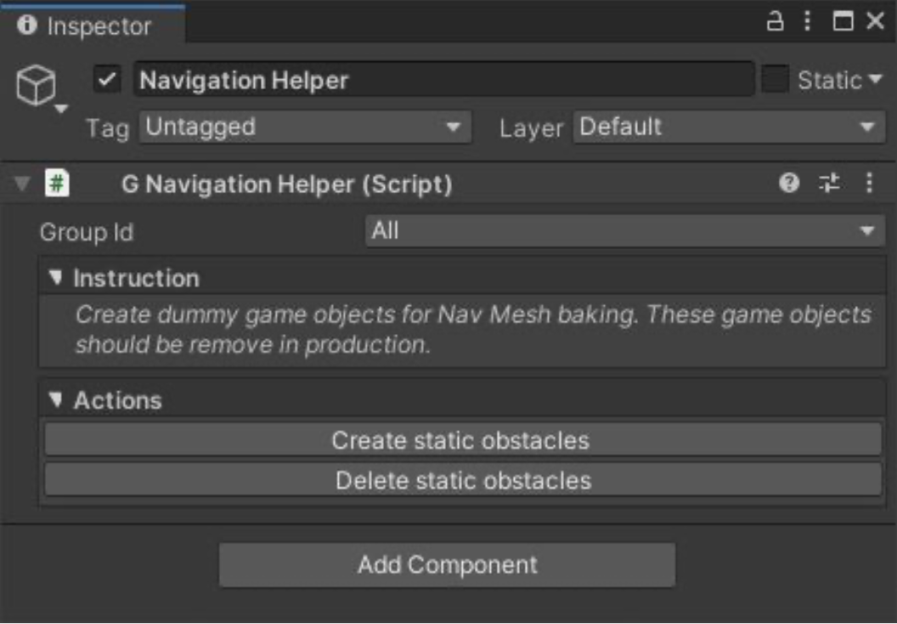
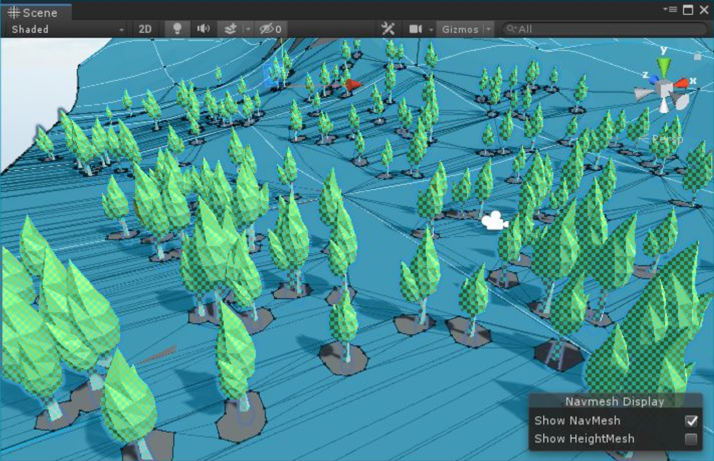

# Prepare For Baking

## Mark geometry as static

在 editor 执行 baking 之前（例如 Lightmap baking），你必须标记 terrain geometry 为 static。然而，包含 geometry mesh 的 game objects 被从 Hierarchy 中隐藏了，以防止 clustering，你不应该标记 terrain game object 为 static，因为它还包含其他类型的 components，流入 tree collider。

要正确地标记 geometry 为 static，选择 Window > Polaris > Project > Settings,​ 然后选中 Show Geometry Chunks In Hierarchy.​ 一个名为 ~Geometry 的 child game object 将会出现，标记它为 static，然后选择 “Yes, change children”.

## Nav Mesh baking

Terrain geometry 被自动标记为 Navigation Static，因此它可以被 Unity Navigation System 获取。然而，Polaris 渲染的 trees 不是 game objects，因此 Unity 不知道如何在 navmesh carve holes 以得到更精确的结果。幸运的是，Polaris 提供了一个 helper tool 帮助你处理这个问题。在 GameObject > 3D Object > Polaris > Tools > Navigation Helper​ 来创建它。

在 baking nav mesh 之前，点击 Create static obstacles，它会在你的 trees 所在的位置创建一些 dummy game objects，因此 Unity 会知道如何在 nav mesh 上 carve holes。

一旦你满意结果，记得点击 Delete static obstacles 来删除那些 dumpy game objects。
