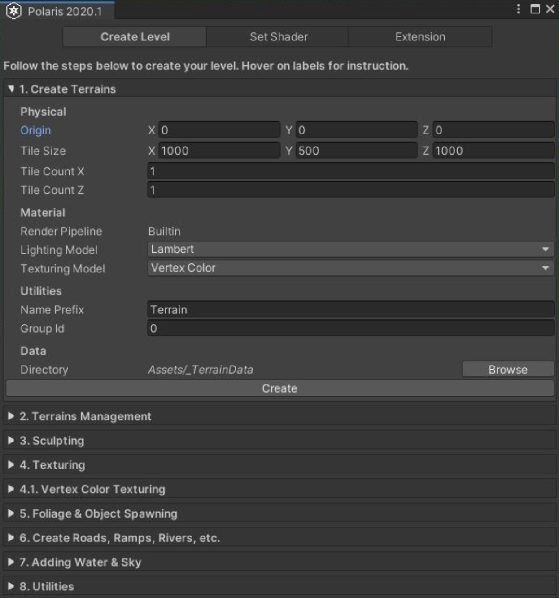
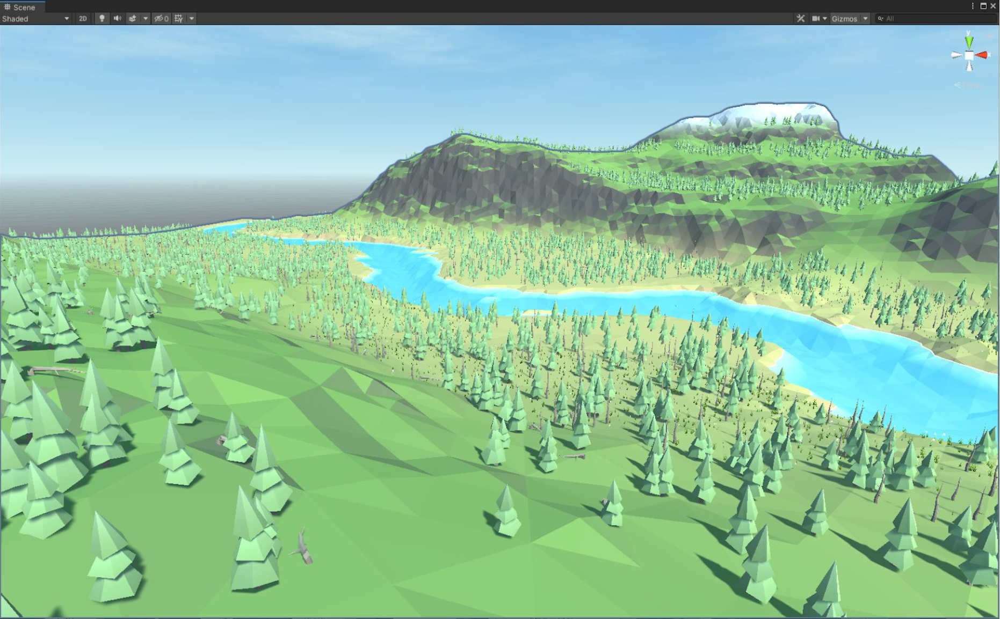

# Quick Start

## Main structure

Polaris 的 核心架构 被设计为支持 multi-terrains 编辑，和 GPU 处理。

场景中每个 terrain 由两个部分组成：terrain 组件 和 terrain data asset。Terrain component：负责数据并创建 terrain mesh。

Terrain editing 工具没有和 terrain 组件组合在一起。它们是分离的组件，editing 工具只用来修改 terrain 数据。有一些预制的工具可以直接使用：

- Geometry & Texture Painter：雕刻 geometry，喷涂颜色 color、金属度 metallic、平滑度 smoothness、splats（层叠）等等到 terrain surface
- Foliage（植被） Painter：喷涂 trees 和 grasses
- Object Painter：生成 game objects 到场景中
- Spline：创建样条曲线，并执行诸如生成 ramps（斜坡），paint path（喷涂路径），clear foliage（植被清除路径）等等
- Geometry Stamper：Stamp 在 geometry surface 起作用，使用一些基本数据操作来 blend 结果，例如 add，subtract，min，max，linear interpolation 等等
- Texture Stamper：Stamp（戳）texture/color 到 surface 上，使用更多的过程化 blending 方法，例如 height-based，slope-based 或 nois
- Foliage Stamper：类似 Texture Stamper，但是不是 stamping texture，而是 stamp trees 和 grasses
- Object Stamper：使用一些过程化规则，在 scene 中生成 gameobjects

## Wizard

Polaris 提供一个 Wizard window 来帮助你以最常用的工具开始。右键点击 Hierarchy，选择 3D Object > Polaris > Terrain Wizard 打开它。

你应该自上而下遵循其中的步骤。每一步将会有一些指令帮助你:

1. Create Terrains
2. Terrains Management
3. Sculpting
4. Texturing
  - Vertex Color Texturing
5. Foliage & Object Spawning
6. Create Roads, Ramps, Rivers, etc
7. Adding Water & Sky
8. Utilities

## Shading styles

Polaris 支持广泛的 shading styles，从 geometry-based（height，slope） gradient lookup，albedo metallic，splat map blending，到 vertex color。一些 terrain tools 只用于特定 shading style。有一个 wizard tool 来帮助你配置 material。

Package 包含了 3 个 lighting model：

- PBR：physical based，最高视觉质量，最昂贵的光照模型
- Lambert：简单 lighting，没有 specular（高光）
- Blinn Phong：简单 lighting，带有 specular

### Gradient Lookup

这个 shading 模型使用两个渐变 gradients 基于 vertex 高度和 normal vector 着色。这两个 gradients 使用一个 curve 被 blended 一起。

这是最简单地过程化着色 terrain 的方式。你还可以在上面绘制一个额外的 albedo layer，用于 roads 和 fine details。

### Color Map

这个 shading mode 使用一个 albedo map 用于整个 terrain。适合小的 terrains，并且不需要太多细节。

### Splates

类似 Unity terrain，它使用多个 textures 彼此叠加在上面，被 control/alpha maps blended 在一起。这个 model 可以提供最高的细节等级，尤其是在近距离时。

有 3 个 sub-model：

- 4 Splats：最多使用 4 个 splat textures
- 4 Splats 4 Normals：最多使用 4 个 splat textures 以及 normal maps
- 8 Splats：最多使用 8 个 splat textures

你可以使用 MicroSplat Integration 来使用更多 splat textures 和更多 shading effect。

### Vertex Color

为 terrain 使用 vertex color channel。当生成 terrain geometry 时，Vertex colors 从 albedo map 读取。它可以为每个 triangle 产生比 Color Map mode 更明锐 sharper 的颜色。

## Main asset

有一些你需要关心的 asset 类似：

- Terrain Data：包含一个 terrain 的相关数据，例如它的 height map，material textures，foliage instances，和其他 setting。一个新的 instance 在你创建 terrain 时被创建。每个 instance 将会被赋予一个 ID 用于一些目的。**不要复制这个 asset**，这不会工作。相反地，使用 data export/import 来复制数据。
- Terrain Generated Data：包含生成的 geometry meshes。你不需要提交这个 asset 到 version control，因为它可以使用 terrain data 重新生成。这个 asset 被自动创建。
- Splat Prototype Group：包含一个 splat texture 集合，可以被在多个 terrains 之间共享。在 Project Window > Create > Polaris > Splat Prototype Group 来创建一个。
- Tree Prototype Group：包含一个 tree prefabs 集合和相关事情，可以在多个 terrains 之间共享。在 Project Window > Create > Polaris > Tree Prototype Group 创建一个。
- Grass Prototype Group：包含一组 gress texture 和 detail object prefabs 以及相关事情，可以在多个 terrains 之间共享。​在 Project Window > Create > Polaris > Grass Prototype Group​ 创建一个。

既然 Polaris 支持 multi-terrain 编辑，一些属性例如 splat textures 和 foliage prototypes 没有绑定到单个 terrain 上。相反地，它们被配置为一个 asset object 作为一个 gallery，然后 asset 被赋予到 scene 中的多个 terrain。

## Undo and Backup

Polaris 提供一个自定义 Backup System 来帮助你更好地编辑 history。在 Window > Polaris > Tools > Backup 打开 Backup editor。

Polaris 将会记录你的 terrains 修改后的 snapshot。每个 shapshot 将会有个一名字，依赖你进行的操作。注意这个系统是非线性的，这意味着你可以在 History list 中的任何一点恢复数据，通过点击那个 entry。History entries 在 Unity Editor 关闭后背清除。

还可以使用 Ctrl + Z 和 Ctrl + Y 像通常那样执行 undo/redo。

区别于 History snapshot，一个 Backup 会将所有数据写到 disk 上，这使它可以在不同的 editor sessions 之间保持。使用 Create foldout 来执行 backup。Backup 文件被存储在 GriffinBackup 目录中。

**这个系统只记录 textures 和 foliage data，其他 numeric values 不会被记录。**

## Frequently used editor menus

可以在下面的 editor menu 中找到 Polaris 功能：

- Assets > Create > Polaris > ...:​ 创建 Polaris 特定 assets，例如 Terrain Data，Splat Prototypes Group，Foliage Prototypes Group 等
- GameObject > Create > 3D Object > Polaris > ...​: 在 scene 中创建 terrains 和 terrain tools GameObject
- Window > Polaris > ...: 打开额外的 editor window，或者配置 Polaris global settings

## Maximize performance

Polaris 不需要按照任何额外 package/asset 就可以工作得很好，除了 URP support 扩展。

但是为了最大化它的性能和可能性，考虑看着这些 packages/assets：

- Unity Burst Compiler：得到更快的 geometry generation 和 foliage rendering
- Editor Coroutine：在 editor mode 开启 time-sliced generation
- Shader Graph：自定义 URP 的 shader
- Amplify Shader Editor：为 Builtin RP 自定义 shaders
- MicroSplat 和 MicroSplat-Polaris integration：添加更高级的 terrain shaders
- Vegetation Studio Pro：更多生成和渲染 foliage 的选项，而不是使用默认的选项

