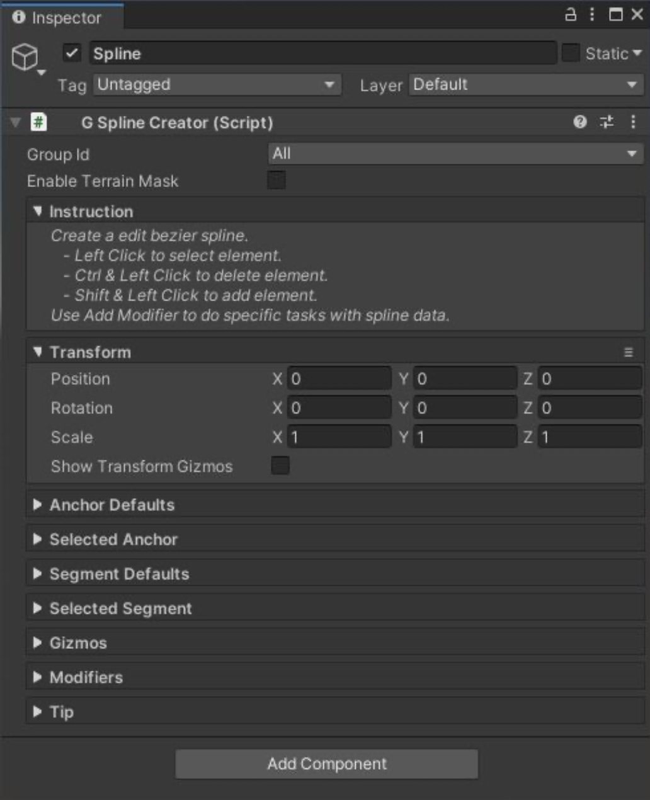

# Spline Creator

Spline Creator 是一个有用的工具来沿着一个 spline 执行一些特定的操作，例如生成 ramp（斜坡），绘制路径 path，或者生成 trees 等等。

G​ameObject > 3D Object > Polaris > Tools > Spline​ 来创建 Spline Creator 到 scene 中。

Spline 保存一个它通过的 anchor points 列表以及一些连接它们 anchors 的 segments。当使用 spline 时，有一些操作：

- Left Click: 选择一个 Anchor 或 Segment
- Shift Click: 添加一个新的 Anchor，这个 anchor 将会被自动连接到选中的 anchor，并且可能创建一个新的 branch 分支
- Shift Click between 2 anchors: 连接两个 anchors
- Ctrl Click: 移除一个 Anchor 或 Segment
- Ctrl Click on the dotted line: 将 Anchor 对齐到 surface 

每个 Anchor 有它自己的 position，rotation，和 scale。你可以想 GameObject 一样修改这些信息（在 scene view 使用 transform tool，使用 WER 来切换 modes）。如果你想要一个精确 value，使用 Inspector 中 Selected Anchor section 下面列出的属性。

Spline tangents 是 per-segment basis（基于逐 segment），因为它支持分支 branching。选择一个 segment，并移动它的 tangents 来 bend spline。如果你想要一个准确的 value，使用 Inspector 中 Selected Segment section 下面列出的属性。

Inspector 中每个属性的细节：

For Transform:

- Position/Rotation/Scale: Spline object 自身的 transformation
- Show Transform Gizmos: 显示 gizmos 来 translate，rotate，或 resize 整个 spline

For Anchor Defaults:

- Position Offset: 当 anchor 被创建时，添加到 anchor position 的一个 offset，类似 “在 ground 上 1 米创建一个新的 anchor”
- Initial Rotation: 当 anchor 被创建时，anchor 的 rotation
- Initial Scale: 当 anchor 被创建时，anchor 的 scale

For Selected Anchor:

- Position/Rotation/Scale: Anchor 在 spline local space 的 Position/Rotation/Scale

For Segment Defaults:

- Smoothness: spline 细分因子（subdivision factor），更大的数值产生更平滑的 spline，但是需要花费更多时间去处理
- Width: 当 operations 使用全部 strength 时，spline 的宽度
- Falloff Width: Spline 两端 width 上 operations fade 的 falloff

For Selected Segment:

- Start Tangent: 第一个 tangent 在 spline local space 的位置
- End Tangent: 第二个 tangent 在 spline local space 的位置

For Gizmos:

- Show Mesh: 确定是否在 scene view 中可视化 spline mesh

Spline Creator 只负责创建基本 spline。要在那个 spline 上应用 operation，你必须添加一个 Spline Modifier，通过点击 Add Modifier：

- Ramp Maker: 通过修改 terrain Height map 生成一个 ramp
- Path Painter: 通过在 Albedo 或 Splat map 绘制来生成一个路径 path
- Foliage Spawner: 沿着 path 生成 trees 和 grasses
- Foliage Remover: 沿着 path 清理 trees 和 grasses
- Object Spawner: 沿着 path 生成 prefab instances
- Object Remover: 沿着 path 移除 prefab instances

这个 tool 的一个特殊事情是，它允许你在应用到 terrain 之前查看结果，最小化反复试错的过程。

尝试这些参数，查看它如何工作。一旦对它满意，点击 Apply 完成。

