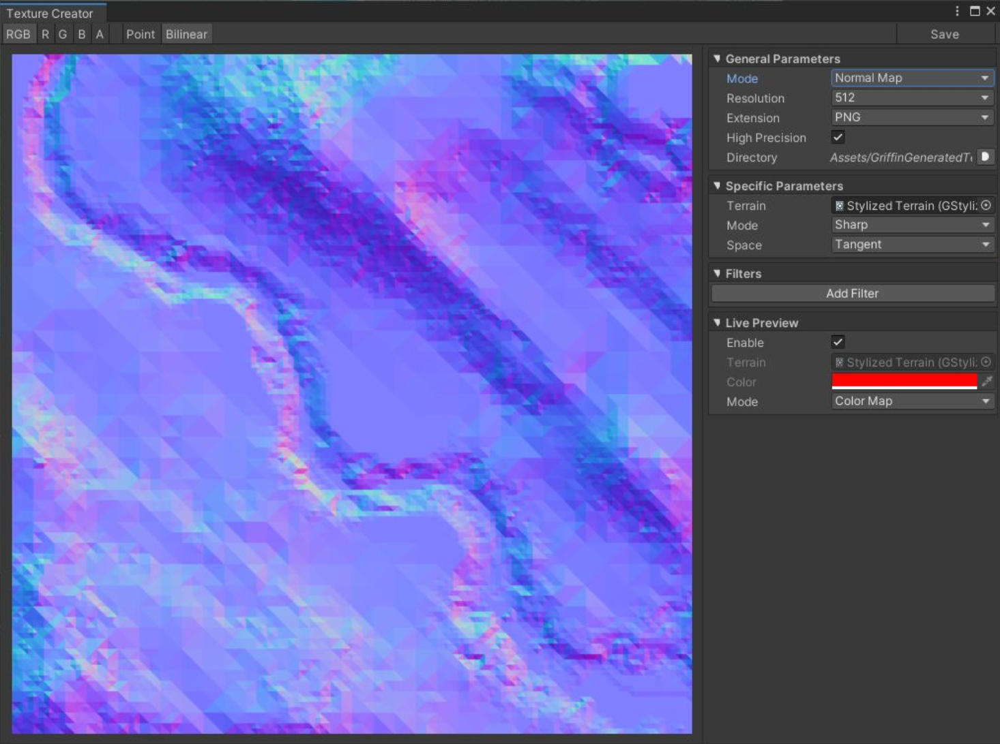

# Texture Creator

Texture Creator 是一个直观的方法来创建 terrain textures，以及高级 masking。

在 Window > Polaris > Tools > Texture Creator 打开窗口。

## Toolbar

Toobar 在 window 的顶部，你可以在 view modes 之间切换，并且保存 texture 到 asset。

- RGB/R/G/B/A: 在 full color 或 per channel view 中切换
- Point/Bilinear: 在 point 或 bilinear filter mode 之间切换
- Save: 保存 texture 到 asset

## General Parameters

这个 section 决定 generation mode，以及在 modes 之间共享的属性

- Mode: 生成何种 texture
- Resolution: texture 的大小
- Extension: 保存到 asset 的 Image 文件扩展名（PNG，JPG，EXR，TGA）
- High Precision: 确定是否使用 floating point（HDR） texture，应该为 height map，mask 和 normal map 生成开启，因为它们包含非颜色数据
- Directory: 保存的 Image 的位置

## Specific Parameters

这个 section 显示特定于每个 generation mode 的属性。

### Height Map

从 terrain 导出高度数据。

- Terrain: 要导出 height map 的 terrain，只有 elevation（RG chanel），sub-division 和 visibility 被忽略
- Real Geometry: 选中以导出一个 sharp edged height map

### Height Map From Mesh

Generate a height map using custom mesh, useful for stamper mask, or third-parties’ terrain meshes.

使用自定义 mesh 生成一个 height map，用于 stamper mask，或者第三方 terrain meshes。

- Mesh: 要导出数据的 mesh
- Offset: 相对于 camera 的 mesh Position
- Rotation: mesh 的 Rotation
- Scale: Scale of the mesh.
- Depth: 控制 grayscale range 的 strength
- Fit Camera: 自动 fit mesh 到 texture 

### Normal Map

从 terrain geometry 或 height map 导出一个 normal map。

- Terrain: 要导出 texture 的 terrain
- Mode: 选择 Sharp，Interpolated，或 Per-Pixel 的 normal map
- Space: 选择 Local 或 Tangent space

### Steepness Map

Extract slope steepness（陡峭程度） data from a terrain.

从一个 terrain 导出 slope steepness 数据

- Terrain: 要导出 texture 的 terrain
- Mode: 选择 Sharp, Interpolated or Per-Pixel 法向量

### Noise Map

生成一个 noise map，用于添加 fine detail 到 terrain 上，或用作 height map

- Type: noise 类型， Perlin, Ridged, Voronoi, 等等
- Origin: noise 坐标偏移
- Frequency: 确定 noise detail 的 size，更高的频率产生更小的细节
- Lacunarity: 确定每个 layer/octave 的 frequency increment
- Persistence: 确定每个 layer/octave 的 amplitude 的 decrement
- Octaves: 叠加的 noise layers 数量
- Seed: A random seed.

### Color Map

从 splat data 生成一个 color map，称为 Base Map，或 Mega Texture

- Terrain: The terrain to extract.

### Blend Map

执行一些基本 texture blending 操作用于 masking。点击 Add Layer 来添加一个 blend layer。对于每个 layer：

- Source: Blend 数据源，来自一个 Texture，或者一个常量，或者一个向量
- Texture: 用于混合的 texture 
- Number: 用于混合的常量
- Vector: 用于混合的向量
- Operation: 要应用的操作
- Factor: 在两个 layers 之间插值的因子，在 Lerp mode
- Mask: 在两个 layers 之间插值的 mask，在 Lerp mode

### Foliage Distribution Map

Extract a distribution map from trees and grasses.

- Terrain: The terrain to extract.
- Brush: Brush texture to paint at each location.
- Opacity: Brush opacity.
- Size: Size of the brush, in normalized space.
- Rotation Min/Max: Rotation of the brush.
- Trees: Tree prototypes to extract.
- Grasses: Grass prototypes to extract.

## Filters

这个 section 包含一个 image filters 的 stack（叠加）用来操作生成的 textures。这个 stack 自顶向下应用，每个 layer 可以通过选中 Enable box 被忽略。点击 Add Filter 来添加一个 layer。

### Curve

使用 curves remap color 数据。

- Master: master curve, remapping 每个 channel 之后应用
- Red/Green/Blue/Alpha: Remap 每个 channel 的 value

### Blur

应用一个高斯模糊效果，这个 filter 是很昂贵的。

- Radius: 模糊半径

### Invert

翻转每个 channel 的颜色（1 - value）

- Red/Green/Blue/Alpha: Invert each channel, selectively.

### Step

Apply a value stepping/snapping effect, useful for creating a terraced heightmap, for example.

应用一个 stepping/snapping 效果，例如可以用来创建一个梯田 heightmap

- Count: The number of steps，阶梯的数量

### Warp

Apply a normal map based image warping.

基于 image warping（弯曲） 应用一个 normal map。

- Mask: 使用的 normal map
- Is Normal Map: 这个 mask 是否已经是一个 normal map？uncheck 以使用一个灰度 image 
- Strength: effect 的强度

## Live Preview

这个 section 在 scene view 控制 Live Preview

- Enable: 切换 Live Preview on/off
- Terrain: 应用 texture 的 terrain，在一些 modes 中会被自动采用 
- Color: Mask mode 中 mask 的颜色 Color of the mask in Mask mode.
- Mode: Render mode, Mask, Color Map or Geometry.

## Texture Importing

保存的 textures 使用默认的 importer 被导入，它将被认为是一个 color 纹理。对于特定用途，例如 normal map 或 height map，你必须手动调整 importer。

建议的 heightmaps 和 masks 的格式是 R16.

