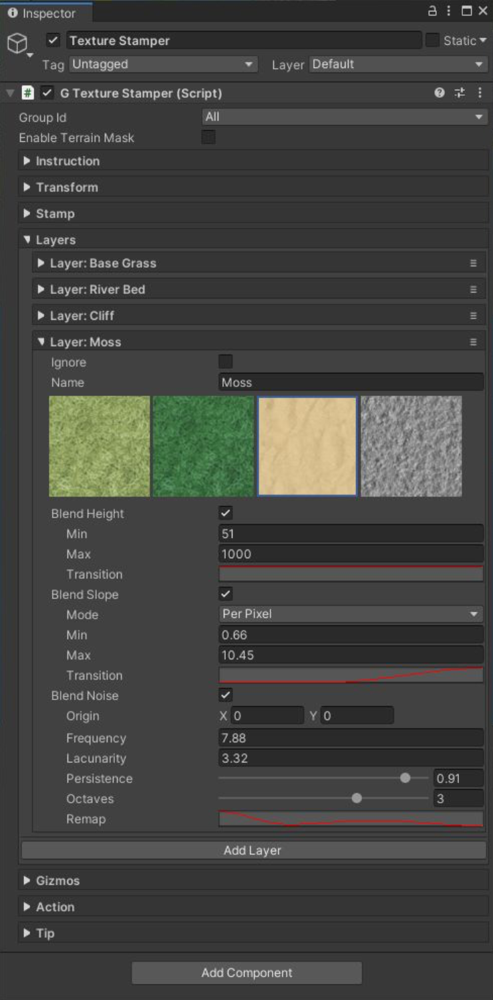

# Texture Stamper

相比于手动绘制，Texture Stamper 让你在 terrain surface 执行过程化 texturing。

​GameObject > 3D Object > Polaris > Tools > Texture Stampers​ 添加一个 Texture Stamper。

Texture Stamper 还有在 Geometry Stamper 中描述的基本 properties 来定义这个 shape。

这个 stamper 允许你在两个 channels 中的一个 stamp：

- Albedo Metallic Smoothness
- Splat

还有，它有多个 stamp layers 构成，它们将会被一个一个应用到 surface。要添加一个 stamp layer，点击 Add Layer。

每个 stamp layer 有它自己的 properties：

- Ignore: 跳过当前 layer
- Name: layer 的名字，用于更好的管理
- Color: 要应用的颜色，只在 Albedo Metallic Smoothness mode 可用
- Metallic: 要应用的 metallic value，只在 Albedo Metallic Smoothness mode 可用
- Smoothness: 要应用的 smoothness value, 只在 Albedo Metallic Smoothness mode 可用
- Splat: 要应用的 texture，只在 Splat mode 可用
- Blend Height: 确定是否使用 height-based blending
- Height Min/ Height Max/ Height Transition: 定义满足 height condition 的 region（应用 stamper）
- Blend Slope: 定义是否使用 slope-based blending
- Slope Mode: 在 Sharp，Interpolated，Per-Pixel normap map 之间选择
- Slope Min/ Slope Max/ Slope Transition: 定义满足 slope 条件的区域（应用 stamper）
- Blend Noise: 决定是否生成一些 Perlin noise 来添加一些随机性
- Origin / Frequency / Lacunarity / Persistence / Octaves: 基本 Noise 属性，你可以在网络上找到对它们的解释
- Remap: remap noise value 来创建更有趣的效果

你可以有多个 layer，尝试它们，一旦满意结果，点击 Apply 完成。

