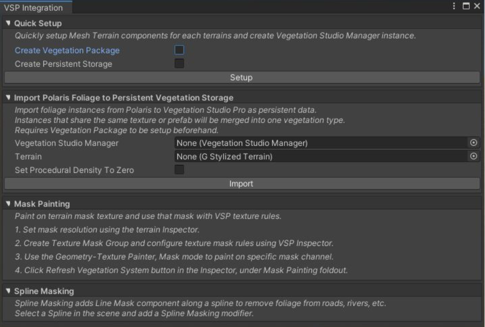
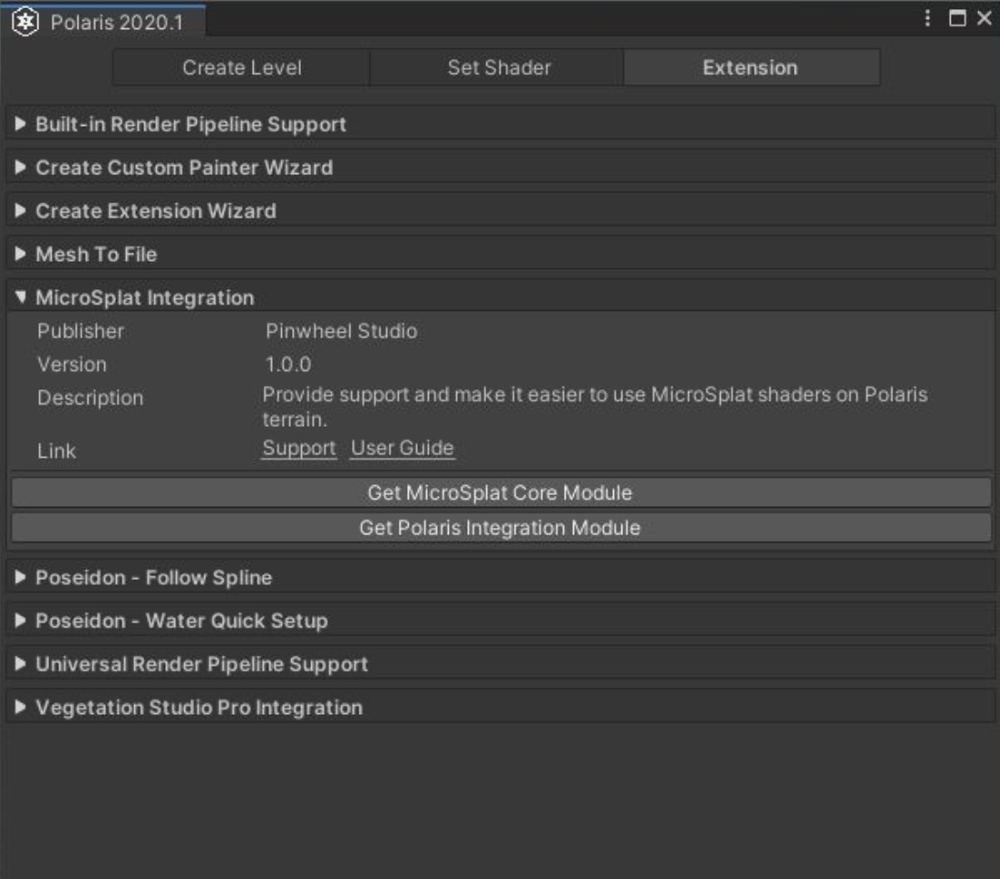
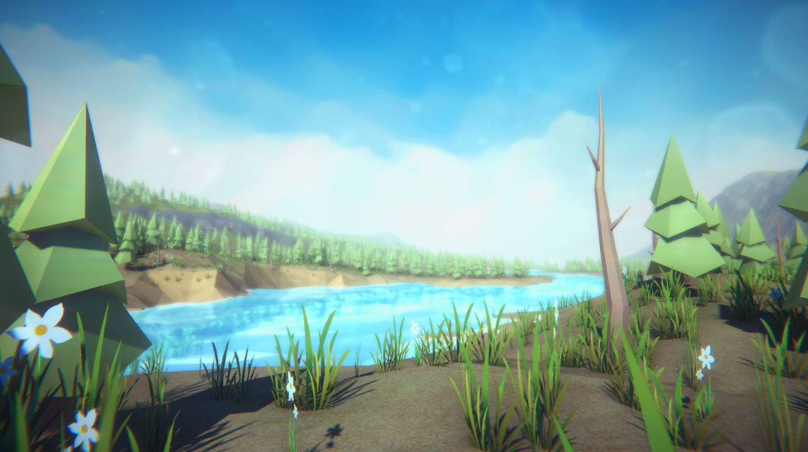
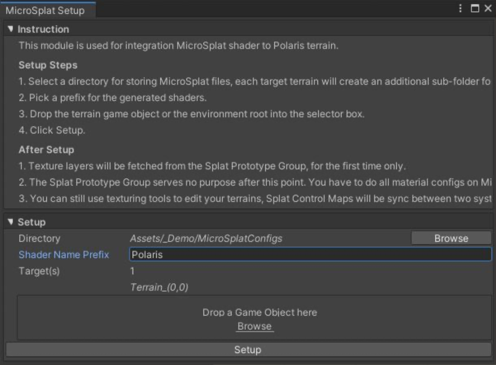
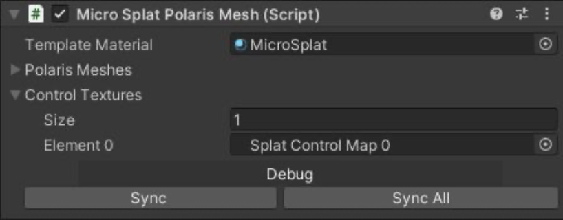
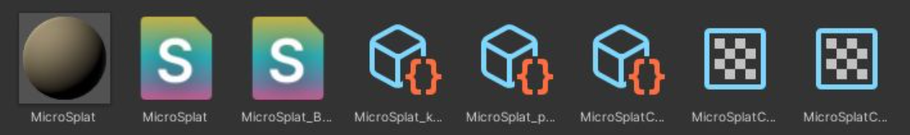
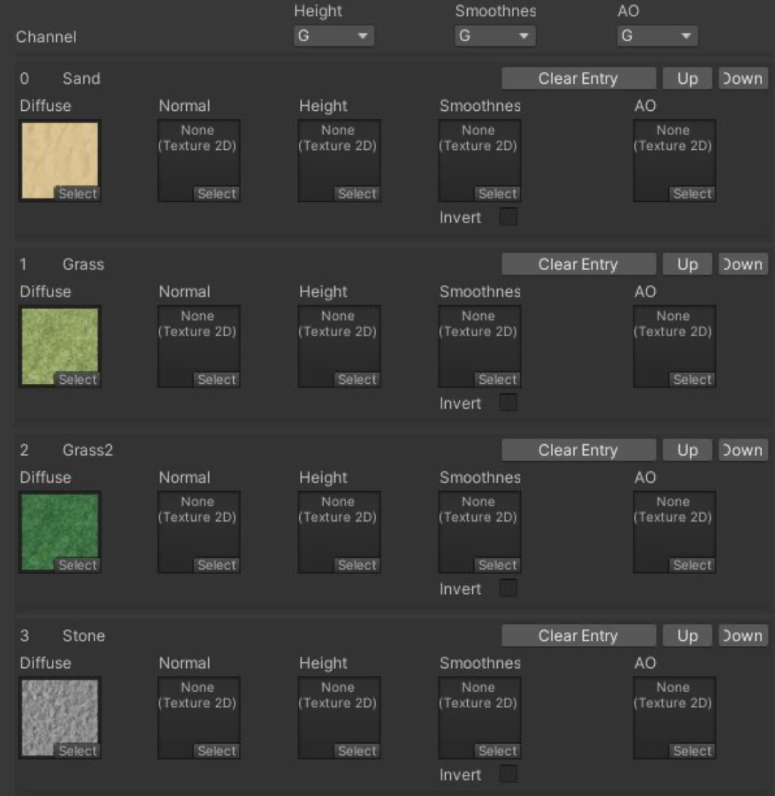
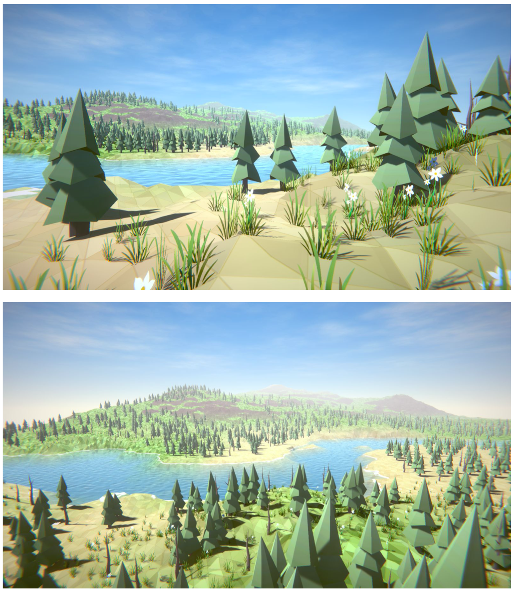

# Third Parties Assets Support

## Amplify Shader Editor

Most of the terrain and foliage shader in Builtin RP are made with Amplify Shader Editor (ASE), so you can visually edit and tailor them to your special needs.
To open these shaders as graphs, you need to import ASE first. If you don’t have ASE yet, get it here: ​http://bit.ly/2Bq79CX

## Vegetation Studio Pro

Vegetation Studio Pro integration provides handy wizards and tools to help you switch from Polaris foliage renderer to VSP.

### Installing VSP and the extension

Download ​VSP a​ nd the ​VSP Integration extension​ package via the Asset Store.
Go to W​ indow>Polaris>Tools>Vegetation Studio Pro Integration​ to open the editor.

Follow the instructions provided in the window to perform integration tasks.

## MicroSplat

MicroSplat integration enhances your terrain shading with several techniques that offer high visual fidelity and performance.
The integration also provides tools for quickly setting up your terrain to be used with MicroSplat, as well as texture synchronization between the two systems, so texturing tools will work as usual.
Please carefully read and follow the instructions below for correct usage.
Installing MicroSplat and the extension
Open the Extension window by going to ​Window>Polaris>Tools>Extensions.​
In the Extension window, look for the​ MicroSplat Integration​ entry:

Click on ​Get MicroSplat Core Module and ​Get Polaris Integration Module to download and import necessary packages. Or you can use the following links directly:

- MicroSplat Core Module.​
- Polaris Integration Module​.

### Setting up your terrain

Next step is to connect Polaris terrain to MicroSplat system. Let’s take the Demo_00 scene as an example.

Open the Demo_00 scene and select the terrain game object in the Hierarchy.
In the Inspector, you will there is an additional section called MicroSplat Integration, expand it and click Open Editor:

Select a directory for storing MicroSplat data, type in a prefix for new shaders, drop your terrains into the box, then click Setup.
After the process, make sure you see the following things:

- A new component Micro Splat Polaris Mesh is added to the terrain, with the splat control map(s) assigned.

  

- In the selected directory, there are several files created.

  

- Select the MicroSplatConfig asset, the terrain splat layers are set. Note that they only be set for the first time setup, if you want to add more or edit splat layers later, you have to use MicroSplat editor instead.

  

At this point, Polaris has been linked with MicroSplat to render the terrain. All tasks related to splat layers, material editing, etc. should be performed using MicroSplat editor and follow its instructions.

Note:​ In case you want to restart from the beginning, make sure to delete the Micro Splat Polaris Mesh component and the files generated by MicroSplat before proceeding.

### Result

The images below utilize MicroSplat Core module and Low Poly Look module to achieve its style.

