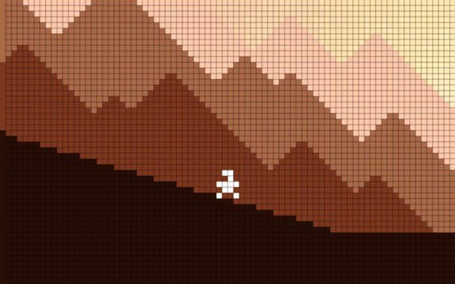

# Extension

## Camera Window

提供了 camera space 中的一个矩形区域，target 在矩形内移动可以不改变 camera 的位置。但是超出矩形区域时，就会移动 camera 使得 target 重新位于矩形区域内。


## Cinematics

Cinematics 允许你创建简单但强大的 cinematic sequence。它添加任意数量的 cinematic targets 到它的 editor 中，并为每个 target 定义参数。然后你可以在游戏中的任何时候 play or stop cinematics，而 camera 将会平滑地按顺序 transition 它的 regular targets，and vice-versa。如果你想要在 scene 中拥有多个 cinematics，你只需要添加多个 ProCamera2DCinematics 组件到 camera。


## Content Fitter

帮助你控制游戏在不同 size 和 aspect ratios 的 screen 上显式。定义一个 target height，width，或者 aspect ratio，然后让这个 extension 为你关心剩下的事情。


Fixed Width


Fixed Height


## Forward Focus

补偿 target 运动，通过添加一些空间到 target 的前面，以便可以关注前面将出现什么。这是绝大多数 2D 动作游戏的必备功能。


## Geometry Boundaries

使 camera 和任何 Layer parameter 定义的 layer 上的 3D collider “collide”。这允许你使用 walls 或任何其他 3D collider 定义 camera 的边界。小心放置你的 colliders 放置使 camera 卡住，并且避免使 camera 在开始位于 collider 内部。这些 colliders 应该被放置在 Z = 0 上，如果你使用 XY 坐标轴，或者其他坐标轴等价的 第三轴。


## Limit Distance

防止你的 target 离开屏幕区域。例如，如果你有一个非常平滑的 camera 运动，如果 player 移动地过快，它可能运动到屏幕之外。使用这个 extension，target 将会 push camera 以便总是位于可视区域内。


## Limit Speed

防止 camera 移动过快超过一个特定速度。可以被用来防止由特定 targets 引起的快速移动。

Extension 每个都是限制某一方面，因此通常会组合多个 Extension 来完成最终的 camera 行为。


## Numeric Boundaries

防止 camera 移动超过定义的限制。即 camera 只能在指定 world 区域内移动，其他 extension 总是跟随 target。为 camera 定义一个世界中的限制。

这个 extension 非常简单，但是同时非常灵活。例如，你可以用它 animate left boundary，并生成一个 auto-scrolling level。此外还有一个 soft boundaries 选项（称为 smooth edges，它在 camera 到达停止边界时，为 camera 运动提供了一个额外的 polished result。


## Pan And Zoom

非常适合 RTS 或任何 player 可以控制 camera 的游戏。Pan And Zoom extension 提供了广泛的选项来手动 moving 和 zooming camera。

注意，使用这个扩展时，最好不要设置任何 camera targets，使得 camera 知道 follow 什么。如果需要，你可以总是临时关闭这个 extension，并在运行时添加和移除 targets。


## Parallax

为 ProCamera2D 赋予创建流行的 2D 效果的能力。它通过使一个使每一个 parallax layer 拥有一个 camera 来到达想要的效果。每个 layer camera 只渲染包含在相应的 Culling Mask 中的元素。然后这些 camera 以不同的速度移动，来创建视差 parallax 效果。

使用 parallax 组件 editor，你可以添加，移除，和排序 layers。editor 将会负责关心按照需要创建 cameras 并调整每个 camera 的渲染设置。


### Considerrations

- layers 应该按照从后到前排序。使用左边的 handlers 来移动它们
- layers speed 应该是递增的 ascending，例如一个 back layer 应该被它前面的 layer 移动的更慢
- speed 小于 1 的 layers 意味着 layer 元素将被渲染在 Main Camera elements 之后。speed 大于 1 的 layers 元素渲染在 Main Camera elements 之前
- 每个 layer 的 Culling Mask 应该是唯一的，以避免在多个 camera 上绘制相同的元素。这同样应用到 Main Camera 的 Culling Mask，你必须手动设置它，例如需要从 Main Camera 中关闭 parallax layers 的 Culling Mask

Culling Mask 是包含或忽略要渲染的 objects 的 layers。

## Pixel Perfect

确保你的 pixel-art sprites 总是尽可能清晰的显示。如果你制作 pixel-art 游戏，可以使用这个扩展。



### Considerations

要达到 pixel perfect 结果，你还应该设置 render setting：

- 关闭 anisotropic filtering
- 关闭 anti aliasing

在你的 sprites 上：

- 确保你使用无损压缩
- 关闭 mipmapping
- 使用 Point sampling

## Pointer influence

Pointer influence 只不过是 camera 上一个从 camera 中心到 player pointer（mouse 或 finger）的 influence。你可以控制每个 axis 上对 camera 的 influence。这是最简单的扩展，它是学习如何制作你自己的 ProCamera2D 扩展一个很好的开始。例如，如果你的游戏使用一个 controller，它应该可以非常直接地适配现有代码。


## Rails

允许你定义一个 path，你的 camera 将会跟随相应的 targets 位置。

It’s great for situations where you need that extra control over the camera position but still want the player to dictate its position。

理解它的一个关键方面是，你真正限制到 path 上的东西是一个 target，而不是 camera 自身。这意味着你需要添加自己的 targets 到 Rails extension editor，并将它们从正常的 ProCamera2D camera target list 中移除。

在正常的 camera 运动上再加一层 influence。


## Repeater

允许你使用任何一个 GameObject 并按照需要重复它来水平或垂直覆盖整个 screen。意味着你可以轻松地达成任何种类的无限 background。

只需要选择你想要重复哪个 object，定义它的左下角的位置，它的 size，就可以了。


## Rooms

允许你在 scene 中定义一个 rectangular areas，类似 numeric boundaries。每个 room 可以有不同的 size 和 transition settings，导致一个非常广泛的可能的配置。使用这个 extension，你可以容易地 recreate 老式塞尔达风格 linear room transitions，或者更现代的 Limbo。

当移动到一个 room 时，camera 移动到这个 room 的边界内。


## Shake

创建所有种类不同的 camera shake 效果。你可以创建 shake effects。你可以创建应用一次或者多次的 shake effects，例如爆炸或者枪械开火。或者你可以创建在特定时间内开启的持续 shake effects，例如手持相机效果，或者一个长时间的地震。Shake editor 简单列出当前 scene 中所有可用 presets。要创建新的 preset，点击 Create ShakePreset 或 Create ConstantShakePreset。它们将自动添加都 list 中。然后你独立地选择每个 preset，并调整其 values。所有 presets 存在于它们自己的文件中，并且所有 changes 甚至在运行时被保存。这样，你可以在运行时测试你的 shakes，并调整直到你找到完美的 values。

一次 shake 示例（爆炸）


Constant shake 示例（手持相机）


## Speed Based Zoom

基于 targets speed 自动 zooms in/out。这非常有用，例如，在一个 racing game 中，camera 在 car 加速时 zoom out，在停止时 zoom in。


## Transitions FX

允许你为 camera 创建 in/out 出现动画。使用一个非常 cool 和 smooth transition 进入和离开 scene。Transitions 使用 shaders 完成，并将会添加更多。

如果你在运行时修改 extension，之后你需要调用以下方法：

- UpdateTransitionsShaders
- UpdateTransitionsProperties
- UpdateTransitionsColor


### FX over UI

transitions 可以出现在 Unity standard UI 之上。

## Zoom To Fit

用于如果你 following 多个 targets 并且它们移动向不同的方向。这个扩展自动 zoom in/out 来确保 targets 在所有时间都可见。


## Trigger Boundaries

Boundaries Trigger 被用于在游戏中改变 camera numeric boundaries。一旦 camera 进入 trigger shape（circle 或者 rectangle），camera transitions 到新的 boundaries 定义。这可以用于各种场景，但是绝大多数情况下可以被用来创建 room constrained cameras，它在 player 穿过 door 时切换相机。一个常见用法是还是在平台游戏中，camera 依赖 player 在哪个 platform 上获得一个新的 bottom boundary。


## Trigger influence

吸引 camera 到一个特定 point。Camera target 越接近 trigger 中心，camera 就越快到达 focus point（关注点）。

Focus point 不必在 trigger 中心。例如，你可以将 trigger 放到 door 附近，把 focus point 旁边的 key 上。当 player 接近 door 时，camera 将会关注到 key。


## Trigger Rails

允许你动态地开启和关闭 Rails 扩展。这种方式中，你可以在一个 action scene 期间给你的 camera 一定的自由，然后将它拉回到 tracks。试验一下它如何满足你的需求。


在上面的例子中，在 trigger 中，关闭 rails，角色跳跃时 camera 将跟随它，而在 trigger 之外重新开启 rails，camera 重新 follow rails，不会随着 角色跳跃而跳跃。

## Trigger Zoom

用来改变 camera zoom。Camera target 越接近 trigger 中心，它越接近 target zoom size。例如，你可以使用它，当 player 到达一个 boss 时，zoom in，或者当 player 到达一个很大的区域时 zoom out。


## Custom Extensions and Triggers

尽管我们尝试覆盖尽可能多的用例，和广泛的功能，extensions 和 triggers 到 ProCamera2D 中，你还是可能需要在你的游戏中做特定的裁剪。

有两种主要的方法来修改 ProCamera2D 的行为。你可以通过 extensions 或通过 triggers 来完成。唯一的区别是 Extensions 在游戏中没有一个物理的表示，而 Trigger 则有。因此 Extension 组件通常被放在 ProCamera2D 组件上（可能就是 Main Camera），而 Trigger 被放置在场景中的任何 GameObjects 上。

当构建自己的 Extendsion 或 Trigger 时，有两个 classes 可以被扩展来使你的工作更加容易：

- BasePC2D：提供了创建自定义 extension 的需要访问的所有东西。对 ProCamera2D 实例的访问，用于处理基于选择的 axis 转换 vectors 的方法
- BaseTrigger：扩展自 BasePC2D，但是创建了一个 shape（circle 或者 rectange），你可以用来检测你何时进入了 trigger

### Custom Extension

```C#
using UnityEngine;
using Com.LuisPedroFonseca.ProCamera2D;

public class ExtensionExample : BasePC2D
{
    public float ViewDistance = 2f;

    void Update()
    {
        if(Input.GetKey(KeyCode.DownArrow))
        {
            ProCamera2D.ApplyInfluence(new Vector2(0, -ViewDistance));
        }
    }
}
```

效果如下：


当按下 down arrow key 时，向下移动 camera，使得可以看到下面更多的东西。

### Custom Trigger

```C#
using UnityEngine;
using Com.LuisPedroFonseca.ProCamera2D;

public class TriggerExample : BaseTrigger
{
    public Color EnterColor;
    public Color ExitColor;

    protected override void EnteredTrigger()
    {
        base.EnteredTrigger();

        ProCamera2D.GameCamera.backgroundColor = EnterColor;
    }

    protected override void ExitedTrigger()
    {
        base.ExitedTrigger();

        ProCamera2D.GameCamera.backgroundColor = ExitColor;
    }
}
```

效果如下：


## 3rd Party Plugins Support

PlayerMaker

2D Toolkit
