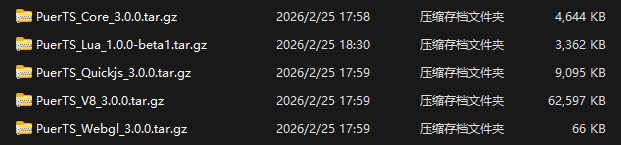
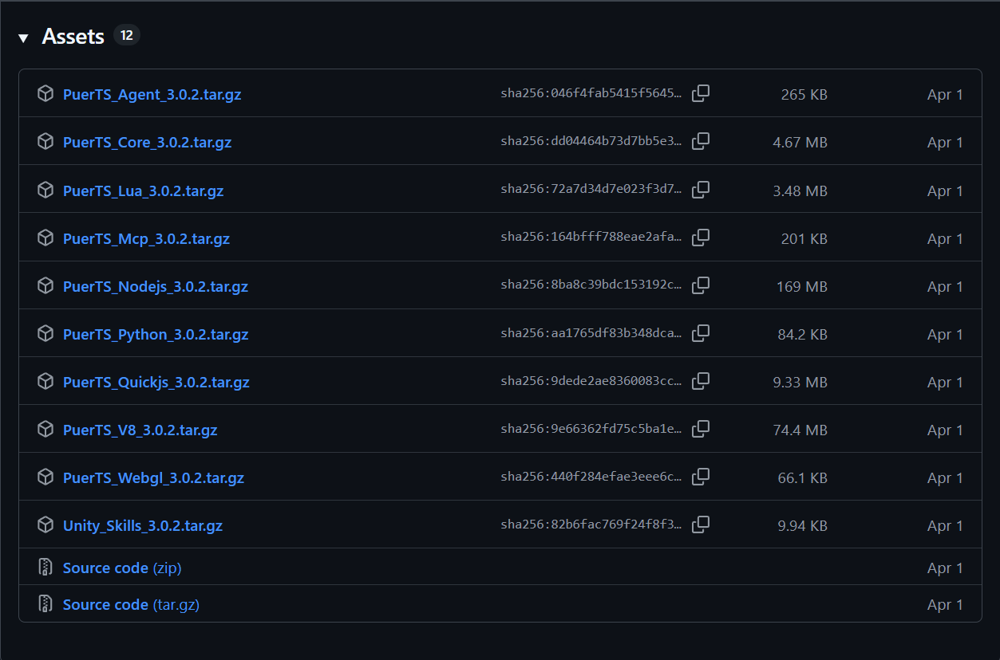
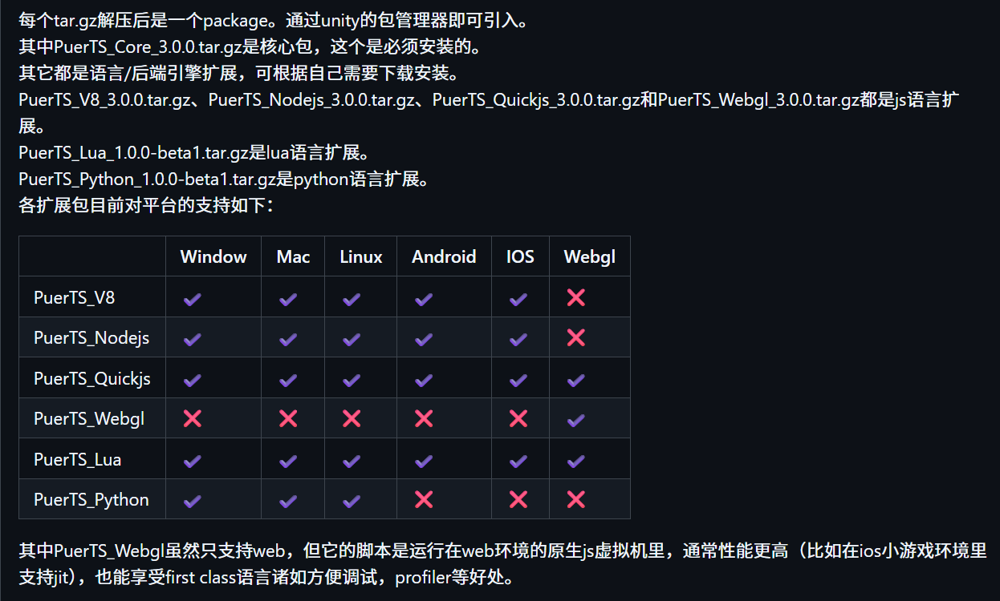
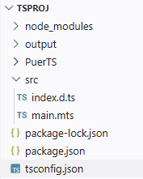
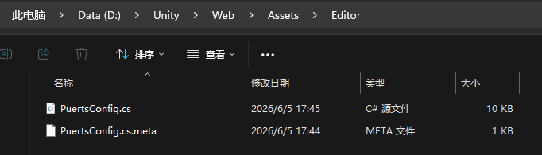

# 代码资源剥离

Unity 打包后，会计算剥离没有用到的代码、资源（材质、shader）等。因此在运行时执行动态脚本调用 api、加载资源可能会失败，因为要调用的 api，要加载的资源可能在 build 中不存在（被剥离了）。例如在脚本中调用 CreatePrimitive 创建的 cube 可能就没有材质，显示为紫色，因为默认的材质、shader 可能因为没有引用而被剥离。

CreatePrimitive创建 Cube 时，确实会给它赋 Unity 内置的 Default-Material，但这个 Default-Material 不是普通资源，它依赖 Built-in 管线的 Standard Shader（或 URP 的 Lit Shader）Default-Material / Default Shader 被包含在构建中。出现紫红色（Unity 的 Internal Error Shader）通常有下面两种原因：

- 打包后 —— Shader / Default-Material 被代码剥离（Strip）
- Unity 打包 Build 时只打包场景/Prefab 中引用到的 Shader

正确做法：运行时主动赋值材质
最稳妥的方案是不要依赖 Default-Material，自己在 JS 里给 Cube 赋一个明确材质：

```
const mat = CS.UnityEngine.Resources.Load("Materials/RedMat");
cube.GetComponent(CS.UnityEngine.Renderer).material = mat;
```

或者添加一个默认的 cube，这会在场景中引用材质、shader。

# Eval 作用

PuerTS 同一个 ScriptEnv 下多次调用 Eval()，是在同一个全局作用域（globalThis）中执行的

- 上一次 eval 声明的变量在 globalThis上存在，下一次 eval 可见
- 第二次 eval 再用 let/ const/ class声明同名标识符，JS 规范直接抛 SyntaxError（重复声明）

这是 PuerTS 已知注意点:

```
PuerTS 官方文档也明确提到这点：Eval相当于在 JS 全局作用域执行代码，多次 Eval声明同名 const/let会抛异常，建议用 IIFE 或模块。

用 IIFE 隔离作用域（最常用）:

env.Eval(@"
(function(){
    const a = 123;
    console.log(a);
})();
");

```

每次 eval 的变量在 IIFE 私有作用域里，不污染 global，也不冲突。

或者推荐用 ExecuteModule("xxx.mjs")

ESM 模块有自己的模块作用域，互不污染。

若真要反复 eval 且改值 — 只用赋值（不重新声明）

```
env.Eval("var a = 1;");   // 第一次
env.Eval("a = 2;");       // 后面只赋值，不用 var/let/const
```

同一个 ScriptEnv 的所有 Eval()共享一个 JS 全局词法环境。​ 

let/const/class不允许同一作用域重复声明，所以第二次 eval 会报错；变量本身上一次是可见的。

开发时建议把 eval 代码包进 IIFE 或用 ExecuteModule。

# TypeScript

TypeScript 不是一门“可直接运行”的语言，它必须先编译（转译）成 JavaScript，才能在运行时环境中执行。

TypeScript ≠ 运行时语言
TypeScript → JavaScript → 运行（Node / Browser / Unity + PuerTS / Deno / Bun）

| 项目 | 说明 |
| --- | --- |
| TypeScript | 静态类型系统 + 语法扩展 |
| 运行环境 | 不能直接运行 |
| 真正执行 | JavaScript |
| 编译器 | tsc/ swc/ esbuild |
| 产物 | .js .cjs .mjs 文件 |
| | |

TypeScript 的核心作用是：

- 在编译期做类型检查
- 在编译期发现错误
- 生成符合目标 JS 版本的代码

常见运行流程:

浏览器 / Node / Unity(PuerTS) 

```
.ts 文件
   ↓ tsc / swc / esbuild
.js 文件
   ↓
JS 引擎（V8 / QuickJS / Hermes / JSC）
```

为什么很多人误以为 TS “能跑”，因为工具链把它们“藏起来了”：
- ts-node：内部先 tsc → js再执行
- ts-node-dev：同上，只是加了 watch

和 Unity + PuerTS 的关系：

PuerTS 里：不能直接加载 .ts 只能加载 .js

通常流程是：

```
TypeScript (.ts)
   ↓ tsc / esbuild
JavaScript (.js)
   ↓
PuerTS (QuickJS / V8)
```

# 安装 PuerTS

在 [github](https://github.com/Tencent/puerts/releases)上下载需要的 package







Core 是必须的，是 PuerTS 的核心，用来支持 Unity C# 环境与脚本环境的交互，无论哪个平台必须安装。Lua、Quickjs、V8、Webgl 都是不同的语言引擎，用来执行各自的脚本环境，Core 负责屏蔽不同脚本环境与 Unity C# 环境的交互，可以支持 Lua、Js、Python 三种语言。此外，Js 有三种不同的引擎：Nodejs、Quickjs、V8。

例如，如果像在 Unity webgl 版本运行脚本，必须按照 Core + Quickjs/Webgl。

# 创建 TS 工程

建议在 Unity 项目根或 Assets 旁建 TS 工程：

```
MyUnityProject/
 ├─ Assets/
 │   ├─ Puerts/
 │   ├─ Gen/Typing/
 │   └─ Resources/js/   ← PuerTS 默认 Loader 读取 .js 的位置
 └─ TsProject/          ← TypeScript 工程（用 VS Code 打开此文件夹）
     ├─ src/
     │   └─ main.ts
     ├─ package.json
     └─ tsconfig.json
```



创建一个 TS 工程，只需要先建立一个空的工程目录（例如 TSProj），然后在根目录下运行初始化命令（类似 git init）：

```sh
# 初始化（在 TsProject/下）：
npm init -y
npm install --save-dev typescript
```

就会创建 package.json 和 tsconfig.json。

tsconfig 控制整个 ts 工程如何编译，编译为何种目标语言，输入文件在哪，输出文件在哪，引用的类型提示在哪。

配置 tsconfig.json（重点：typeRoots）

```json
{
  "compilerOptions": {
    "target": "esnext",
    "module": "commonjs",
    "sourceMap": true,
    "strict": true,
    "noImplicitAny": false,

    // 指向 PuerTS 的 C# 类型声明
    "typeRoots": [
      "../Assets/Puerts/Typing",
      "../Assets/Gen/Typing",
      "./node_modules/@types"
    ],

    // 编译后 JS 输出到 Unity 能加载的位置
    "outDir": "../Assets/Resources/js",
    "rootDir": "src"
  },
  "include": ["src/**/*.ts"]
}
```

module 选项包括 'commonjs', 'es6', 'es2015', 'es2020', 'es2022', 'esnext', 'node16', 'node18', 'node20', 'nodenext', 'preserve'。

# 设置 Unity API 类型提示

tsconfig.json 中的 typeRoots 类型声明文件，*.d.ts（例如 index.d.ts），要为 Unity API 提供类型提示，只需要创建相应的 index.d.ts，并添加相应的 api 类型声明，既可以手写填入，也可以程序生成。要程序生成， 必须先提供一个 PuertsConfig.cs 文件，里面包含要生成类型提示的 Unity 类。这里面提供了 PuertsConfig.cs 可以直接使用。在 Assets 下创建一个 Editor 目录，将 PuertsConfig.cs 放在其中，然后按顺序执行：

- PuerTS → Clear Generated Code
- PuerTS → Generate Code（生成 Blittable / Wrap 代码）
- PuerTS → Generate index.d.ts（关键！生成 C# API 的 TypeScript 声明）



这里生成的 index.d.ts 就是可以用在 TS 工程中的 Unity API 类型提示。这里也提供了生成的 index.d.ts，可以直接使用。

生成后应看到：
- Assets/Gen/Typing/index.d.ts        ← 含 UnityEngine 声明
- Assets/Puerts/Typing/puerts.d.ts    ← PuerTS 运行时声明（自带）

这是两个最重要的类型提示声明，第一个用来对 Unity API 进行类型提示，puerts.d.ts 提供了 puerts 核心提供的一些额外的功能的类型声明，例如 puer.$typsof。

Puerts/Typing/puerts.d.ts 类型提示：

```ts
declare enum __Puerts_CSharpEnum { }

declare namespace puer {
    function $ref<T>(x?: T): CS.$Ref<T>;

    function $unref<T>(x: CS.$Ref<T>): T;

    function $set<T>(x: CS.$Ref<T>, val: T): void;

    function $promise<T>(x: CS.$Task<T>): Promise<T>;

    function $generic<T extends new (...args: any[]) => any>(genericType: T, ...genericArguments: (typeof __Puerts_CSharpEnum | (new (...args: any[]) => any))[]): T;

    function $genericMethod(genericType: new (...args: any[]) => any, methodName: string, ...genericArguments: (typeof __Puerts_CSharpEnum | (new (...args: any[]) => any))[]): (...args: any[]) => any;

    function $typeof(x: new (...args: any[]) => any): CS.System.Type;

    function $extension(c: Function, e: Function): void;

    function on(eventType: string, listener: Function, prepend?: boolean): void;

    function off(eventType: string, listener: Function): void;

    function emit(eventType: string, ...args: any[]): boolean;

    function loadFile(name: string): { content: string, debugpath: string };

    function evalScript(name: string): void;
    
    function require(name: string): any;
}

import puerts = puer;

// compat 1.4- version
// 兼容1.4-版本，不需要可以注释掉
declare module "puerts" {
    export = puerts;
}
```

typeRoots路径必须正确指到 Puerts/Typing和 Gen/Typing，否则 CS.UnityEngine.GameObject无提示。

```
Assets/
 ├─ Puerts/          ← 核心插件 + C# 源码
 │   ├─ Typing/      ← PuerTS 内置 .d.ts（CS 命名空间、puerts 全局对象）
 |   |    └─index.d.ts
 │   └─ ...
 ├─ Gen/             ← 稍后自动生成
 │   └─ Typing/
 │        └─csharp
 |            └─index.d.ts
 └─ Editor/
```

如果是下载 package，然后通过 Unity Package Manager 安装，Package 目录不会复制到 Unity 中，而是在原地，例如 ```D:\Program\PuerTS_Core_3.0.0\core\Typing\puerts```，但是在 Unity Editor 中，显示在 Packages 的 Hierarchy 下面。因此在 tsconfig.json 中引用它，不能使用相对路径，例如 ```../Packages/Puerts/Typing```，因为目录不在 Packages 中，此时应该使用绝对路径。

```json
{
  "compilerOptions": {
    "target": "esnext",
    "module": "es2022",
    "sourceMap": true,
    "strict": true,
    "noImplicitAny": false,

    // 指向 PuerTS 的 C# 类型声明
    "typeRoots": [
      "D:/Program/PuerTS_Core_3.0.0/core/Typing/puerts",
      //"D:/Unity/Web/Assets/Gen/Typing/csharp",
      //"../Assets/Gen/Typing/csharp",
      "./node_modules/@types"
    ],

    // 编译后 JS 输出到 Unity 能加载的位置
    "outDir": "../Assets/Resources/js",
    "rootDir": "src"
  },
  "include": ["src/**/*.ts", "src/**/*.mts"]
}
```

typeRoots 支持绝对路径，而且在这种 Unity + TS 工程不在 Assets 目录下​ 的场景里，用绝对路径往往是最稳的做法。

| 场景 | 原因 |
| --- | --- |
| TS 工程在 Unity 项目外 | 相对路径容易错 |
| VS Code 打开的不是 Unity 根目录 | TS 解析基准目录不同 |
| 多仓库 / monorepo | 相对路径不稳定 |
| CI / Docker 构建  | 绝对路径更可控 |
| | |

此后，在 TS 工程的 src 目录下就可以编写 ts 代码，并包含 Unity API 提示了。

编译 ts 工程：

```sh
# TsProject 目录下
npx tsc -p tsconfig.json
```

编译后生成：

```
Assets/Resources/js/main.js
Assets/Resources/js/main.js.map
```

这些文件就可以在 Unity Puerts 中加载运行了。

## 异常

不知何原因，即使将 typeRoots 指向生成的 Unity index.d.ts，还是引用不到，使用命令 ```npx tsc -p tsconfig.json``` 可以查看 ts 工程中引用的 .ts 文件和 *.d.ts 文件。现在可行的做法，是将 index.d.ts 放在可以生效的目录中，例如直接放在 src 目录。

```
"include": ["src/**/*.ts", "src/**/*.mts"]
```

```src/**/*.ts``` 会同时引用到 *.d.ts，但是 *.d.ts 只作为类型提示，不会被编译为 js 源文件。所有 ts 使用的源文件，都需要在 include 中包含，此外 exclude 还可以指定排除哪些文件。这里 ```src/**/*.mts``` 是包含了 ts 的模块文件 *.mts，它们在编译后会生成相应 js 引擎的模块文件，例如 *.cjs，*.mjs，分别是 CommonJS、ES 的模块文件。

# 加载运行模块

PuerTS 的 ScripEnv 是 C# 中的脚本执行环境，

```C# 
env = new	ScriptEnv(new Puerts.BackendQuickJS());
```

env 有两种方法执行 js 代码：Eval 和 ExecuteModule。

Eval 在全局环境执行一段普通的 js 代码，ExecuteModule 直接加载运行一个模块文件，可以作为整个 js 脚本的入口。无论是 Eval 还是 ExecuteModule，执行的代码都必须符合 env 脚本环境的标准。


```C#
using Puerts;
using UnityEngine;

public class JsMain : MonoBehaviour
{
    private JsEnv env;
    void Start()
    {
        env = new	ScriptEnv(new Puerts.BackendQuickJS());
        env.ExecuteModule("js/main");
        //env.ExecuteModule("js/main.mjs"); 都可以
    }
    void OnDestroy() => env?.Dispose();
}
```

QuickJS 原生只支持 ES Modules（ESM，import / export），不支持 CommonJS（require / module.exports）。

在比较古老的PuerTS版本里，曾经也支持过CommonJS模块规范。但在2.0版本之后，PuerTS不再默认支持CommonJS，转为建议使用更为流行的ESM规范。

使用模块文件时，*.ts 文件必须写成 *.mts，编译后才会产生相应的 js 模块文件，*.cjs 或 *.mjs。

## 加载模块文件

将一个模块文件加载运行，首先使用 ExecuteModule。

静态 import 只能使用 ExecuteModule，并将文件写成 js 模块。Eval 执行的代码中不能使用 import 语句（ES Module 语法）。​Eval运行在脚本（Script）上下文，不是模块上下文，ESM import是非法语法，会直接抛异常。

Eval是"脚本模式"，不是模块

```c#
jsEnv.Eval(@"
import { add } from './math.js';   // ❌ SyntaxError
");
```

import/export只允许出现在 ES Module 顶层。Eval()等价于 \<script\>标签执行（非 type="module"）

QuickJS / V8 都会直接报错。

Eval适合：

- 执行一段普通 JS 表达式/语句
- 热补丁逻辑
- 调用已加载模块里的全局函数

Eval不支持：

- import
- export
- import() 作为顶层 await（部分引擎也不行）

但是 Eval 中可以使用动态 import() 函数来加载文件：

```C#
env.Eval("const main = import('js/main')");
env.Eval("const main = import('js/main.mjs')");
```

| 方式  |  支持 import/export	用途  |
| --- | --- |
| ExecuteModule("x") | ✅ ESM	正式模块入口​ |
| JS 文件内 import | ✅	模块间依赖 |
| import()动态导入 | ✅（在模块内）懒加载 |
| Eval(code) | ❌ 执行片段 / 热更 / 调试 |
| LoadModule(C# Loader)	| ✅（你控制返回内容）自定义模块解析|
| | |

PuerTS 的 Eval()不能用 import，想用模块走 ExecuteModule，Eval只用来执行已加载模块暴露出的逻辑。**

静态 ```import {...} from 'xxx'``` 本身不能被 await，它是语句，不是表达式，但可以在 ESM 模块顶层用 ```await import()```（动态导入）来异步等待模块加载，新版 QuickJS 和 PuerTS-V8/QuickJS 后端均支持。

# 默认模块加载器

在 Unity + PuerTS 里，把编译后的 .js放在 Resources目录，是最标准、最简单的加载方式之一。PuerTS 自带了一个 Resources Loader。

```
Assets/
 └─ Resources/
    └─ js/
       └─ main.js
```

```C#
	private ScriptEnv env;
	
    // Start is called before the first frame update
    void Start()
    {
	    env = new ScriptEnv(new Puerts.BackendQuickJS());
	    Application.logMessageReceived += OnLog;
    }
    
	[Button]
	public void RunCode()
	{
		env.ExecuteModule("js/main.mjs");
	}
```

通常 js 源码结构大致如下：

```
Resources/
 └─ js/
    ├─ main.js
    ├─ game.js
    └─ ui/
       └─ panel.js
```

tsconfig.json一定要这样配：

{
  "compilerOptions": {
    "outDir": "../Assets/Resources/js",
    "rootDir": "src"
  }
}

编译后：```src/main.ts → Assets/Resources/js/main.js```

运行时热更 JS（不用重启 Unity）直接替换 Assets/Resources/js/main.js，Unity 运行时重新 Eval/ import,立即生效（无需重新打包）

真机需走 AB 包 / StreamingAssets,Resources 在真机是只读的（iOS）

真机 / 生产环境正确做法（重要）

| 平台  | 正确做法 |
| --- | --- |
| Editor | Resources |
| Android / iOS | StreamingAssets 或 AssetBundle |
| | |

热更新流程：下载 JS → 本地目录 → 自定义 Loader。

把编译后的 .js放进 Resources/，C# 侧用 new JsEnv()+ Resources.Load<TextAsset>或 import("xxx")即可运行；Editor 用 Resources，真机用 StreamingAssets / AB。

什么时候应该用 Resources：

- 启动引导 JS
- 内置兜底逻辑
- 不常变动的配置
- 小项目 / Demo

不适合：
- 活动 JS
- UI 脚本
- 热更新内容
- 大型项目

# 自定义模块加载器

创建 ScriptEnv 时，可以为脚本引擎指定一个 Loader。

```C#
env = new	ScriptEnv(new Puerts.BackendQuickJS());
env.ExecuteModule("js/main");
```

PuerTS 默认提供了一个 Loader，它从 Resources 目录读取脚本资源。

```C#
public class BackendQuickJS : BackendJs
{
    public BackendQuickJS(ILoader loader) : base(loader) { }

    public BackendQuickJS(): this(new DefaultLoader())
    { 
    }
}
```

```C#
public interface ILoader
{
  bool FileExists(string filepath);
  string ReadFile(string filepath, out string debugpath);
}

public class DefaultLoader : ILoader, IModuleChecker
{
  private string root = "";

  public DefaultLoader()
  {
  }

  public DefaultLoader(string root)
  {
      this.root = root;
  }

  private string PathToUse(string filepath)
  {
#if !PUERTS_GENERAL
    if (filepath.EndsWith(".js"))
    {
        UnityEngine.Debug.LogWarning("It is not recommended to use '*.js' in using Puer's DefaultLoader because '.js' is a reserved extension in older Unity3D. Use '.mjs' or '.cjs' instead");
    }
#endif
    return 
    // .cjs asset is only supported in unity2018+
#if UNITY_2018_1_OR_NEWER
    filepath.EndsWith(".cjs") || filepath.EndsWith(".mjs")  ? 
        filepath.Substring(0, filepath.Length - 4) : 
#endif
    filepath;
  }

  public bool FileExists(string filepath)
  {
#if UNITY_WEBGL && !UNTIY_EDITOR
      return true;
#elif PUERTS_GENERAL
      return File.Exists(Path.Combine(root, filepath));
#else 
      string pathToUse = this.PathToUse(filepath);
      bool exist = UnityEngine.Resources.Load(pathToUse) != null;
#if !PUERTS_GENERAL && UNITY_EDITOR && !UNITY_2018_1_OR_NEWER
      if (!exist) 
      {
          UnityEngine.Debug.LogWarning("【Puerts】unity 2018- is using, if you found some js is not exist, rename *.cjs,*.mjs in the resources dir with *.cjs.txt,*.mjs.txt");
      }
#endif
      return exist;
#endif
  }

  public string ReadFile(string filepath, out string debugpath)
  {
#if PUERTS_GENERAL
      debugpath = Path.Combine(root, filepath);
      return File.ReadAllText(debugpath);
#else 
      string pathToUse = this.PathToUse(filepath);
      UnityEngine.TextAsset file = (UnityEngine.TextAsset)UnityEngine.Resources.Load(pathToUse);
      
      debugpath = System.IO.Path.Combine(root, filepath);
#if UNITY_EDITOR_WIN || UNITY_STANDALONE_WIN
      debugpath = debugpath.Replace("/", "\\");
#endif
      return file == null ? null : file.text;
#endif
  }

  public bool IsESM(string filepath) 
  {
      return filepath.Length >= 4 && !filepath.EndsWith(".cjs");
  }
}
```

# 热编译

每次编写完 ts 文件，都需要执行 npx tsc 编译工程，将 ts 文件编译为 js 文件。可以 npx tsc -w 实时监听 .ts 变更，当发生 ts 文件变化时，自动立即编译 js 文件到输出目录。

# V8 Nodejs Quickjs TypeScript 区别

## V8

V8 是一个 JavaScript 引擎（VM）由 Google 开发,用于 Chrome / Chromium,也被 Node.js、Electron、PuerTS 使用, 

特点：

- 性能极高（JIT）
- 复杂、重
- 体积大
- 适合：PC / 主机 / 高性能场景
- 不适合：超低端设备 / 极度内存受限

## Node.js

Node.js = V8 + 系统 API（FS / Net / Process…），它不是引擎，而是 JS 运行时环境。包含 V8 引擎，LibUV（事件循环），文件系统、网络、进程等 API，用于后端服务、CLI 工具、构建工具（webpack / vite / tsc）。

重要：Node.js 不能嵌入 Unity 直接使用（除非你自己写 Native Plugin），在 Unity 里你用的是 PuerTS + V8 / QuickJS，而不是 Node.js。

## QuickJS

QuickJS 是一个极轻量的 JavaScript 引擎，由 Fabrice Bellard（大神）开发，单文件、无依赖，支持 ES2020+。

体积小，大约 200KB，启动速度极快，内存占用极低，适合：移动端 / 小游戏 / 嵌入式，不适合：CPU 密集型逻辑。

## TypeScript 是什么？

TypeScript ≠ 引擎 ≠ 运行时
它是：
静态类型系统，JS 的超集，必须编译成 JS，然后由 V8、Node.js、QuickJS 等引擎执行。

TypeScript 提供了类型检查、接口约束、IDE 智能提示、编译期错误，它不执行代码、不管理内存、不提供 API。

V8 和 QuickJS 是 JS 引擎，Node.js 是 V8 的运行环境，TypeScript 只是给 JS 加类型的工具。
​
# .mjs 和 .js 的区别

.mjs和 .js的唯一本质区别是：.mjs明确告诉运行环境“这是 ES Module”，而 .js默认是 Script（非模块）。**

npx tsc把 TypeScript 编译成 CJS（CommonJS，即 require/module.exports）​ 非常简单，关键是 tsconfig.json里的两个选项。

{
  "compilerOptions": {
    "target": "esnext",
    "module": "commonjs",      // 核心：输出 CJS
    "moduleResolution": "node",
    "strict": true,
    "esModuleInterop": true,
    "outDir": "../Assets/Resources/js",
    "rootDir": "src"
  },
  "include": ["src/**/*.ts"]
}

```
npx tsc
```

生成的 .js文件就是标准 CommonJS。

要把 TypeScript 编译成 .mjs（ES Module）​ 而不是 .js/.cjs，需要 tsconfig.json正确配置 + 文件扩展名控制，否则 tsc 仍然会生成 CommonJS。

最简正确 tsconfig（输出 ESM）

```json
{
  "compilerOptions": {
    "target": "esnext",
    "module": "esnext",          // 生成 import / export
    "moduleResolution": "node",
    "strict": true,
    "esModuleInterop": true,
    "outDir": "../Assets/Resources/js",
    "rootDir": "src",
    "declaration": false
  },
  "include": ["src/**/*.ts"]
}
```

```
npx tsc
```

生成的 .js文件内容是：

```js
// main.js (实为 ESM)
import { add } from './math.js';
console.log(add(1, 2));
```

让 tsc 生成真正的 .mjs（推荐做法），源文件用 .mts（最干净）

目录结构

```
src/
 ├─ main.mts
 └─ math.mts
```

math.mts：

```ts
export const add = (a: number, b: number) => a + b;
```

main.mts：

```ts
import { add } from './math.mjs';
console.log(add(1, 2));
```

tsconfig.json：

```json
{
  "compilerOptions": {
    "target": "esnext",
    "module": "esnext",
    "moduleResolution": "node",
    "strict": true,
    "outDir": "../Assets/Resources/js",
    "rootDir": "src"
  },
  "include": ["src/**/*.mts"]
}
```

编译后：

Assets/Resources/js/
 ├─ main.mjs
 └─ math.mjs

mjs 就可以直接作为 PuerTS 中的模块文件使用了。
