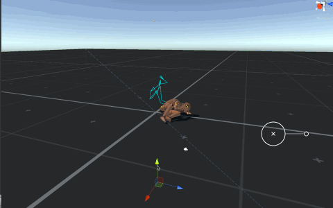
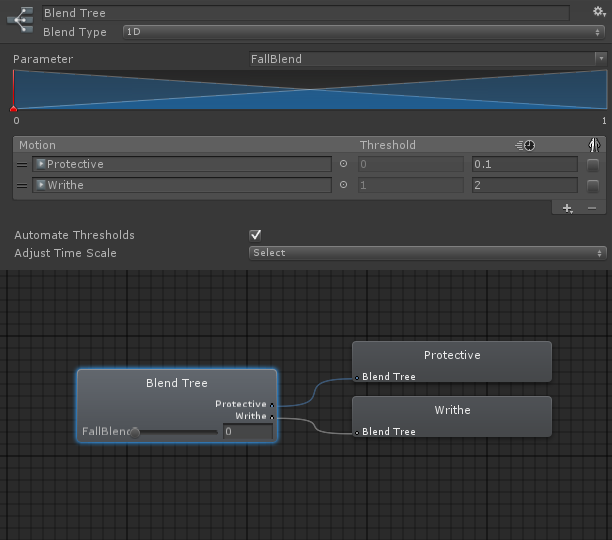
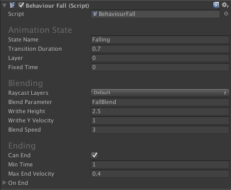

# BehaviourFall

BehaviourFall 根据 ragdoll 距离地面的高度简单地在一个 blend tree 中的两个 animatio clips 之间 blends。就像下面的 gif 所看到的一样，当 ragdoll 被地面高，播放一个翻滚动画，但是当它跌落时 fall down，一个防护的姿势被 blend in。

Behaviour Fall 需要角色的 Animator 具有一个设置好的 blend tree 就像下图一样。你可以从 Falling demo scene 中的 AnimatorController 复制 blend tree。

## Component Variables

- stateName：当 behaviour 被 activate 时要 crossfade 的 Animation State 
- transitionDuration：到 stateName crossfading 的 duration
- layer：包含 destination state 的 layer index。如果没有指定 layer，或者 layer 为 -1，第一个具有给定 name 或 hash 的 state 将被播放
- fixedTime：当前 destination state 的 start time。如果没有显式指定 fixedTime 或 fixedTime 是 float.NegativeInfinity，state 或者从头开始播放（如果它还没有开始播放），或者从它当前 time 继续播放，而且没有 transition 发生
- raycastLayers：将被 raycasted 的 layers 发现碰撞的物体
- blendParameter：Animator 中的 parameter，它在 catch fall 和 writhe animations 之间 blend
- writheHeight：开始 blend writhe 动画时，pelvis 到 ground 的高度
- writheYVelocity：开始 blend writhe 动画时 pelvis 的垂直速度
- blendSpeed：在两个 falling 动画之间 blending 的速度
- canEnd：如果为 false，这个 behaviour 将不会结束
- minTime：在可以结束之前 behaviour activated 的最小时间
- maxEndVelocity：如果 pelvis 的速度降到这个 value 的下面，就可以结束这个 behaviour
- onEnd：当 end conditions 满足时，触发的事件

