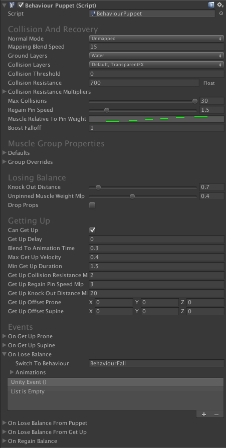

# BehaviourPuppet

BahaviourPuppet 在 puppets 和 objects 碰撞或者通过 code hit 时 pinning 和 unpinning，还自动从一个 unbalanced state 站起来。 

Muscle 就是 dial rig 中 shadow rig 的 bone，它有自己对应的 normal rig（target）的 bone。

## Getting Started

- 从 Melee scene 中的 demo character 复制 BehaviourPuppet 的整个 gameobject 到你自己的 Puppet（parent 到 Behaviours root）
- 碰撞抗拒 Collision resistance 依赖于很多事情，also the mass of your rigidbodies，如果 Puppet 太容易或太难 unbalance，首先调整 Collision Resistance 的值

## Troubleshooting

- Puppet 从不会跌落 falls over，具有 snake feet

  减少 Collision Resistance

- Puppet 在最少的接触上失去 balance

  增加 Collision Resistance 以及/或者 Regain Pin Speed。增加 Knock Out Distance

- Puppet 尝试站起来，但是不断地失败

  增加 Get Up Collision Resistance、Get Up Regain Pin Speed Mlp、Get Up Knock Out Distance

- Puppet 的 muscles 在 unbalanced 时太僵硬

  降低 Unpinned Muscle Weight Mlp

- Puppet 很重地撞到 legs 时不会失去平衡

  找到用于 Hips 和 Leg 的 group override，以及 Foot group。增加 Unpin Parent，Unpin Children，和 Unpin Group 使 Collisions 更大量地传播给其他身体部分。还可以尝试降低 Knock Out Distance

## Collision And Recovery

- normalMode：当 puppet 当前没有和其他东西接触时如何行为？Active mode 保持 PuppetMaster 一直 Active 和 mapped。Unmapped blend out mapping 以维护 100% animation 质量。Kinematic 保持 PuppetMaster 在 Kinematic 模式，直到有一个碰撞发生
- mappingBlendSpeed：Unmapped normal 模式下，在发生接触时，mapping 中 blending 的速度
- activateOnStaticCollisions：如果为 false，静态 colliders 在碰撞 muscles 时，将不会 activate 这个 puppet。注意 static colliders 需要有一个 kinematic Rigidbody 挂载到它上面以工作。只用于 Kinematic normal 模式
- activateOnImpulse：用于 activating puppet 的最小的 collision 冲量 impulse。只用于 Kinematic normal 模式
- groundLayers：当 unpinned 或 getting up 时，character controller 将会 grounded 的 layers
- collisionLayers：collision 时可以 unpin Puppet 的 layers
- collisionThreshold：一个优化。将会被处理的 impulse 的最小平方量级
- collisionResistance：更小的值意味着从 collisions 更多的 unpinning，使得 character 可以更容易地被击倒。如果使用一个 curve，将会通过每个 muscle target velocity 量级求值对曲线求值。这可以被用来使 collision 在 character 移动或动画更快时，更加抗拒
- collisionResistanceMultipliers：基于和 Pupet 碰撞的 layer 将这个值乘到 collision resistance 上
- maxCollisions：优化。每个 physics step 处理的最大碰撞数量。帮助避免 peaks（处理高峰）
- regainPinSpeed：这个 group 的 muscles regain（重新获得）pin weight 的快慢
- muscleRelativeToPinWeight：相对于 pin weight 的 muscle weight multiplier（因子）。它可以用于在正常 Puppet state 下，当更多/更少 unpinned 时使 muscles 更弱/更强 
- boostFallOff：Boosting（促进，增加）是一个术语，用于使 muscles 临时免疫于碰撞，并/或处理（吸收）其他 charactes muscles 更多 damage。这通过增加 Muscle.State.immunity 和 Muscle.State.impulseMlp 完成。例如当你设置 muscle.state.immunity 为 1，boostFalloff 将会决定这个值多快回落到 normal 0. 使用 BehaviourPuppet.BoostImmunity() 和 BehaviourPuppet.BoostImmpulseMlp() 在脚本中 boosting。它可以在播放一个 melee hitting/kicking 动画时，帮助使 puppet 更强，并传递更多打击 punch。

## Muscle Group Properties

- defaults：默认 muscle 属性。如果没有 Group Overrides，这将被用于所有 muscles
  - unpinParents：muscles 的 collisions 将会多大程度 unpin parent muscles
  - unpinChildren
  - unpinGroup：这个 group muscles 的 collisions 将会多大程度 unpin 同一个 group 的 muscles
  - minMappingWeight：如果为 1，group 的 muscles 将总被映射到 ragdoll
  - maxMappingWeight：如果为 0，group 的 muscles 将不会被映射到 ragdoll pose，即使它们是 unpinned 的
  - disableColliders：如果为 true，这个 group 的 muscles 将在 puppet state 时使它们的 colliders disabled
  - regainPinSpeed：这个 group 的 muscles regain 它们的 pin weight（multiplier）的速度
  - collisionResistance：更小的值意味着从 collisions 更多地 unpinning（multiplier）
  - knockOutDistance：如果从 muscle 到它的 target 的距离比这个 value 更大，character 将被击倒
  - puppetMaterial：当 character 在 Puppet 或 GetUp state 时应用到 muscles 的 PhysicsMaterial。使用一个更小摩擦的材质减少 muscles stuck 或者从 joints 拉离的风险
  - unpinnedMaterial：当 character 在 Unpinned state 时应用到 muscles 的 PhysicsMaterial
- groupOverrides：对同一个 muscle groups 的默认 muscle 属性的 overriding（例如使 feet 更加坚硬或 hands 更加放松）

## Losing Balance

- knockOutDistance：如果从 muscle 到它的 target 的距离被这个值更大，character 将会被击倒 knock out
- unpinnedMuscleWeightMlp：更小的值使 muscles 在被击倒时更脆弱
- dropProps：如果为 true，Prop group 的所有 muscles 在它失去平衡时，将会从 puppet detach 掉

## Getting Up

- canGetUp：如果为 true，GetUp state 将会在 Get Up Delay 之后，并且当 hip muscle 的 velocity 比 Max Get Up Velocity 更小时自动触发
- getUpDelay：失去平衡后 get up 的最小 delay。在这个 time 过去之后，将会等待 hip muscle（muscle 就是 dial rig 中 shadow rig 的 bone）的速度降到 Max Get Up Velocity 之下，然后切换到 GetUp state
- blendToAnimationTime：一旦 GetUp state 被触发，从 ragdoll pose 到 getting up animation 混合 blending animation target 的时间
- maxGetUpVelocity：在 hip muscle 的速度回到这个 value 之前不会 get up
- minGetUpDuration：在失去平衡之后，get up 之前必须经过的时间
- getUpCollisionResistanceMlp：（Mlp -> multiplier）当在 GetUp state 时的 collision resistance。增加这个值将会阻止 character 在从 Unpinned 到 GetUp state 之后再次失去平衡
- getUpRegainPinSpeedMlp：当在 GetUp state 时，regain pin weight speed multiplier。增加这个值将会阻止 character 在从 Unpinned 到 GetUp state 之后再次失去平衡
- getUpKnockOutDistanceMlp：当在 GetUp state 时，knock out（击倒）distance multiplier。增加这个值将会阻止 character 在从 Unpinned 到 GetUp state 之后再次失去平衡
- getUpOffsetProne：当从一个 prone（俯卧）pose 初始化 getting up 动画时，从 hip bone 的 target character 偏移（在 character rotation space）。如果你的角色在开始 getup 时有点滑动，调整这个值。
- getUpOffsetSupine：仰卧

## Events

- onGetUpProne：在 character 从一个 prone pose（面朝下）开始 getting up 时调用
- onGetUpSupine：仰卧（面朝上）
- onLoseBalance：在 character 被击倒时调用（失去平衡）。从哪个 state 失去平衡不重要
- onLoseBalanceFromPuppet：只有从 normal Puppet state 被击倒（失去平衡）时调用
- onLoseBalanceFromGetUp：只有从 GetUp state 被击倒（失去平衡）时调用
- onRegainBalance：当 character 完全恢复并切换到 Puppet State 时被调用

