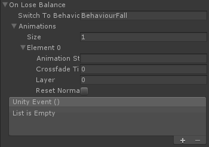

# Behaviours

Puppet Behaviours 是继承自 BehaviourBase 的类。主要的 idea 是提供一个模式 pattern 以开发动态调整 muscle 和 pin weights，strength，和其他属性的功能，或者 make kinematic adjustments to the target pose。

最重要的 Puppet Behaviour 是 BehaviourPuppet ，它处理 Puppets pinning 到 target animation，在碰撞时释放这些 pins，当从地面站起来时 re-tightening pins。Puppet Behaviours 可以被切换，例如当 BehaviourPupet 失去平衡，它理论上可以切换到 BehaviourCatchFall 或 BehaviourWindmill。Puppet Behaviours 被设计不包含一个外部 object 引用，这意味着它们可以简单地复制并移到另一个 Puppet。

## Switching Behaviours:

当和 multiple Behaviours 一起使用，在 Editor 中只开启应该首先运行的那个。例如，当你有 BehaviourPuppet 和 BehaviourFall，如果你希望 Puppet 从 normal animated state 开始而不 falling，保持前者 enabled 而后者 disabled。

通过 code 在 behaviours 之间切换必须通过在你想要切换到的 Behaviour 上调用 BehaviourBase.Activate() 完成。所有其他 Behaviours 将会被 disabled。

## Events

Behaviours 在特定场景中（例如失去平衡）触发事件。它们可以被用于将一个消息传递给你的脚本，或者切换 behaviours。

- switchToBehaviour：在这个 event 中切换到的另一个 Puppet Behaviour。这个必须是 Behaviour 的准确类型，小心拼写
- animations：在这个 event 中 cross-fade 的 animations。这从下面的 UnityEvent 分离出来，因为 UnityEvent 不能处理超过一个参数的调用，例如 Animator.CrossFade
- unityEvent：在这个 event 上调用的 UnityEvent

## Sub-Behaviours:

Sub-behaviours 是可重用的功能的 self-contained chunks，可以容易地在 multiple Puppet Behaviours 之间共享。例如 SubBehaviourCOM 是一个模块，它自动计算和更新这个 Puppet 的质心相关信息（例如中心或压力的数据，COM vector 的方向和角度，以及检测这个 Puppet 是否在地面上）。这防止了需要进行 COM 计算的所有 Behaviours 重复 code 的必要性。

## Creating Custom Behaviours:

PuppetMaster 从开始构建时就考虑可定制和可扩展。要创建你自己的可重用 behaviours，编写一个扩展 BehaviourBase 抽象类，或者只是复制一下 BehaviourTemplate.cs 并开始跟随手头上 pattern 添加功能。
