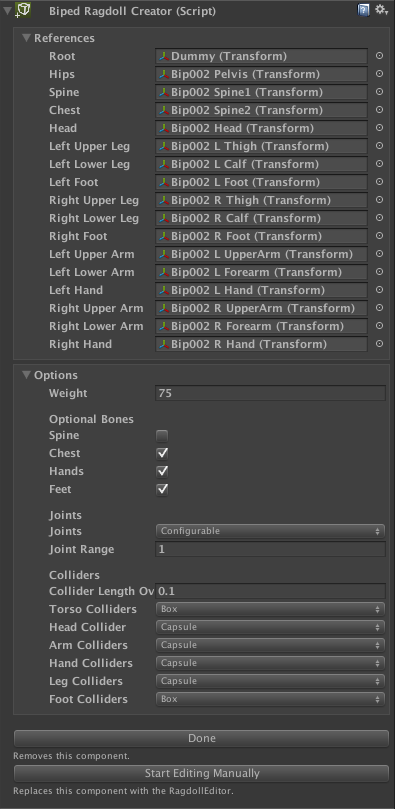

# Creating Ragdolls

## BipedRagdollCreator

PuppetMaster 包含一个非常容易使用的用于 biped characters 的 visual ragdoll 创建工具（实际上可以被用于任何具有至少 4 个 limbs 的 character），称为 BipedRagdollCreator。当 BipedRagdollCreator 组件在 character 上启用，每次改变 references 或 options 时，ragdoll 组件都会被销毁和重建。这允许快速和直观的实时编辑。

## Getting started

- 拖拽 character 模型到 scene 并添加 BipedRagdolCreator 组件。如果它是一个 Humanoid character，Biped bone 引用将会被自动填充。其他情况下，它们可以被手动填充
- 点击 Create a Ragdoll 开始 live-updating and editing ragdoll。然后你应该能看见 Rigidbody，Collider 和 Joint 组件添加到 character
- 注意所有对 BipedRagdollCreator 参数的调整，ragdoll 组件将会被删除并重建，因此不要制造对它们的任何引用直到 BipedRagdollCreator 被移除
- 当前 PuppetMaster 只支持 ConfigurableJoints，因此使用 Configurable 作为 Joints
- 一旦你满意基本 Collider 和 Joint 类型和 Options 中的其他设置，点击 Start Editing Manually 使用 RagdollEditor 来生成最终的调整。这将会移除 BipedRagdollCreator 组件

## Component variables:

- references：对 biped bones 的引用 
- weight：character 的全部权重。将会被生物学分配到 ragdoll rigidboies 之间
- spine/chest/hands/feet：toggle 包含在 ragdoll 的 spine/chest/hands/feet bone
- joints：PuppetMaste 只支持使用 ConfigurableJoints 构建 ragdoll
- jointRange：multiplies joint limit ranges
- colliderLengthOverlap：决定 colliders 彼此重叠的程度，也支持负值
- torsoColliders/headColliders/armColliders/handColliders/legColliders/footColliders：torso（躯干）使用 BoxColliders 或 CapsuleColliders 用作 body part



## Creating ragdolls in runtime:

```C#
[Tooltip("The character prefab/FBX.")]
public GameObject prefab;
void Start() {
    // Instantiate the character
    GameObject instance = GameObject.Instantiate(prefab);
    // Find bones (Humanoids)
    BipedRagdollReferences r = BipedRagdollReferences.FromAvatar(instance.GetComponent<Animator>());
    // How would you like your ragdoll?
    BipedRagdollCreator.Options options = BipedRagdollCreator.AutodetectOptions(r);
    // Edit options here if you need to
    // options.headCollider = RagdollCreator.ColliderType.Box;
    // options.weight *= 2f;
    // options.joints = RagdollCreator.JointType.Character;
    // Create the ragdoll
    BipedRagdollCreator.Create(r, options);
    Debug.Log("A ragdoll was successfully created.");
}
void Update() {
    // If bone proportions have changed, just clear and recreate:
    // BipedRagdollCreator.ClearBipedRagdoll(r); //ClearAll if you have changed references
    // BipedRagdollCreator.Create(r, options);
}
```