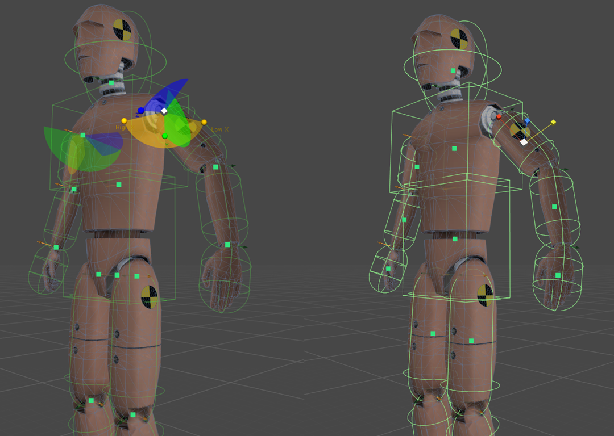
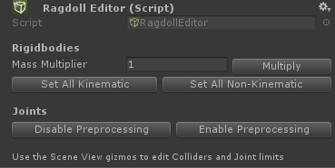
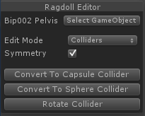
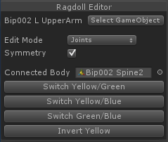

# Editing Ragdolls

## RagdollEditor

RagdollEditor 是一个直观可视化的 Scene View 工具，用于编辑 Colliders，Joints，和 Rigidbody settings。Collider position，size，和 joint limit 支持对称编辑。RagdollEditor所有 actions 都是可撤销的。

## Getting started

- 添加 RagdollEditor 组件到 ragdoll 的 root
- 在 Colliders/Joints 上点击绿色的 buttons 来选中它们
- 在 Scene View 中使用 Move/Scale handles 来编辑 Colliders 和 Joints
- 当你完成时移除组件

## Component interface:

- Mass Multiplier：使用这个值乘以所有 Rigidbodies 的质量 mass
- Set All Kinematic：设置所有 Rigidbodies kinematic
- Set All Non-Kinematic：设置所有 Rigidbodies non-kinematic
- 关闭预处理 Preprocessing：uncheck 所有 Joints 上的 enablePreprocessing。这可以使 ragdoll 在特定情形下更稳定
- Enable Preprocessing：check 所有 Joints 的 enablePreprocessing

## Collider tool:

- Select GameObject：改变 Unity 选择为当前编辑的 Collider 的 GameObject
- Edit Mode：切换 Joint editing mode
- Symmetry：开启对称编辑。Symmetry 操作 ZY 平面（RagdollEditor GameObject 的 local space）另一侧最近的 Collider（在一个 threshold 内）
- Convert to Capsule/Sphere Collider：转换选择的 collider 为 CapsuleCollider/SphereCollider
- Rotate Collider：正交地旋转 collider size vector

## Joint tool:

- Select GameObject：改变 Unity Selection 为当前编辑的 Joint GameObject
- Edit Mode：切换 Collider editing mode
- Symmetry：启用对称编辑
- Connected Body：选择和改变 selected Joint 的 connectedBody
- Switch Yellow/Green：切换 respective Joint axes
- Switch Yellow/Blue：切换 respective Joint axes
- Switch Green/Blue：切换 respective Joint axes
- Invert Yellow - 翻转 Joint.axis

