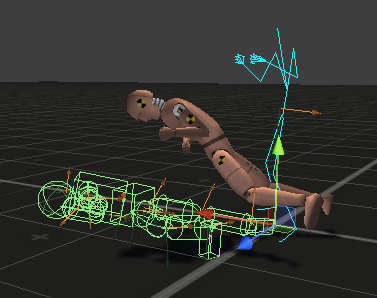

# Overview

## PuppetMaster Contains

- 用于 animating 任何类别 ragdolls 的工具
- 自动的，易于使用的，所有 biped character 的 ragdoll 生成器
- Ragdoll Editor：允许你在 Scene View 直观地编辑 collider 和 joints
- Joint Inspectors：在 Scene View 可视化和编辑 Character 和 Configurable Joints

## Technical Overview

- 用于 Humanoid，Generic，和 Legacy characters
- 自定义可撤销的 inspectors 和 scene view handles
- 性能优化
- 模块化的，容易扩展。组装你自己定制的 character rigs
- 在大量 characters 上测试

## What can I do with PuppetMaster?

- Animate ragdolls
- 一键创建 biped ragdolls
- Edit colliders and joint limits intuitively and visually in the Scene View.
- Create procedural behaviors for ragdoll characters.

Puppet Master 的核心功能就是：Animate ragdolls，对 ragdolls 进行动画。

Ragdoll 是按照 character 骨骼构建的布娃娃系统，每个 bone 被使用一个简化的 Collider 表示，并具有 rigidbody。通常只用于角色死亡时，创建 body 和物理世界真实的交互效果。Collider，Rigidbody，Joint 组件被添加到 bone GameObject 上，并激活，之后关闭 Animator，这样 bones 就不在受 Animation 控制，而是被物理引擎控制。这样，skeleton 或者被 animaiton 完全控制，或者被 ragdoll 完全控制。

PuppetMaster 的主要目的则是在 Animation 和 Ragdoll 之间进行桥接，让 animation 可以控制 ragdoll，然后 ragdoll 控制 skeleton，skeleton 控制 SkinnedMesh。如上图所示，青色表示正常的动画，绿色表示 ragdoll，skinned mesh 位于中间。这个例子中，Pin Weight = 0，即 Animation 几乎不影响 ragdoll，任其被物理引擎处理，因此 ragdoll 倒在了地上，而 Mapping Weight = 0.5，定义 skeleton 在 animation 和 ragdoll 混合的权重，如果 Mapping Weight = 0，则 skeleton 完全被 ragdoll 控制，如果 Mapping Weight = 1，则 skeleton 完全被 animation 控制。

Pin Weight（？Muscle Weight）：PuppetMaster 通过 AddForce 尝试将 Ragdoll 捆绑到 Animation 上。如果 Pin Weight = 0，则完全不绑定 Ragdoll，如果 Pin Weight = 1，则完全绑定。

