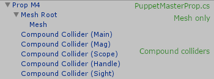
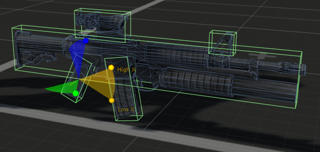
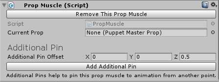
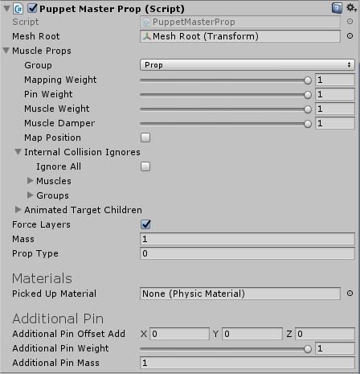
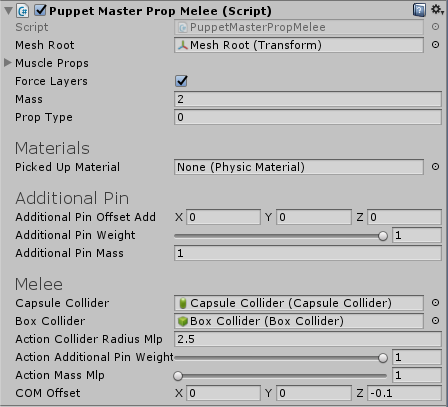

# Props

Muscle 就是 bone，是 PuppetMaster Dial Rig 中 Shadow rig/Ragdoll rig 的 bone，有可以相应物理行为，并通过 AddForce 以一定权重绑定到 Animation 中的 Bone 上，它有对应的 Target（normal）Rig 的 bone。动画播放时，会使用 AddForce 活动相应 Ragdoll bone，然后 Target bone 以一定权重映射到 Ragdoll bone。

PuppetMaster 包含一个有用的工具，用来 attaching，detaching，和管理物理物品 props —— PropMuscle 和 PuppetMasterProp 类。

PropMuscle 是一个特殊类型的 muscle，PuppetMasterProp objects 将会挂载到它上面。

### Prop Setup:

由于 Dual Rig 结构，prop 需要被设置以使它的 root GameObject 是带有 Rigidbody 和 ConfigurableJoint 组件的 Muscle ，并将 Target 和它的 mesh 和 renderer 一起 parent 到它上面。当 prop 被 pick up，prop 将会被分离（split up）使得 Mesh Root 将会被 parented 到 Target root hierarchy，而 prop 剩下的部分和 colliders 被 parented 到 Prop Muscle。当 prop 放放下 drop 时，原始 hierarchy 将会被恢复。

当 prop 被 pick up，它上面的 Rigidbody 组件将会被销毁，因为 PropMuscle 已经有一个 Rigidbody 了。这个 Prop 的 colliders 将会作为 PropMuscle
 Rigidbody 的复合 colliders。当 prop 被放下时，原始 rigidbody 将会被恢复。





## PropMuscle component:

PropMuscle 是一个特殊类型的 muscle，所有 prop objects 可以被附加到它上面。你可以在 Editor 中创建一个 PropMuscle，通过选择 PuppetMaster GameObject，并点击 PuppetMaster 组件底部的 Add Prop Muscle。点击 scene 中表示 PropMuscle 的蓝色按钮，并移动/旋转它们到你想要的地方。如果你的 puppet 没有 hand muscles，并且 PropMuscle 被挂载到 forearm muscle 上，在 Target Root hierarchy 下找到 Prop Muscle Target GameObject，并 parent 它到 hand bone。

- Remove This Prop Muscle：销毁这个 PropMuscle object
- currentProp：当前被 Prop Muscle 握住的 PuppetMasterProp。要 pick up 一个 prop，只需要将它赋予 propMuscle.currentProp。要 drop 物品，设置 propMuslce.currentPop 为 null。将这个 value 替换为另一个 prop 将 drop 任何之前 hold 的 props
- additionalPinOffset：局部空间中 additional pin 相对于 Prop Muscle 的偏移
- Add/Remove Additoinal Pin：添加或移除 pin object。Additional Pins 帮助从另一个位置钉住 pin 这个 prop muscle 到动画。没有它，这个 prop muscle 只会被 Muscle Sprint 驱动，这可能不足以跟随快速的 swinging animation。通过 Additional Pin Offset 向着 prop 末端（swor 的 tip）移动 additional pin



使用 PropMuscle 进行 Picking up，dropping 和 switching prop 是通过简单改变 PropMuscle.currentProp value 完成的。当你通过 propMuscle.currentProp = myProp 将一个 prop 赋予 propMuscle 时，任何 PropMuscle hold 的 props 都会被 dropped，而新的 myProp 将会被挂载。如果设置 currentProp 为 null，任何被 PropMuscle hold 的 props 将会被 dropped，而 PropMuscle 自身则会 deactivated。

```C#
// Dropping props
propMuscle.currentProp = null;
// Dropping any props held, picking up myProp
propMuscle.currentProp = myProp;
```

当一个 prop 被挂载到 PropMuscle，它的 localPosition 和 localRotation 被设置为 zero/identity，因此调整 holding prop 的最佳实践是 parent prop 到 PropMuscle，设置 localPosition/Rotation 为 zero，并调整 mesh 和 colliders 的 positions 知道它们完美位于手上时。

## PuppetMasterProp component:

- meshRoot：当 Prop 被 pick up 时，Mesh Root 将会被 parented 到 Prop Muscle 的 target，要确保 mesh 和 colliders match up，Mesh Root 的 localPosition/Rotation 必须为 zero
- muscleProps：当 prop 被 pick up 时，将被应用到 Prop Muscle 的 muscle 属性
- internalCollisionIgnores：定义哪个 muscles 或 muscle groups 内部 collisions 将总是被忽略，无视 PupperMasterinternalCollisions state
- animatedTargfetChildren：parented 到这个 muscle Target 上的 animated bones 列表，除了 targets bones 或者人行业 child muscles 的 target child。这用来当使用 PuppetMaster.DisconnectMuscleRecursive() 将 muscle disconnected 时在那些 bones 上停止动画。例如如果你想 disconnect spine02 muscle，你想要使这个列表中的 spine03 和 clavicles 停止动画
- forceLayers：如果为 true，当 prop 被 pick up 时，这个 prop 的 layer 将会被强制到 PuppetMaster layer，并且 target 的 layer 强制到 PuppetMaster 的 Taraget Root 的 layer
- mass：当 prop 被 pick up 时的 mass。当 dropped 时，原始 rigidbody 的 mass 将被使用
- propType：这个字段没有其他目的，只是用来帮助你通过 PropRoot.currentProp.propType 区分 prop
- pickedUpMaterial：如果被赋值，在 pick up 时，将会设置 prop colliders 到这个 PhysicMaterial。如果这里没有赋予 materials，将会维持原来的 PhysicsMaterial
- additionalPinOffsetAdd：当 prop 被 pick up 时，添加这个到 Prop Muscle 的 Additional Pin Offset
- additionalPinWeight：additional pin 的 pin weight。增加这个 weight 将会是 prop 更好地跟随 animation，但是将会在和物体碰撞时增加 jitter 抖动
- additionalPinMass：当 prop pick up 时，将 additional pin 的 mass 质量乘以这个值。Prop 上的 rigidbody 将会在 pick-up 时被销毁，并在 drop 时重新 attach。因此它的质量在 pick up 时不被使用



## Melee Props:

很长的近战武器对 PuppetMaster 是一个很大的挑战。挥舞它们迅速地需求大量 muscle force 和 solver iterations 以对抗 inertia（惯量）并保持 ragdoll chain 完整。连接到一起的 Joints chain 越长，模拟越不精确不稳定，而不幸的是那些近战武器倾向于是很长的 Joint chains 的末端（pelvis/spine/chest/upperarm/forearm/hand/sword）。此外，因为 props 被挥舞，它们具有大量线性速度和角速度，一个非常细的 collider，因此可以很容易在两个 fixed frames 之间跳过 victim 牺牲品（被武器伤害的事物）（隧穿）。它通常使用大量调整 tweaking 和一些技巧 tricks 以使 melee props 正确工作。PropMuscles 具有 Additional Pin 功能，它可以用于添加另一个 pinning point 到 prop 上，帮助更好地将它 pin 到很高角速度的 animation。

- 使 collider thicker 在 hitting 时更细以减少 collider skipping
- 使用 Continuous/Continuour Dynamic Collision Detection Mode 来减少 skipping，然而这有很大的性能代价
- 减少 fixed timestep
- 使用 Additional Pin
- 沿着 prop 调整 Additional Pin 的 position 和 Additional Pin Target
- 减少 PuppetMaster.pinDistanceFalloff
- 增加 PuppetMaster.muscleString 和 sovlerInteractionCount
- 关闭 PuppetMaster.internalCollisions 以防止大 prop collider 和 Puppet 碰撞
- 丢弃 hand muscle 使 joint chain 更短

## PropMelee Component: (this component will be made more generic in PuppetMaster 0.4).

- capsuleCollider：当 prop 被 pick up 时，切换 collider 为一个 Capsule。Capsule 碰撞更平滑，并具有更少的 jitter
- boxCollider：当 dropped 时，切换回 BoxCollider
- actionColliderRadiusMlp：当 PropMelee.StartAction(float duration) 被调用时使用这个值乘以 Capsule 的 radius
- actionAdditionalPinWeight：当 PropMelee.StartAction(float duration) 被调用时临时设置（增加） additional pin 的 pin weight
- actionMassMlp：当 PropMelee.StartAction(float duration) 被调用时临时增加 Rigidbody 的质量
- COMOffset：偏移 offset Rigidbody 的默认质心（可能改善 prop handling）


