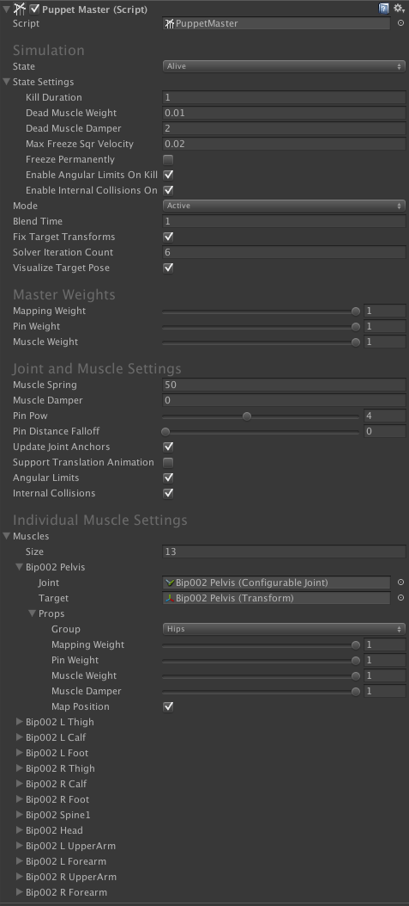

# PuppetMaster Component

## Simulation

- state：设置 puppet 的 state（Alive，Dead，或者 Frozen）。Frozen 意味着一旦它进入 dead state，ragdoll 将被 deactivated
- stateSetting：用于 killing 和 freezing puppet 的设置
  - killDuration：weigh out（减少 weight）到 deadMuscl Weight 的时间
  - deadMuscleWeight：当 puppet 是 Dead 时，muscle weight mlp（multiplier）
  - deadMuscleDamper：当 puppet 是 Dead 时，muscle damper mlp（multiplier）
  - maxFreezeSqrVelocity：为了 freezing puppet 的 ragdoll bones 的最大速度平方
  - freezePermanently：如果为 true，PuppetMaster，它所有的行为和 ragdoll 将会在 puppet 被 frozen 时销毁
  - enableAngularLimitsOnKill：如果为 true，当 killing puppet 时将开启 angular limits
  - enableInternalCollisionOnKill：如果为 true，当 killing puppet 将开启内部碰撞
- mode：Active mode 意味着所有 muscles 是 active 的，而且 character 是物理模拟的。Kinematic mode 设置所有 muscles 的 rigidbody.isKinematic 为 ture，并简单地更新它们的 position/rotation 来匹配 target（类似物理模拟，是将图形 mesh 匹配物理世界的对应实体）。Disabled mode disables ragdoll。通过简单地改变这个 value 就可以切换 mode，Blending in/out 将会自动被 PuppetMaster处理
- blendTime：从 Active 到 Kinematic/Disabled 或从 Kinematic/Disabled 到 Active 的 blending 的时间。从 Kinematic 到 Disabled 或反过来立即完成
- fixTargetTransforms：如果为 true，将会在每个 update cycle fix target character 的 Transforms 到它们的默认 local positions 和 rotations，以避免 additive reading-writing 导致的漂移。只在 target 包含 unanimated bones 时使用这个选项
- solverIterationCount：用于 puppet muscles 的 Rigidbody.solverIterationCount 
- visualizeTargetPose：如果为 true，将在 scene view 中绘制 target 的 pose 为 green lines。这只在 Editor 中运行。如果你想 profile PuppetMaster，关闭这个选项

## Master Weights

- mappingWeight：将 animated character（skeleton 骨架）映射到 ragdoll pose 的权重
- pinWeight：将 muscles（ragdoll 上的骨骼）使用简单的 AddForce pinning 到它们的 animated targets position 的权重
- muscleWeight：muscles 的 normalized strength

## Joint and Muscle Settings

- muscleSpring：ConfigurableJoint的 Slerp Drive 的 positionSpring
- muscleDamper：ConfigurableJoint的 Slerp Drive 的 positionDamper
- pinPow：调整 pinWeight curve 的倾斜率 slope。只在 interpolating pinWeight 从 0 到 1 然后返回时有效
- pinDistanceFalloff：随着远离 target 减少 pinning force。更大的 value 放松（loosens） pinning，导致更散漫的行为
- updateJointAnchors：当 target 在 muscle bones 之间 animated bones，joint anchors 需要在每个 update cycle 被更新，因为 muscle 的 target 在 position space 彼此相对移动。这给出更加精确的结果，但是在计算方面更昂贵，因此考虑将它关闭
- supportTranslationAnimation：如果任何 target 的 bones 具有 translation animation，开启这个选项
- angularLimits：joints 是否应该使用 angular limits？如果 PuppetMaster 不能匹配 target 的 pose，它可能是因为 joint limits 太 stiff 并不允许这样的运动 motion。
- internalCollisions：muscles 是否应该彼此碰撞？当 puppet 被 pinned 以节约性能和更好精度时，关闭这个选项。既然 joints 是被驱动的，绝大多数 PuppetMaster 模拟实际上根本不需要内部碰撞

## Individual Muscle Settings:

- joint - muscle 使用的 ConfigurableJoint
- target - muscle 尝试跟随的 target Transform 
- props - muscle 的主要属性
- group - muscle 术语身体的额那个部分？这可能被一些 behaviours 使用（BehaviourPuppet）
- mappingWeight - mapping muscle 的 target 到 muscle 的权重（multiplier）
- pinWeight - 使用一个简单的 AddForce 命令 pinning 这个 muscle 到它的 target position 的权重 multiplier
- muscleWeight - muscle strength (multiplier).
- muscleDamper - ConfigurableJoint 的 Slerp Drive 的 positionDamper 的 multiplier
- mapPosition - 如果为 true，将会 map target 到 muscle 的 world space 位置。通常这只应对 root muscle（hips）为 true

