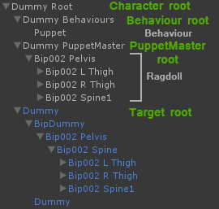
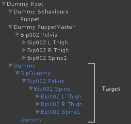
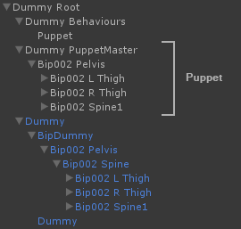
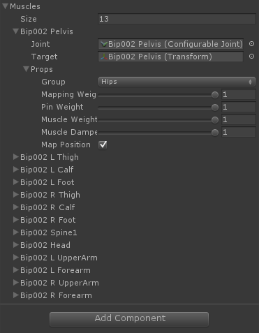
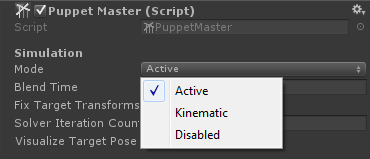
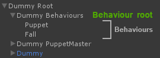

# PuppetMaster Overview

## Terminology

PuppetMaster 使用一个 Dual Rig，其包含正常的 animated character（此后称为 Target），和简化的 ragdoll 结构（Puppet）。PuppetMaster 的主要目的是以物理方式制作 Puppet ragdoll，跟随 animated Target character 的运动和动画。它以两种方式完成，一种方式是连接关节（Muscles），另一种方式钉住 pinning rigidbodies 到它们的 targets（使用 AddForce 命令）（Pins）。控制 Muscles 行为，处理它们的 strength，pinning，以及其他属性的类称为 Puppet Behaviours。这个 dual rig 和 Behaviours 将会共享一个共同的 parent GameObject（“Root”），它作为一个用于 PuppetMaster character rig 的容器。这个 kinematic Target character 将会被映射到 dynamic Puppet ragdoll，通过 ”Mapping“ 的方式，这还可以对整个 character 或单独的每个 Muscle 平滑地 blended in/out。

## Dual Rig

使用一个 dual rig 相对一个单个 character setup（Unity 内置的 ragdoll）的主要优势是性能。它之所以这么廉价是几乎就是因为没有执行代价昂贵的带有 Colliders 的 objects 的 transformations。性能优势在必须在 target pose 上执行 IK/FK 过程时更加明显。PuppetMaster 可以被平滑 blended 来在 Kinematic 或 Disabled 模式下运行。前者将会简单地制作 ragdoll kinematic 并且匹配它到 target，后者将会当你不需要时完全 deactivate ragdoll。Dual rig 还允许为 ragdoll 在 flat 或 tree hierarchy modes 之间进行选择（点击 PuppetMaster context menu 的 Flat/Tree Hierarchy），并在 PuppetMaster 将来的版本中支持在多个 characters 之间共享 ragdolls。当你提供一个传统 ragdoll character（Unity 内置 ragdoll）引用时，PuppetMaster 将会为你自动设置 dual rig。

## Target

Target 可以被想象为你在任何游戏中看见的 normal animated character，它通常有一个 character controller 以及任何其他挂载的 gameplay components。每一帧，PuppetMaster 将会读取 Target 的 pose，并 feed 它到 Puppet 的 Muscles 用来跟随 following。在物理被解析之后，Target 将会被映射到 Puppet 的 pose 中，基于 mapping settings，并保持在那里，直到 animation 在下一帧覆写了它。

## Puppet

这个简化的 ragdoll 结构（Puppet）基本上时 Target 的副本，但是挂载了 ragdoll 组件，并且剔除了所有其他不相关的组件和 GameObjects。PuppetMaster 需要 ragdoll 只使用 ConfigurableJoints 设置。任何其他 Joint 可以被转换为 ConfigurableJoint，通过选择（root）GameObject 并点击 ”GameObject/Convert to ConfigurableJoint“。Puppet ragdoll 可以以 tree 或 flat hierarchy mode 设置（从 PuppetMaster 上下文菜单中选择 Flat/Tree Hierarchy）。

## Muscles

PuppetMaster 将每个 ConfigurableJoint 转换成一个 Muscle，Muscle 维护一个对它 animated target 的引用，并且自动计算 Joint target rotations，pinning forces ，以及其他的值。当 Puppet 是 unpinned 的，ragdoll 将会在 muscle space 跟随 animation，而 result 是物理上真实而准确的。当 pinned 时，pinning forces 将会移动 ragdoll bones 到它们 targets 的 world space position，它们可以被想象为 spring joints，将每个 ragdoll bone 拉向着它们 animated target。因此 Pinning 不是一个自然的 force，它可以被管理来使 ragdoll 模拟 game character 在物理上做不到的 motion（动作）。Muscles 被列在 PuppetMaster inspector，每个 Muscles 有独立的属性，允许你指定每个 Muscle 或 Muscle Group 的物理行为。

## Modes

PuppetMaster 可以运行在 3 个 Modes。Active 是一个 active ragdoll mode，这个 mode 通过使用 muscle forces 使得 Puppet 物理上跟随它的 Target。Puppet 能够被碰撞，被 scene 中的物体影响。Kinematic mode 使 Puppet kinematic 的 Rigidbodies 和 Muscles 不再被使用。Puppet 仍然能够和 objects 碰撞并接受 raycast hits。Disabled mode 完全 deactivates Puppet 以及它的 Rigidbodies 和 Colliders。在 Disabled mode，PuppetMaster 在性能上将没有任何效果。所有 modes 可以根据 Blend Time 参数平滑地 blended in/out。

## Puppet Behaviours

Puppet Behaviours 是继承自抽象的 BehaviourBase 的类，主要的想法是提供一个模式 pattern，用来开发动态调整 muscle 和 pin weights，strength，和其他属性的功能，或者进行到 target pose的 kinematic 调整。最重要的 Puppet Behaviour 是 BehaviourPuppet，它处理 Puppets 到 target animation 的 pinning，在碰撞的时候释放这些 pins，当它们从地面起来时重新 tightening 它们。Puppet Behaviours 可以被切换，例如当 BehaviourPuppet 失去平衡时，它理论上能够切换到 BehaviourCatchFall或 BehaviourWindmill。Puppet Behaviours 设计为它们不会包含一个外部 object 引用。这意味着它们简单地复制并移动到另一个 Puppet 上。
