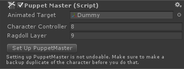

# PuppetMaster Setup

要设置一个带有 ragdoll 组件的 character 为一个 puppet，最容易的方式是简单地添加 PuppetMaster 组件到它上面，然后点击 Set Up PuppetMaster 按钮。这会制作一个 character 的副本，并设置副本为 Puppet，而选中的 instance 将变成 Target。二者都会被 parented 到一个新的 GameObject，它是整个 character rig 的容器。还会添加一个名为 ”character name“ + Behaviours 的 GameObject。所有 Puppet Behaviours（BehaviourPuppet，BehaviourFall...）应该被 parented 到它上面。

或者你可以赋值另一个 character hierarchy 称为 Target。PuppetMaster 支持在多个 characters 之间共享 ragdolls，只要 muscles 的 position 匹配它们的 targets。Rotations 可以是不同的，因此你甚至可以使用另一个具有不同 bone 方向的 rig。

”Character Controller Layer“ 和 ”Ragdoll Layer“ 将会被分别应用到 Target 和 Puppet 以避免 character controller 和 ragdool colliders 之间的碰撞。确保两个 layers 的 collisions 在 Edit/Project Settings/Physics/Layer Collision Matrix 中是关闭的。



## Creating puppets in run-time

在运行时设置 puppets 在 ”Creating Puppets In Runtime“ demo scene 和 CreatePuppetInRuntime 脚本中展示。

它需要 character 已经设置了 ragdoll 组件。

```C#
Transform ragdoll = GameObject.Instantiate(ragdollPrefab, transform.position, transform.rotation) as Transform;
ragdoll.name = instanceName;
// This will duplicate the "ragdoll" instance, remove the ragdoll components from the original and use it as the animated target, setting the duplicate up as a puppet.
PuppetMaster.SetUp(ragdoll, characterControllerLayer, ragdollLayer);
// or...
//PuppetMaster.SetUp(target, ragdoll, characterControllerLayer, ragdollLayer);
// or if you want the "ragdoll" instance to become the puppet, not the target:
//PuppetMaster.SetUpTo(target, characterControllerLayer, ragdollLayer);
Debug.Log("A ragdoll was successfully converted to a Puppet.");
```