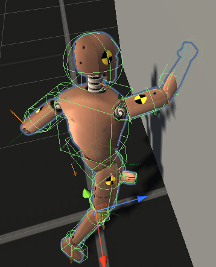
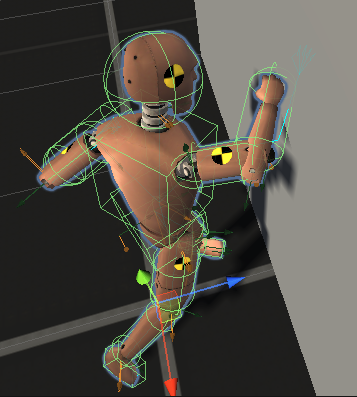

Retarget, Animation Layer, IK, Motion Capture, Ragdoll 等都是用来简化动画制作的工具，有的是 EditorTime 工具，有的是 Runtime 工具。

Ragdoll 是运行时物理动画系统，用来动态生成和环境交互的动画，是程序式动画的一种，这些动画在 EditorTime 无法预知和制作，而且于环境之间的交互是无数种可能的。

开始时 Ragdoll 只是用来模拟死亡时身体各部分于环境的交互。PuppetMaster 则提供了 Animation 对 body 的控制和 Ragdoll 对 body 的控制之间的混合，使得 body 即可以播放预制的动画片段，同时身体还能和环境交互。

当动画不与环境交互时，character 的右拳打入墙内

当动画与环境交互时，动画 bone 打入墙内，但是 ragdoll bone 停留在墙上，最终使 character bone 留在墙上，不会打入墙内（注意右肘关节产生一些错位）。

PuppetMaster 的核心功能就是为 character 创建一个 ragdoll skeleton，在使用 AddForce 将 ragdoll bone 绑定在 Animation bones 上，这样 Animation 驱动 bones 时通过 AddForce 驱动 ragdoll bones，同时 ragdoll 上有 Joint、Collider、Rigidbody，可以和真实物理世界响应，这样 character 就有了两个 bones 动画，一个是动画片段输出的，一个是 Ragdoll 输出的，然后 PuppetMaster 提供一个 weight 让 character 的最终骨骼在这两者之间混合。

可以这样认为，只在角色死亡时用 ragdoll 模拟 body 和环境交互，是因为角色肌肉已经不能为骨骼提供力量了，只能任由 body 被物理世界操弄。而 PuppetMaster 在角色活着的时候，将 Animation Clip 作为肌肉对骨骼施加的力量（Animation 会 transform 骨骼，可以视为肌肉对骨骼发力），同时 Ragdoll 上的 bones 可以响应物理世界，这样就可以取得更加真实的效果，而且不必让 Ragdoll 只模拟角色死亡。

让角色在活着的时候，将动画和物理 ragdoll 混合，是非常高级的功能，几乎肯定是 AAA 级游戏才会用到的功能。Ragdoll 是在执行骨骼物理模拟，这是非常耗时的操作。只用 Ragdoll 模拟死亡尚可接受，因为死亡过程很短暂，在死亡时开启 ragdoll，一段时间 body 不动之后就可以关闭 ragdoll 了。而在角色活着的时候实时运行 ragdoll 则是非常耗时的，因此只可能用于 AAA 级 RPG 游戏（例如 The Last Of US）的主角，或者体育游戏的两名对手等。而且 PuppetMaster 只能用于人形动画，而且提供失去平衡、重新站立时的各种动画设置，这些都是非常特化和高级的功能，不是一般游戏能用的。

任何工作室、公司都有自己擅长和专攻的方向（例如全面战争游戏公司只专攻大型军团作战游戏，SuperCell 则专攻小型手机游戏），没有人能做全部类型的游戏。要明确自己专攻的游戏类型范围，不要尝试所有游戏类型，因而将技术也限制在必需的范围内。每种类型的游戏都有自己技术难点，如果只专精一种类型，那面就可以将技术难点限制到最少，一旦攻克，就可以创建流水线，源源不断生成游戏。而如果尝试全部的游戏类型，就会面对全部的技术难点。例如赛车游戏中车辆的碰撞体和 Wheel Collider & Joint 设置，大型军团作战中的寻路，任何游戏中的特性例子系统 和 Shader，游戏资源的制作等等，难题多不胜数。要限定自己专攻的方向和范围，明确自己需要的技能，设置起自己的流水线，而不是盲目地在最终用不到的技术难点之间投入精力。

不同类型的游戏各有不同的技术难点，生活中还有很多其他重要的问题要解决。因此只专注解决自己主攻游戏类型的技术难题。

即使想使命召唤、反恐精英 Go 这样的大型游戏也只是用 Ragdoll 模拟死亡而已，而不是实时为每个单位模拟一个 Ragdoll。

我们的目标是小型单人或多人的专注游戏性 gameplay 的手机游戏。之所以要学习 FinalIK 是因为 IK 是非常通用的功能，不仅可以在运行时创建真实效果，而且在制作动画时也是必备的工具，不仅可以用于人形动画，还可以用于各种生物，以及机械，这是做所有游戏都必须的。学习 FinalIK 主要用来只制作简单的人形动画，或者修改网上下载的动画，满足制作通用游戏的最低需求。但 PuppetMaster 则是十分高级的工具，不是必需的。

我们的目标是诸如《弓箭传说》、《皇室战争》、《部落冲突》这样的注重游戏性，趣味玩法的精美小型游戏，而不是《The Last Of US》这样的宏大的主机游戏。

模型 UV 编辑就是确定每个多边形（三角形）在 Texture 空间中的位置。对于 lowpoly 模型，可以一个一个三角形来放置，但是对于很多面数的模型，一个一个操作三角形是非常耗时的，而且很多连续的三角形在逻辑上是一体的，将它们一起解 UV 是有意义的，例如人物的胳膊上的所有三角形可以作为一个整体在 texture space 铺开，其中每个三角形的位置无关紧要，只要它们连接在一起，就能在模型上显示连续的纹理。在建模时，这种连续的三角形集合，通过在模型上选择 edges 将这个部分和身体上其他部分切分开来定义。这些切分的 edges 称为 seam。切分开的部分作为整体在 texture space 上铺开，这些作为整体的三角形集合称为 UV lands，作为 UV 编辑的基本单位。即使对于 lowpoly 模型，逻辑上一体的三角形作为一个 uv island 整体进行操作也是非常便利的。

UV island 就是解 UV 的基本单位。UV 可以一个三角形一个三角形地铺开，也可以一个 UV island 一个 UV island 地铺开。

Animation Rigging 也是通用的工具，而且不仅是工具，还介绍了一个观念，所有通过一个 GameObject 控制另一个 GameObject 的功能都是 Rigging。
