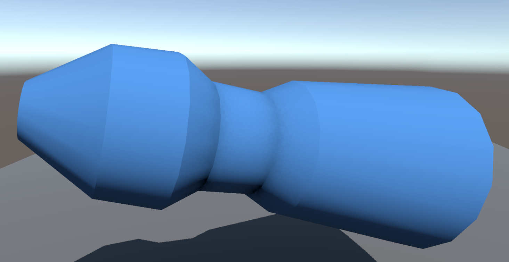
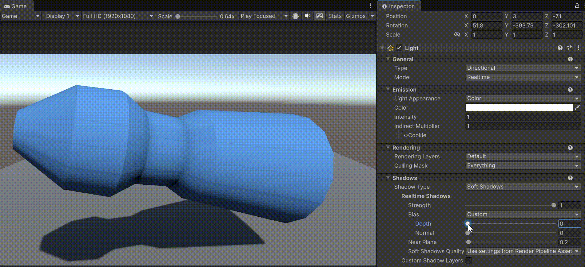
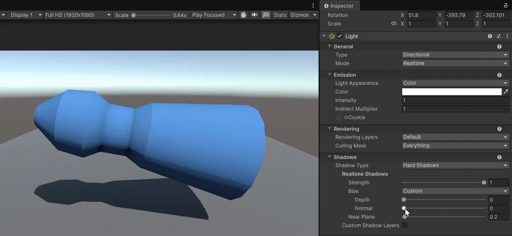
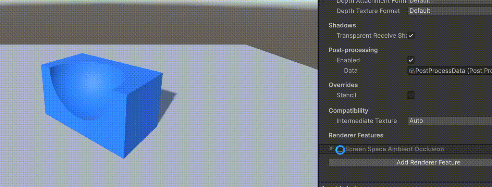

# Hard Shadows 与 Soft Shadows

| 阴影类型             | 原理                       | 采样数量    | 特征              |
| ---------------- | ------------------------ | ------- | --------------- |
| **Hard Shadows** | 仅对当前像素做一次深度比较            | 1       | 边界清晰、无模糊，无法线干扰  |
| **Soft Shadows** | 对当前像素附近区域做多次采样平均（PCF 模糊） | 多（4~16） | 边缘柔和，但依赖法线与深度精度 |

Hard Shadows 是完全的技术性阴影，边缘清晰无模糊。但真实世界的阴影因为边缘的光线衍射，远处的阴影会更加模糊。Soft Shadows 就是模拟这种真实的阴影，距离模型越远的阴影越模糊。

# Smooth Shade 与阴影

平滑着色的模型在 Soft Shadow 下，在面与面交接的 edge 处会显示暗淡细线，如下图所示：

在 Hard Shadow 下则没有此问题：

这应该就是与阴影采样有关。这可以通过 Bias.Depth 和 Bias.Normal 调节。

Shadows Bias 有两个地方可以调节：

- 在 Global Render Asset 中的 Shadow 区块：

  

- Light 默认 Shadow Bias 设置就是读取全局的 Render Asset，但是也可以自定义：

  

HardShadow 不存在这种问题，上面这些调节是针对 SoftShadow 的。

注意：当调节 Normal Bias 时，会看见模型阴影出现明显断裂缝隙，这是调节 Normal Bias 的副作用。因此调节模型表面的暗线和阴影中的缝隙是相互冲突的，消除暗线，就会可能出现阴影缝隙，消除阴影缝隙，就会导致模型暗线。因此需要在二者中权衡。其他的解决办法，可以不使用 SmoothShade，而使用 FlatShade，或者将 Material 的 Cast Shadow 修改为 Two Side，后者可以有效消除任何情况下的阴影裂缝。

但是 HardShadow 也有自己的问题，它可能出现下面的情形，当模型表面与光线接近平行时，就会出现条纹阴影，这也需要调节 Normal Bias 来消除，但是调节 Normal Bias 就会导致阴影出现裂缝，还是需要权衡，或者将 Cast Shadow 修改为 Two Side。

这些问题，跟渲染管线的光照和阴影相关，跟模型本身无关，不管是 UModeler 还是 Blender 还是 Unity 内置的 Primitive Mesh 都一样。

模型曲面上的暗线还与 SSAO 有关（似乎主要与 SSAO 有关）。如果曲面上 Edge 的暗影线很明显，通常就是 SSAO 太大，如下图所示，调整 SSAO 的强度参数，曲面 Edge 的暗线线就会变得明显或不明显：

如果彻底关掉 SSAO，就会发现，曲面彻底没有 Edge 暗影线了：

