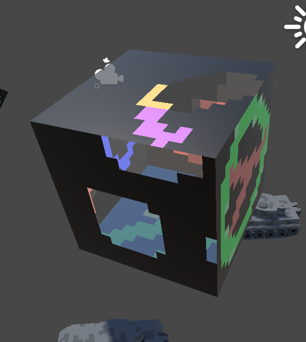
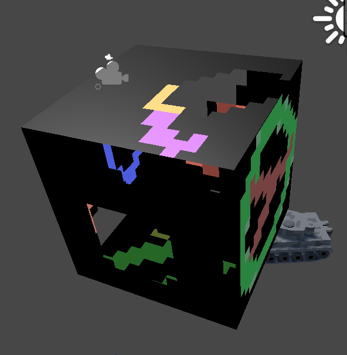
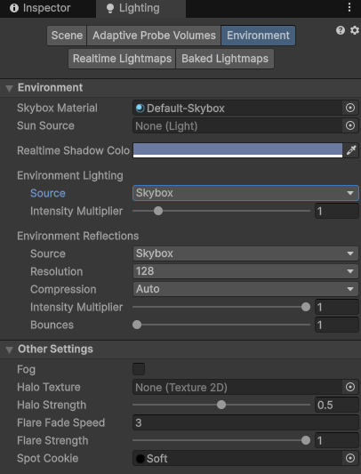
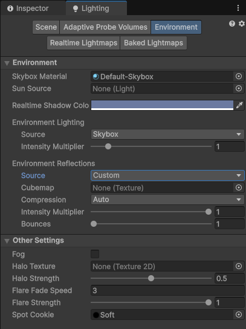
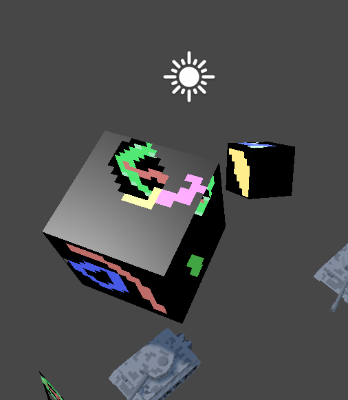

双面透明材质渲染

在 Unity 中使用双面透明材质渲染类似 Minicraft 风格的模型时，会遇到几个问题

1. Unity URP 默认材质的勾选了 Transparent、Both Render Face、Alpha Clipping 后，模型面显示不正确，后面的面可能会覆盖前面的面。这是因为 URP 默认 lit shader 不开窍 Z Writing（Depth Writing），即使对于透明 shader，这就导致前面的面可能先渲染，后面的面后渲染，因为前面的面渲染时没有写入深度，导致后面的面正常覆盖。要解决此问题，只能手动创建 shader（例如使用 Shader Graph），显式启动 Z Writing，才能让这些面正确渲染。但是对于透明材质，显式写入 Z 有一个问题时，如果一个透明面先渲染并写入 Z，后面有一个面的一部分像素比前者的像素更远，则这些像素就无法再渲染了，因为它们无法通过深度测试。一个部分解决办法时，让不透明的物体先渲染，然后透明的物体后渲染。这可以解决不透明物体和透明物体的渲染关系，但是对于两个透明物体，仍然存在前面的问题。如果仅使用 alpha 测试，即 alpha clipping，则没有这些问题，因为对于没有通过透明测试的像素，会直接丢弃。因此如果可能，尽量使用 alpha clipping，而不是 alpha blending。

2. 背面 Smoothness 的问题。当使用双面透明材质时，如果 smoothness 大于 0，背面看起来比正面更亮，似乎收到某种光照。这可能在视觉上很突兀，因为通过透明区域看到的背面往往是闭塞空间中的面，理应更暗，至少不能亮过正面，如下图所示

这是由于 Environment Reflection 导致的。如果在 Lighting 面板中关闭 Environment Reflection，就会看起来更正常一些

Lighting 面板中开启 Environment Reflection

Lighting 面板中关闭 Environment Reflection

关闭 Environment Reflection 不意味着 Smoothness 没有效果了，它只是不再受环境反射的光线的影响了，对于正常光源，它仍然可以体现表面的光滑程度，如下图所示

