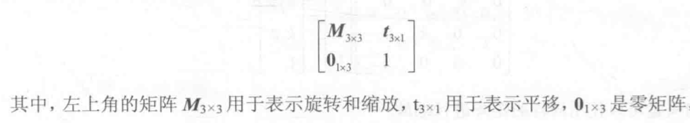

# Matrix

## Overview

- 3x3矩阵不能表示平移，使用4x4齐次坐标，使得矩阵可以表示平移
- 矩阵分解
  
  M3x3矩阵表示旋转和缩放，t3x1表示平移，01x3表示1x3的零矩阵[0, 0, 0]
- 平移矩阵
  
- 缩放矩阵
  
- 旋转矩阵
  - 绕x轴旋转
  - 绕y轴旋转
  - 绕z轴旋转
- 单纯的变换矩阵都是在没有其它任何变换的情况下定义的，它们都是最基础的原子变换矩阵，任何复杂的矩阵变换都是由它们组成
- 复合矩阵
  - 任何复杂的复合变换都是通过联合上面定义的原子变换矩阵完成，都可以分解为一组基础变换矩阵
  - 无法通过一个已经复合过的矩阵直接说出它的变换效果，因为每个矩阵元素都是由许多基础变换矩阵计算而来
  - 因此理解一个矩阵的变换效果的唯一方法就是理解形成它的所有的基础变换矩阵和它们的顺序
  - Unity每个GameObject都包含了一个复合矩阵，任何变换都是对应的基础原子变换矩阵（纯缩放矩阵，纯旋转矩阵，纯位移矩阵），然后将这个基础变换矩阵乘到复合矩阵上。复合矩阵就相当于一个sum，它使用一个4x4矩阵表示大量的基础变换的联合结果
  - 设置localRotation/rotation，localPosition/position也是在设置复合矩阵，只不过不是生成的基础变换矩阵乘到复合矩阵上，而是设置到复合矩阵，相当于放弃之前的变换
- 3D世界中的所有变换最终都是作用到Vector3的，无论是一个GameObject的position，还是GameObject的mesh（mesh就是由一组vector3，GameObject的旋转缩放就是由这些vector3的变换呈现出来的）
- Unity的矩阵连乘是右结合的，最右边的矩阵最先与vector3结合
- 理解矩阵连乘的两种方法
  - 从右到左的理解：每个矩阵都是在identity坐标系中变换vector3，变换之后vector3在idnetity中有了新的位置；左边的矩阵仍然在identity坐标系中变换右边矩阵变换之后的vector3。从右到左理解，vector3的位置始终是在变换的，因为每次变换之后仍然在identity坐标系中解释
  - 从左到右的理解：每个矩阵建立一个参考坐标系，初始参考坐标系是identity，左边的矩阵建立的矩阵将成为右边矩阵的参考坐标系，右边的矩阵总是以为自己是在identity中变换，只是这个identity坐标系是左边矩阵变换后的结果；最终vector3在最右边最上层的矩阵定义的参考坐标系中确定。从左到右理解，vector3的位置始终是不变的，变化的是坐标系
- Unity中提供的所有变换都是生成一个基础变换矩阵，或者一组基础变换矩阵的乘积，然后应用这个矩阵。每个Quaternion都生成对应的矩阵，因此Quaternion的连乘本质上就是矩阵的连乘，矩阵连乘的所有性质对Quaternion也是正确的。这就是为什么Quaternion也是右结合的（右边的先与Vector3结合），为什么lhs的结果将成为rhs的参考坐标系reference frame。欧拉角的本质是创建3个Quaternion，分别对应x、y、z轴的旋转，然后以Qy \* Qx * Qz的顺序相乘得到最终应用的Quaternion，而Qy、Qx、Qz最终也是会转化为相应的基础变换矩阵My，Mx，Mz并以此顺序相乘，所以理解EulerAngle本质就是要立即My * Mx * Mz
- 在Unity中构建复杂的复合矩阵的规范方法就是根据变换过程创建每一步对应的基础变换矩阵，最后将这些矩阵相乘得到想要的复合矩阵。只有立即的真正基础的原理，才能不会被上层复杂的应用方式所迷惑
- Unity中在且只在每个Transform上保存一个复合矩阵，所有应用到这个Transform的变换方法都是在创建基础矩阵并乘以到这个复合矩阵上。这个矩阵用来变换GameObject自己的mesh和所有的children Transform（这两者本质上都是一组vertices）。每个Transform的localToWorldMatrix是最终从self到world直接所有Transform的矩阵的乘积
- Transform的Rotate方法总是围绕Transform的position，它从不会修改position。只有RotateRound方法可以指定围绕不经过Transform position的轴进行旋转，此时其position也会随之改变。RotateRound本质上是创建了3个基础矩阵，位移矩阵Mt，它的逆Mt'，和旋转矩阵Mr，并以Mt' \* Mr * Mt顺序将其乘以到复合矩阵上
- Socket & Plug算法

  ```plain
  private void Plug() {
    // 移动plug的root使得plug在世界空间的原点，世界空间是root的parent空间
    plug.parent.position = -plug.localPosition;
    /*
     * 反转plug的世界空间旋转使得plug在原点处identity，再应用socket的世界空间旋转，
     * 因此plug和socket在世界空间中将具有相同的旋转，但是这个旋转是应用到plug的root，
     * 因此最终效果是root整体旋转而使得plug和socket具有相同的世界旋转
     */
    Quaternion q = socket.rotation * Quaternion.Inverse(plug.rotation);
    float angle;
    Vector3 axis;
    /*
     * 因为旋转是在原点处发生的，而root不在原点，因此需要使用RotateAround函数
     * RotateAround已知了point，还需要知道旋转的axis和angle
     * 通过Quaternion.ToAngleAxis得到旋转的aixs和angle
     */
    q.ToAngleAxis(out angle, out axis);
    plug.parent.RotateAround(Vector3.zero, axis, angle);
    /*
     * 已经将root旋转使得plug和socket具有相同的rotation
     * 因此只需要移动root，使得plug.position与socket.position重合即可
     * socket.position - plug.position就是需要移动的向量（位置差）
     */
    plug.parent.position += socket.position - plug.position;
  }
  ```

- 当需要为一个Transform同时设置位移，旋转，缩放变换时，约定的顺序是位移-旋转-缩放，即TRS，对于vector3来说，先缩放，再旋转，最后位移
  - 缩放将时坐标系不一致，因此先执行缩放，使得旋转和位移不受影响
  - 旋转通常理解的是围绕GameObject中心旋转，如果在位移之后执行，就不再围绕GameObject中心了，而且GameObject的position也将发生变换
  - 通常我们期望最终GameObject的位置就是我们在参数中指定的位置，如果它在缩放和旋转任何一个变换之前执行，GameObject的位置都不会等于我们在参数中指定的位置，因此让位移变换最后执行，GameObject变换之后的位置就是我们指定的位置
  - Maxtrix4x4.TRS就是以TRS顺序创建3个矩阵的乘积矩阵

## 静态成员

- identity：单位矩阵
- zero：零矩阵

## 成员字段

- decomposeProjection：将matrix视为一个投影矩阵projection matrix，返回定义这个投影视锥体的6个平面，包括透视投影和正交投影。属性，只在读取的时候计算
- inverse：逆矩阵
- isIdentity：是否是单位矩阵
- rotation：尝试从矩阵中获取Quaternion
- transpose：转置矩阵

## 成员方法

- MultiplyPoint（Generic）
  - 通用变换Vector3的方法
  - 如果矩阵是标准的3D变换矩阵，使用MultiplyPoint3x4更快
  - MultiplyPoint比MultiplyPoint3x4慢，但是可以处理投影矩阵变换
- MultiplyPoint3x4
- MultiplyVector
  - 类似MultiPoint，但是只变换方向，矩阵中的t3x1平移部分被忽略，只考虑M3x3部分
- SetTRS(Vector3 position, Quaternion rotation, Vector3 scale)
- Plane TransformPlane(Plane plane)
  - 使用这个矩阵变换一个plane
- ValidTRS：检查矩阵是否是有效的变换矩阵

## 静态方法

- Ortho：创建一个正交投影矩阵
- Perspective：创建一个透视投影矩阵
- LookAt
  - Vector3 from, Vector3 to, Vector3 up
  - 等价于Matrix4x4.TRS(from, Quaternion.LookRotation(to-from, up), Vector3.one)
- Translate/Rotate/Scale：分别创建位移/旋转/缩放矩阵
- TRS：分别创建TRS矩阵并按照TRS顺序相乘返回结果矩阵

## 操作符

- operator*
  - 两个矩阵相乘：lhs * rhs
  - 变换一个Vector4：lhs * vector4
    - 不要使用operator*变换Vector3，因为它需要齐次坐标Vector4，传递Vector3，最后一个元素将是0而不是1，位移变换将不起作用

## Tips

- Unity具有明确但是隐藏的Matrix层次管理：Transform Hierarchy
- 每个Transform有且仅有一个矩阵，用来保存所有应用到这个Transform的变换的复合结果
- 每个Transform最终到世界空间的变换矩阵由从world到它自身的Hierarchy上所有Transform的矩阵相乘的结果
- Transform上提供的所有变换方法都是在操作Transform自己的复合矩阵
- 如果遇到需要实现Hierarch的情形，直接使用创建对应的Transform和父子关系，因为
  - 这是Transform Hierarchy存在的目的
  - 没有办法绕过Unity Hierarchy的矩阵链相乘机制，不能在parent和自身直接插入一个Matrix，插入Matrix的唯一方法和最直接的方式就是创建一个中间的parent transform
- Unity Hierarchy矩阵链相乘的机制是隐式而强制的
- Transform的localToWorldMatrix和worldToLocalMatrix都是RO的，它们应该都是属性，在读取的时候实时计算的，无法访问Transform自身的matrix，只能读写对应的position/rotation/scale
- Transform的matrix等于Matrix4x4.TRS(localPosition, localRotation, localScale)
- Matrix4x4中左上角的3x3矩阵表示旋转和缩放矩阵，另一种解释它的方式是，它的3列分别对应它确定的坐标系的x轴单位向量，y轴单位向量，z轴单位向量。如果你拥有了3个可以构建坐标系的向量，就可以直接将它们设置到3x3的矩阵，而不需要通过Matrix4x4的各种创建方法创建对应的矩阵，即你不需要知道由这3个向量构成的矩阵的rotation和scale是多少。第4列前3个元素表示位移向量，如果有这个向量就设置，没有就设置为0。最后一行是(0, 0, 0, 1)。通过这种方法构建的矩阵就是直接由构建它的3个向量确定的坐标系对应的矩阵。
