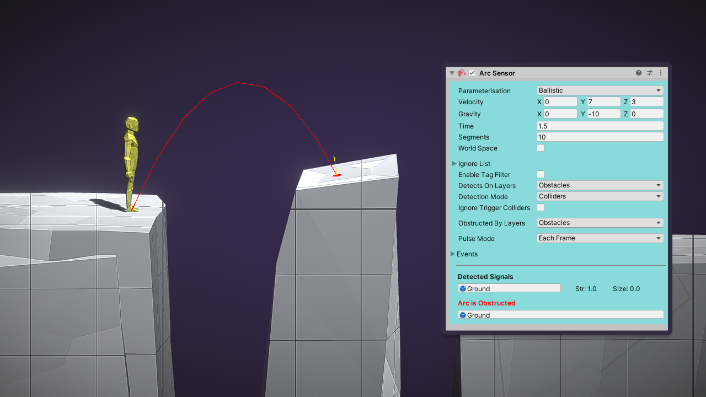

Arc Sensor 检测与一个 curve 相交的 objects。它与 Ray Sensor 类似，检测及所有能检测到的 objects，直到遇到 obstruction。

Arc 由折线段构成，arc 检测是通过对每个折线段进行 ray cast 完成。

# Output Signals

- Object
- Strength
- Shape

见 RangeSensor。

# Configuration

## Parameterisation

如何用参数定义 arc，但是最终 arc 会被离散化为折线段。由两个选项：

- Bezier：局部空间中 3 个点定义的四次贝塞尔曲线
- Ballistic：弹道，以一个常量速度和加速度，经过一段时间运行，构成的 projectile 的 arc

## Segments

arc 被打断为一组直线段。Sensor 对每个直线段进行 raycast，因此最好尽可能使用更少的直线段。Segmetns 有一个可变 length，可以更好地适应 curve。

## Layers

参加 Ray Sensor。

## Fiters

参加 Ray Sensor。

# Optimisation Considerations

参加 Ray Sensor。