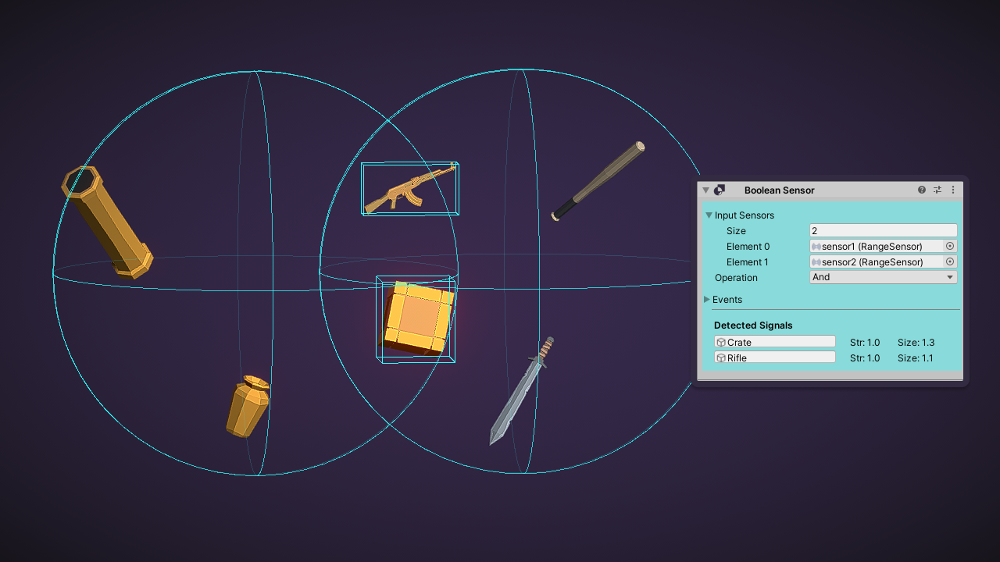
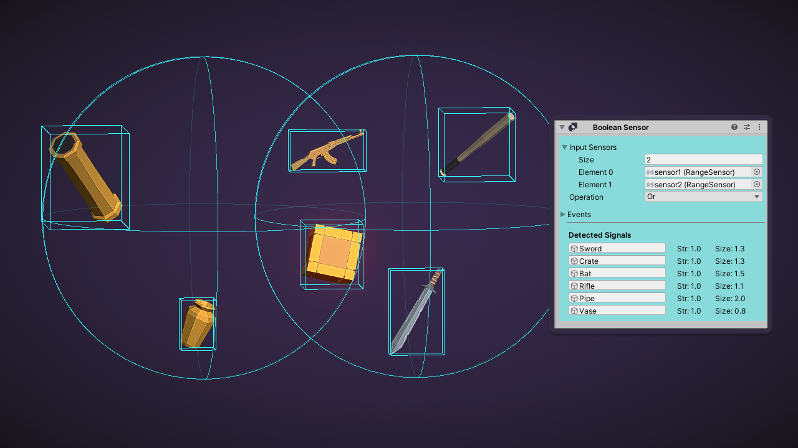

Boolean Sensor 是另一个复合传感器 Compound Sensor，它组合 input sensors 的 signals。它通过指定的 logical And 或 Or，merge 每个 sensor 的 signals。

And Mode 下 Boolean Sensor 的输出 signals：

Or Mode 下 Boolean Sensor 的输出 signals：

# Output Signals

- Object：与 Input Signal
- Strength：input signals 中的最大值
- Shape：input 的 signals 包围 shape

如果多个 input sensors 检测到同一个 object，它们的 strength 和 shape 在 output signal 被合并 merged。

Boolean Sensor 不需要 pulsed。它会订阅 input sensors 的事件，并在任何 input signal 改变时立即更新。

# Configuration

## Input Sensors

Sensor 派生的 sensors 的列表。

## Operation

Boolean Sensor 如何合并 input sensors 的 signals。

- And：逻辑与，object 被所有 input sensors 检测到才算被检测到
- Or：逻辑或，object 被任何一个 input sensor 检测到就算被检测到
- Exclusive Or：object 只被 input sensors 中的一个检测到才算被检测到，如果被超过一个 sensor 检测到，则不算被检测到

