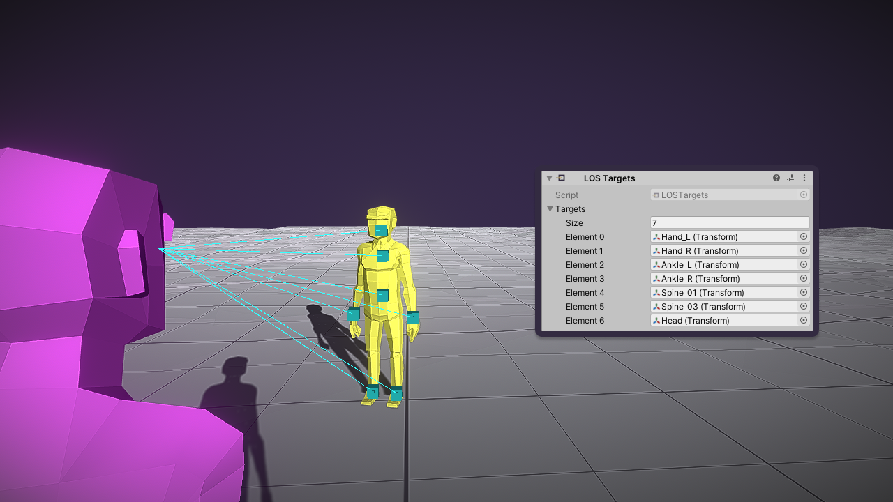

LOS (Line of Sight) Sensor 检测可见性高于一定阈值的 objects。它通过向 object 投射一组 rays 并计算被遮挡的 ray 的比率，来计算可见性。它是一个复合传感器 Compound Sensor，意味着它需要另一个 sensor 作为 input。Input sensor 的 Signals 每一个都会进行 Line of Sight 测试。

# Output Signals

- Object：与 Input Signal 相同
- Strength：Input Signals 的 strength 乘以 visibility(被阻挡的 ray 比率)
- Shape：与 Input Signal 相同

Line of Sight 在 input sensor 检测到新的 Signal 后立即开始计算。每次 LOS Sensor Pulse 时就会更新。

# Test Points

Rays 对每个 Input Signal 投射一组 rays 来确定 visibility。默认 points 是在 signal Shape 内随机产生的。你可以添加 LOSTarget 组件显式指定 test points。

如果 sensor 在 Signal.Object 上找到 LOSTarget，则使用那些 test points 进行测试。

# Configuration

## Input Sensor

可以是 Sensor 派生的任何 sensor，例如 Range Sensor 或 Trigger Sensor。它的检测结果为 LOS 测试提供目标。一个 object 要被检测到，首先要被 Input Sensor 检测到，然后还要通过 sensor 的 LOS 检测。

## Raycasts

Blocks Line Of Sight 属性配置哪些 physics layers 中的 Colliders 会阻碍 visibility。当 sensor pulses 时，执行的 raycasts 数量根据如下规则决定：

- 如果 object 有一个 LOSTarget 组件，它会为 component 上每个 test point 投射 ray
- 否则，它会投射 Number Of Rays 属性指定数量的 ray，test points 在 Siganl.Object Shape 内部随机生成

LOS 不能指定 ray shape，因此只能是射线检测 RayCast。

如果开启 Test LOS Targets Only 选项，sensor 只会检测具有 LOSTarget 组件的 object。

## Moving Average

开启这个选项在多个 pulses 之间平滑 visibility scores，而不是离散的。这会展示一个新的参数，称为 Window Size。Object 的计算 visibility 是它在等于这个 windows size 数量的 pulses 的 visibility 平均值。这可以有效地消除 visibility 的突然变化，即使 sensor 只使用一个 ray 测试。

## Field of View Limits

- Distance Limits

  如果开启 Limit Distance，visibility 通过到 sensor 的距离进行缩放。下面的属性会出现：

  - Max Distance：Objects 必须在这个距离内才能被检测
  - Visibility By Distance：确定 visibility 如何被到 sensor 的距离缩放。默认是 Step，意味着当 object 超过 max range，visibility = 0，否则正常计算。其他选项包括线性插值或自定义 curve

- Angle Limits

  开启 Limit View Angle 时，visibility 被到 sensor 的角度缩放。以下选项变得可见：

  - Max Horiz Angle：sensors 水平 field of view 的最大角度
  - Max Vert Angle：sensors 垂直 field of view 的最大角度
  - Visibility By Horiz Angle：visibility 如何被一个 horizontal angle 的函数缩放。即正常计算的 visibility 再乘以一个到 sensor 的角度的函数
  - Visibility By Vert Angle：visibility 如何被一个 vert angle 的函数缩放

