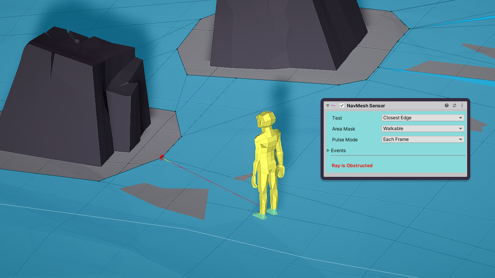

NavMesh Sensor 是一个简单 component，它可以在 Unity NavMesh 检测特定 features。它是 built-in navmesh functions 的简单包装器，例如 NavMesh.Raycat，NavMesh.FindClosestEdge，NavMesh.SamplePosition。它不会检测 Signals，因此它不是从 Sensor 派生的。

# Output

在它的任何 mode 下，sensor 会检测到一个 RayHit，它是一个 Point 和一个 Normal。

# Configuration

## Test

指示要使用哪个 navmesh function：

- Ray：使用 NavMesh.Raycast
- Sample：使用 NavMesh.Sample
- Closest Edge：使用 Navmesh.ClosestEdge

所有情况下，检测的结果数据以通过 GetObstructionRayHit() 方法获取。

## Area Mask

指示要测试的 navmesh area mask。
