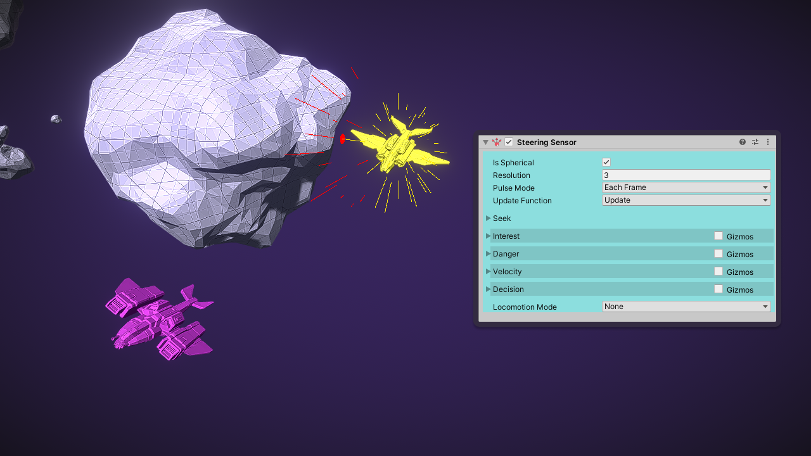
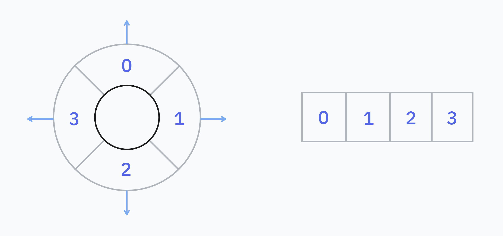
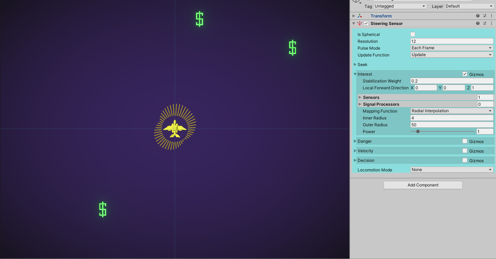
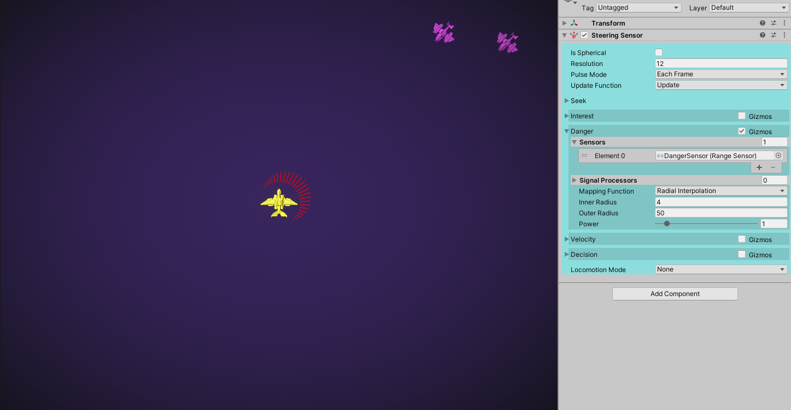
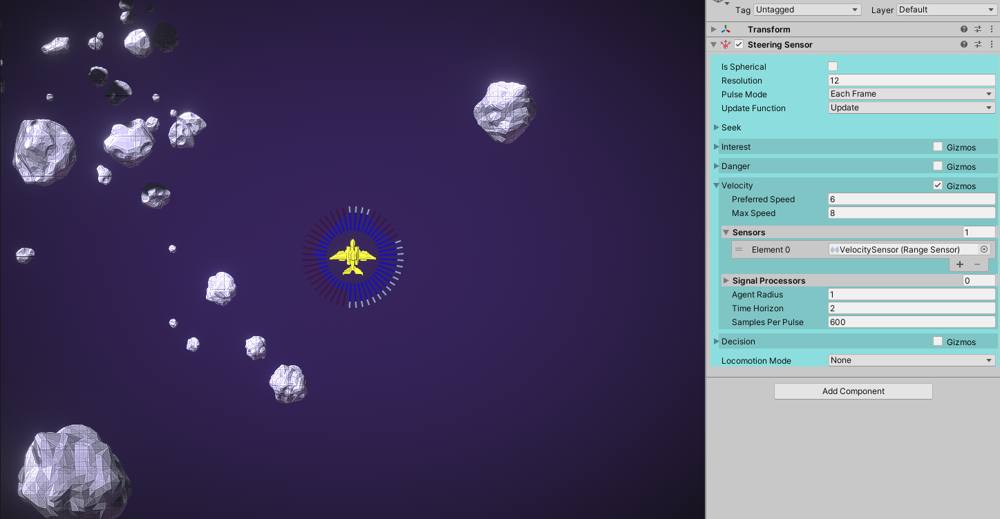
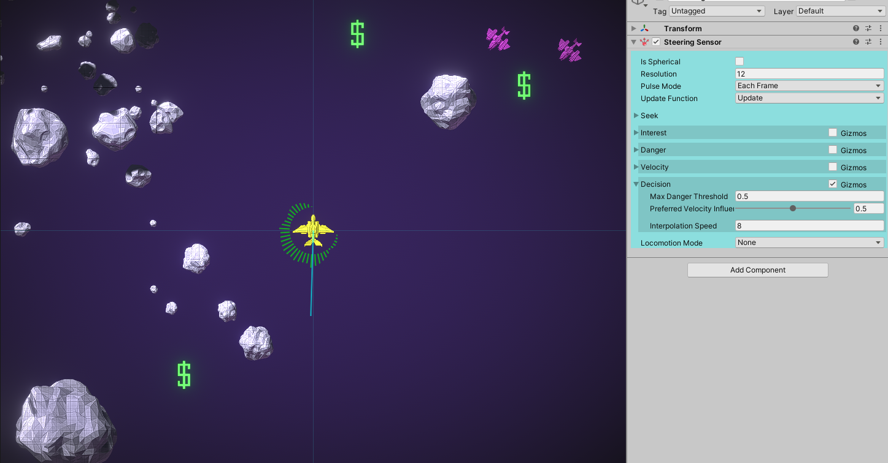

Steering Sensor 用于为你的游戏的 agent 实现 local steering 行为（局部导航）。当 Steering Sensor 被 pulses 时，会产生一个 Steering Vector。这个 velocity vector 是 agent 应该 follow 以达到 interest target，同时避免危险和潜在碰撞的向量。

Sensor 实现一个 Context Based Steering 和 RVO（Reciprocal Velocity Obstacles）的组合。

该传感器通过若干球形网格对周围环境进行建模，并选择一个能最大化效用函数的方向。其中部分网格存储了通过RVO（Reciprocal Velocity Obstacles，互惠速度障碍）方法计算得出的候选速度——这些速度在预定义的时间范围内不会引发碰撞。其他网格则存储了感兴趣或危险的方向。综合这些网格的信息，系统最终确定最佳行进方向以及不会导致碰撞的安全速度。

转向传感器可以工作在适用于飞行单位的球形模式，或者适用于地面单位的二维平面模式。

Steering Sensor 会避开周围的小行星，同时寻找洋红色的 space ship。

# Output

Steering Vector 通过 GetSteeringVector() 方法访问。这是一个可以传递给运动系统的 velocity vector。如果开启内置的 locomotion system，则每帧 Steering Vector 会传递给它。

给定方向的 candidate speed 可以通过 GetSpeedCandidate(direction) 方法访问。这些通过 Velocity behaviour 计算。

# Directional Grids

为了确定一个转向向量 Steering Vector，该传感器首先在多个方向性网格中对其周围环境进行建模。这些网格是由一系列标量值组成的数组，其中每个索引都映射到一个圆或球的表面上。

这是一个在圆周上仅划分4个单元格的低分辨率方向网格。这些单元格在内存中按顺序连续存储（如右图所示）。更高分辨率的网格会将圆周分割成更多数量的单元格。

方向网格的每个单元格存储一个值，该值描述其所包含的球形区域的某种属性。这个值的含义取决于上下文。例如，一个兴趣网格会在每个单元格中存储一个值，用于衡量该方向上的有趣程度。一个危险网格则会在每个单元格中存储一个值，用于衡量该方向上的危险程度。

转向传感器 Steering Sensor 有四种子行为：兴趣 Interest、危险 Danger、速度 Velocity 和决策 Decision。每种行为都会生成一个或多个方向网格。这些网格包含了传感器决定最佳转向向量所需的所有信息。如果你需要的话，也可以在运行时访问这些网格的计算内容。

# Steer Behaviours

## Steer

在这里，你可以选择一个 智能体应该到达的目的地。该行为本身没有独立的网格，而是向兴趣网格中添加数值。因此，这是兴趣行为的扩展。目前提供了几种“寻路”模式可供选择。

- Position：使智能体朝向一个目标Transform或Vector3位置移动。ArriveDistanceThreshold和StoppingDistance属性与该模式相关。你可以使用SteeringSensor.IsDestinationReached查询传感器是否已到达目的地。  
- Direction：使智能体朝向世界空间中的一个Vector3方向移动。  
- Wander：漫游，禁用“寻路”行为，因此不会对 Interest grid 做任何更改。  
- Stop：无论兴趣网格或其他网格中的内容如何，都将使智能体原地停止。

Flee（逃跑）behaviour 也是可能的。将 seek mode 设置为 Position 并将 Distance Offset 设置为一个很大的值。Agent 会查找偏移 target distance 的位置。

Sensor 不会通过复杂的 level geometry 计划一个路径。它只基于周围它能看见的情况进行转向。要计划一条路径，你需要一个 pathfinding system。然后整体跟随路径，局部仍然使用 SteeringSensor 跟随路径。

Vector Field。

## Interest

该行为会构建一个方向网格，用于表示某个方向的"有趣程度"。特定方向上的数值越大，就越能强烈地影响智能体选择该方向。兴趣值会从目标角度开始线性衰减，从而在网格中形成瓣状分布。当两个或多个目标彼此靠近时，兴趣值不会叠加——对于每个方向，只会取最大的兴趣值。

- Stabilization Widget：这有助于避免智能体方向发生不规律的变化。一个具有该长度的兴趣向量将被施加到智能体的前进方向上。鼓励智能体保持其当前方向。
- Local Forward Direction：Stablization Widget 应用的 local direction。
- Sensors：一个 sensor 引用列表，用于检测兴趣目标。对于列表中每个传感器检测到的每个 Signal，都会在其方向上向网格施加兴趣值。
- Signal Processors：一个处理器列表，将对传感器列表中的每个信号额外执行处理。这有助于从兴趣网格中过滤掉某些检测结果，或修改某个检测结果所具有的兴趣值大小。
- Mapping Function：如何计算每个检测结果的兴趣值。可选值包括：径向插值（根据距离计算兴趣值），或信号强度（使用Signal.Strength作为兴趣值）。
- Radial Interpolation：仅在映射函数为径向插值时有效。兴趣值会根据与传感器的距离从1线性插值到0。该属性允许你设置插值范围。

## Danger

该行为会构建一个方向网格，用于表示某个方向的"危险程度"。它实际上是兴趣行为的反面——特定方向上的危险值会促使智能体避开该方向。危险值同样会从目标角度开始线性衰减，从而在网格中形成特定的分布模式。当两个或多个危险源彼此靠近时，危险值不会叠加计算，每个方向只取最大的危险值。

- Sensors：一个传感器引用列表，用于检测危险目标。对于列表中每个传感器检测到的每个信号，都会在其方向上向网格施加危险值。
- Signal Processors：一个处理器列表，将对传感器列表中的每个信号额外执行处理。这有助于从危险网格中过滤掉某些检测结果，或修改某个检测结果所具有的危险值大小。
- Mapping Function：如何计算每个检测结果的危险值。可选值包括：径向插值（根据距离计算兴趣值），或信号强度（使用Signal.Strength作为兴趣值）。
- Radial Interpolation：仅在映射函数为径向插值时有效。危险值会根据与传感器的距离从1线性插值到0。该属性允许你设置插值范围。

## Velocity

Velocity behaviour 在避障方面表现更佳，因为它会让智能体通过加速和减速来避免碰撞，从而产生更真实的效果。而危险行为更适合规避那些具有危险性但不一定处于碰撞路线上的目标。

Velocity behaviour 会计算网格中每个方向的速度候选值。这些速度候选值能够避免在定义的时间窗口内与所有附近障碍物发生碰撞。该行为通过比较 Sensors Pulses 间各障碍物的位置来估算它们的速度。速度候选值是使用速度障碍算法计算得出的。

- Preferred Speed：如果没有障碍物，智能体应尝试达到的速度。
- Max Speed：智能体能够行驶的最大速度。为了避开障碍物，智能体可以加速至该最大速度。
- Sensors：用于检测速度障碍物的传感器列表。通过比较传感器脉冲间各检测目标的位置来估算其速度。
- Signal Processors：一组将应用于输入传感器检测信号的信号处理器列表。
- Agent Radius：用于预测潜在碰撞的智能体半径。
- Time Horizon：传感器会在该时间窗口内搜索能够避免碰撞的候选速度。
- Samples Per Pulse：每次传感器触发时测试的潜在候选速度数量。速度候选方案的搜索是在Unity Job中进行的。

速度障碍被建模为半径为Max(Signal.Bounds.extents)的球体。传感器为网格中的每个方向计算两个速度候选值：一个 Lower 候选值和一个 Upper 候选值。Lower 候选值的选择基于 0 <= Lower 候选值 <= 偏好速度，而 Upper 候选值的选择基于 偏好速度 <= Upper 候选值 <= 最大速度。

上一轮传感器触发产生的速度候选值会被存储在传感器中。你可以通过传感器的API在运行时查询任意方向对应的速度候选值。

## Decision

Decision Behaviour 会综合所有先前行为生成的网格数据，为每个方向计算综合得分。传感器最终生成的转向向量将指向得分最高的方向。

- Max Danger Threshold：超过此阈值的危险分数将始终驱使智能体远离该方向，无论该方向存在多大的兴趣值。
- Preferred Velocity Influence：智能体应优先选择能使其以接近偏好速度行进的方向的程度。当该值大于0时，速度行为将引导智能体绕过障碍物。
- Interpolation Speed：决策网格中的数值会随时间进行插值过渡。当传感器触发时，会生成一个目标决策网格，当前决策网格会逐渐变化以匹配该目标网格。这种变化的速率由本参数控制。这样设计的好处是：即使传感器以固定间隔触发，也能避免出现行为异常的情况。

# Locomotion

如果你已经为智能体配置了移动系统，那么转向向量将非常有用。每帧获取该向量，并将你的移动系统设置为朝其方向移动。或者，你也可以使用内置的移动系统之一。我们为飞行类和地面类智能体提供了简单的实现方案。

内置的移动系统非常简单，不建议在基本用例之外使用。在大多数情况下，你可能希望使用外部移动系统（例如 Character Controller，Tank Controller，Spaceship Controller），并仅使用转向传感器来计算转向向量。

## Locomotion Mode

默认为 None，意味着 locomotion 是关闭的，sensor 只产生转向向量 steering vectors，可以选择：

- Rigid Body Flying：控制一个飞行的 RigidBody，或者是 kinematic 或者通过 forces
- Rigid Body Character：控制一个 ground-based Rigidbody，或者是 kinematic 或者通过 forces
- Unity Character Controller：用转向向量控制一个 CharacterController 组件

2D 版本只有一个 Rigid Body 2D 选项，它在 top-down 游戏中可以用于 flying agent 或者 ground-based agent。

如果选择一个 locomotion mode，你会看见额外的选项，可以控制它的最大 speed 和 acceleration。
