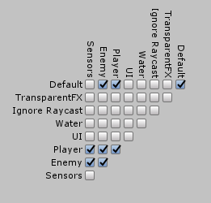

Trigger Sensor 检测与一个 Trigger Collider 相交的 objects。它通过监听 OnTriggerEnter 和 OnTriggerExit 事件工作。

这个 sensor 和 Range Sensor 的角色类似，但是有一些独特的优势。它的缺点是配置起来更难。当使用 Trigger Sensor 时，需要考虑一些微妙的复杂性。

# Background Knowledge

Collision action matrix 尤其重要。它显示了 Trigger Sensors 为什么经常需要挂载一个 Kinematic Rigid Bodies。

Trigger Sensor 监听 Collision Detection 事件。当收到 OnTriggerEnter 事件时则有一些东西被检测到。当收到 OnTriggerExit 事件时则失去了一些检测到的碰撞。

# Output Signals

- Object
- Strength
- Shape

见 Range Sensor。

Trigger Sensor 不需要 pulsed，因为它不是通过物理查询检测的，而是监听 Unity 事件。当它接收到 OnTriggerEnter 或 OnTriggerExit 时，立即更新。在编辑模式，不可能 Test 这个 Sensor。因此为了开发便捷，应该尽量使用 RangeSensor。

# Configuration

## Layers

sensor 上没有属性可以配置能检测的 physics layers，它完全依赖 Unity Physics Setting 中的 Collision Matrix。Sensor 不管你如何配置 layers，你可以自由配置它们。Sensor 只监听 OnTriggerEnter 和 OnTriggerExit，接收到什么就检测什么。

建议创建一个名为 sensors 的 physics layer，将 Trigger Sensors 放到这个 layer 中。然后再 collision matrix 中就可以精确控制哪些 layers 可以被检测。还要注意 sensors 不要与自己 collide，你可能不想两个 Trigger Sensors 彼此检测对方。

## Filters

- Ignore List
- Tag Filter

## Safe Mode

当开启 safe mode，sensor 会添加一个辅助组件，防止一些 Unity 中的怪异问题导致 OnTriggerExit 事件没有被触发。当被检测到的 Object deactivated 之后从 sensor 的 Volume 移除，然后重新 activate Object，就会导致这样的问题。Deactivated GameObjects 不会触发 OnTriggerExit 事件，这样 Trigger Sensor 就会仍然显示它被检测到。Pooling 系统的使用经常导致这样的问题，例如：

- sensor 检测到一个 SpaceShip object
- SpaceShip 被摧毁，这样它的 GameObject 被 disabled，并返回 pool 中
- SpaceShip 重新在其他地方生成，它移动到那里并 enabled。这样 sensor 仍然认为它被检测到，尽管它已经在很远的地方了

Safe Mode 下，sensor 会额外检测 detected object 发送的 OnTriggerStay 事件。这会检测到 object 离开了 detection range 但是没能发送 OnTriggerExit 事件。

你还可以不用开启 Safe Mode 解决这个问题。只需要在 deactivate object 之前，将它的 position 设置到离 sensor 很远的地方，这样 OnTriggerExit 就会被发送，然后再 deactivate object。但这可能需要两个帧来实现，第一个帧原理 object 确保 OnTriggerExit 被发送，第二个帧再 deactivate object。这是最佳方案，但是这明显比 Safe Mode 麻烦了一点。

Safe Mode 可能需要几个帧才能注意到 object 失去检测。这是因为 OnTriggerStay 在 Physics Update 中发送，而物理帧频率经常慢于渲染帧，即 FixedUpdate 通常比 Update 更慢，一个 FixedUpdate 包含多个 Update。物理帧频率可以设定。

# Performance Considerations

Sensor 没有实现 Update，LateUpdate，和 FixedUpdate，因此没有每帧更新它们的开销。唯一的开销是计算 Trigger Colliders 与其他 Colliders 之间的碰撞。通常这是高度优化的，在 Unity 内部实现，尤其是 sensor 没有移动的时候。当你需要大量 static trigger 时，这个 Sensor 有很好的性能。

但是如果开启 Safe Mode，则需要每帧更新，因此 per-sensor 会有一点额外开销。
