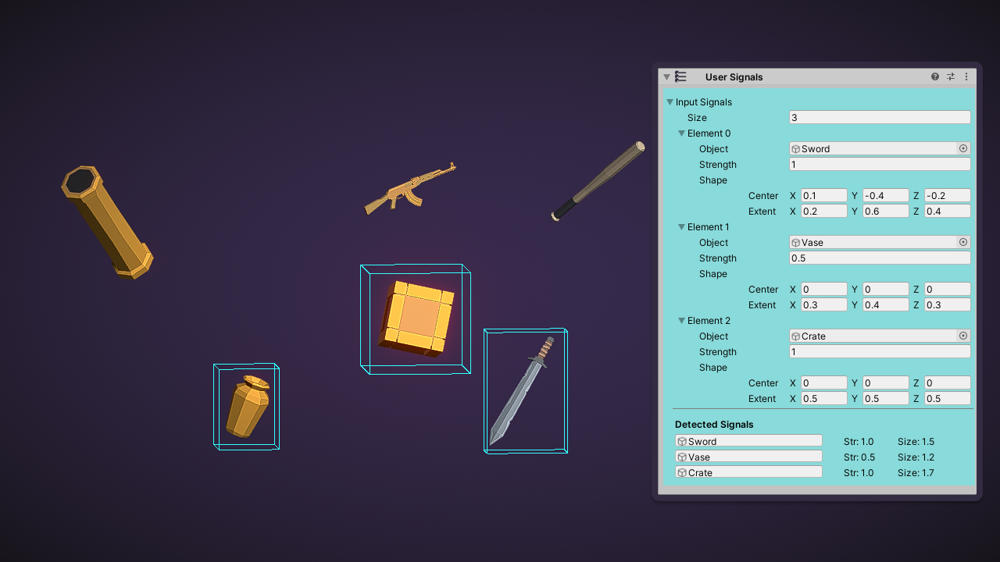

User Signals 会检测你指定的任何内容。它提供了一种直接控制其他复合传感器的方式。例如，你可以将其与视线传感器配合使用，来测试特定对象的可见性。

The User Signals is configured explicitely to detect the Sword, Vase and Crate

# Output Signals

你可以通过在输入信号列表中明确设置输出信号来精确指定检测内容。该传感器无需进行脉冲触发。
