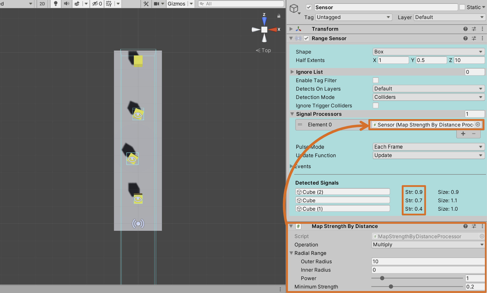

信号处理器提供了一种过滤和修改传感器所产生信号的方法。每个传感器都有一个信号处理器列表，这些处理器会按顺序对其检测到的信号依次执行处理。处理器可以改变信号的强度或形态，将其映射到不同的游戏对象，或者完全将其从检测结果中过滤掉。

如果你使用自己的 tag system，你想要 sensors 基于它来过滤，则 Signal Processors 是实现它的理想方式。



RangeSensor 使用了 MapStrengthByDistance 处理器。该处理器会根据检测目标与传感器之间的距离对信号强度进行插值计算。处理器设定了最小信号强度为 0.2，因此将距离最远的方块从检测列表中过滤掉了。

工具包中包含了一些内置的信号处理器，你也可以通过继承基类 SignalProcessor 来轻松创建自定义处理器。下面展示如何编写一个基于自定义标签系统进行过滤的处理器示例。

```C#
using System.Collections;
using System.Collections.Generic;
using UnityEngine;
using Micosmo.SensorToolkit;

// You should extend SignalProcessor, which itself extends MonoBehaviour.
public class FilterExampleTagProcessor : SignalProcessor {

    public string[] AllowedTags;

    // Implement the Process function, the first parameter is the input signal, and the second
    // is the Sensor the signal originated from. The signal parameter is a 'ref', if you want
    // to change the signals properties then modify this parameter directly.
    public override bool Process(ref Signal signal, Sensor sensor) {
        var tag = signal.Object.GetComponent<ExampleTag>();
        if (tag != null) {
            foreach (var allowedTag in AllowedTags) {
                if (tag.Tag == allowedTag) {
                    return true; // Return true if you intend the signal to be detected
                }
            }
        }
        return false; // Return false if you intend the signal to be filtered out
    }
}
```

建议查看包含的 Signal Processors 来更好地理解如何编写自己的 Processor。
