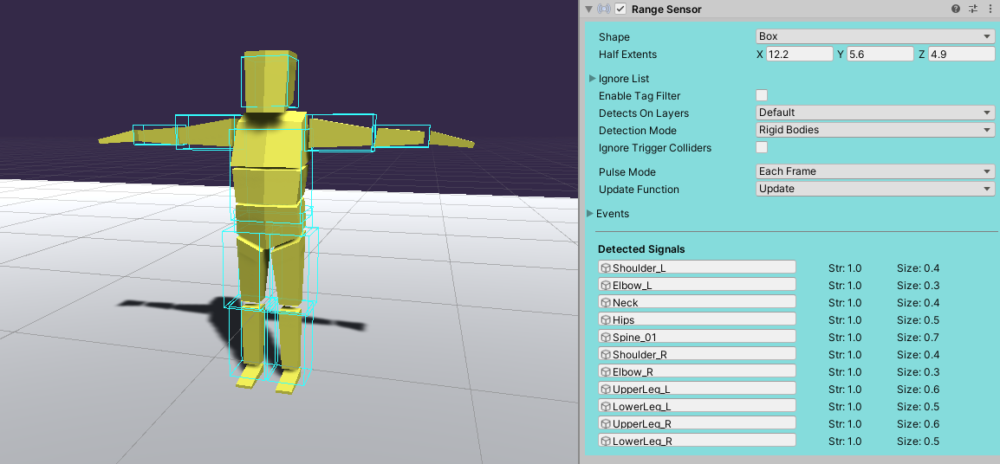
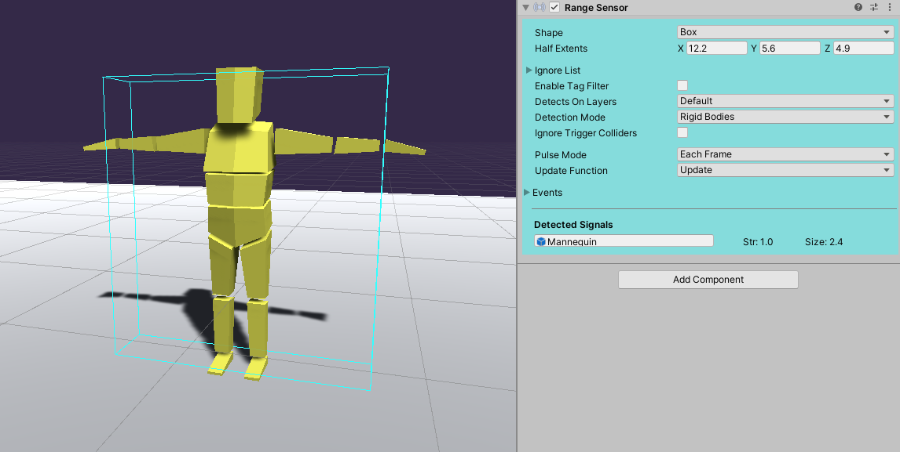

Signal Proxy 组件会在组件的拥有者被检测到时，指示传感器去检测另一个不同的对象。例如，如果你的角色每个肢体都带有刚体，通常这会导致传感器分别检测每个肢体，但你可能希望检测角色的根节点。你可以将这个组件放在每个肢体上，并将其指向根节点。

这个 Character 在它的四肢的每一个上都有 Rigidbody。Sensor 会作为 separate Signal 检测每个 limb。

