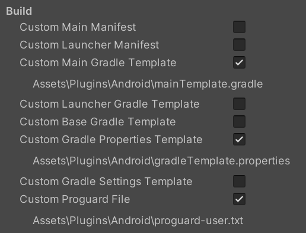
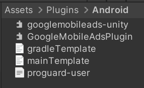

# Google Admob Unity Plugin

下载安装最新版本的 GoogleMobileAds-v8.7.0.unitypackage 并导入，注意移除 iOS 相关的内容。

Plugin 安装后第一次进行 Android resolve 时，需要在命令行中调用 JDK（因为它是插件，不是 Unity 内部的程序，只能调用外部命令）。Unity Android Build Support 虽然安装了 OpenJDK 在本地，但是没有设置环境变量，如果进行 Android Resolve 就会出现没有设置 JAVA_HOME，找不到 JDK 的错误。因此在 Import 插件之前，先设置好 JAVA_HOME 环境变量。

Windows Unity 的 JDK 位于 "C:\Program Files\Unity\Hub\Editor\2022.3.17f1c1\Editor\Data\PlaybackEngines\AndroidPlayer\OpenJDK"。

设置环境变量 JAVA_HOME="C:\Program Files\Unity\Hub\Editor\2022.3.17f1c1\Editor\Data\PlaybackEngines\AndroidPlayer\OpenJDK"。还要设置好 Path，添加 %JAVA_HOME%\bin 到 PATH 中，因为 Resolve 时还要调用 java 命令。

在 GoogleMobileAdsSettings 中填写 AdMob App ID。这一步非常重要。如果没有填写（甚至前后包含空格）应用程序安装后都无法启动，直接退出。测试中经常反复安装 ads plugin 过程中就往往忘记填写 App ID。务必要记住填写 App ID，而且注意不要填写成 AD Unit ID，App ID 是全局设置，整个 APP 一个 ID，AD Unit ID 用在 code 中。App ID 限制尤其严格，填错了或忘记填，在构建时并不报错，但是在安装后，启动 APP 直接退出。

Admob 账号长期没有广告进入，google 会将账号 deactive。Reactive 账户需要验证码重新验证，并且通过 google 的 review。香港账号必须使用香港地区的电话号码。使用 https://sms-activate.org/（用香港 google 账户登录），充值使用，选择 Google 相关应用，地区选择香港。

在 publishing setting 中勾选 Custom Main Gradle Template，Custom Gradle Properties Template 和 Custom Proguard File。



按照官方文档，只需要勾选前两个即可，但是实际测试发现只勾选前两个，安装到设备时会出现 class not found 的问题，应该是 java 代码被剪裁了。因此还需要勾选 Custom Proguard File 防止代码被剪裁。网络上给出的 Custom Proguard File 模板是：

```
-keep class com.google.** { public *; }

-keep class com.google.unity.** {
   *;
}

-keep public class com.google.android.gms.ads.**{
   public *;
}

-keep public class com.google.ads.**{
   public *;
}
-keepattributes *Annotation*
-dontobfuscate
```

但实际测试发现仍然会出现 class not found 的问题，ads sdk 初始化失败。最终的解决方法是，包含一切 com.google 下面的 code（不进行任何剪裁），才测试成功：

```
-keep class com.google.** { public *; }

-keepattributes *Annotation*
-dontobfuscate
```

因此要勾选 Custom Main Gradle Template，Custom Gradle Properties Template 和 Custom Proguard File，然后 keep com.google 下面的所有类。


完成上面的设置后，点击 Assets > External Dependency Manager > Android Resolver > Resolve 菜单解析插件依赖，并设置 gradle 各种文件。如果后面构建有问题或打包后安装在设备上还有问题，就先 Delete Resolved Libraries 然后 Force Resolve。Force Resolve 会生成并勾选 Gradle Setting 文件，注意删除这个文件。

Resolve 后生成的文件都存在于 Assets/Plugins/Android 下面。当前测试成功版本，此目录的内容为：



一切设置好后，就可以构建安装包了。构建后，打包目录下，会生成一个 XXX_mapping.txt，里面似乎是 C# 类到 Java 类的映射关系。它的大小反应了裁剪后保留的 Java 代码的多少。前面设置 Proguard 包含了 com.google 下面的所有 class，当前 mapping 文件大小为 4M 左右，如果很小，说明代码被剪裁了，应用在设备上安装后，很可能出现 class not found 的问题。

如果一切设置正确，测试设备上就可以看到测试广告了。加载广告时需要一定的时间，如果需要显式广告时才去加载，会出现很大的延迟。因此应该在 Ad SDK 初始化成功的回调中就应该预加载广告。然后在每次当前加载的广告播放完毕关闭后，立即预加载下一个广告。

AdMob Unity Kit 初始化加载广告会花费很长时间（10s左右甚至更多），有可能导致 player 已经点击观看广告，而广告还没有初始化好的情况。而且广告初始化以及广告加载在正常的情况下都有可能因各种原因失败。因此广告加载的 code 要尽量健壮，加载失败后要重试，直到成功为止，而且这些要在后台进行，不要干扰游戏正常运行。此外，显示广告前还要检查广告加载是否成功，以及失败的情况下怎么处理。

