# Google Play Billing

## Unity Settings

构建时需要将 Target API Level 设置为最高，当前为 API Level 33。Minimum API Levels 可以设得低，是满足 app 运行的最低 API level。

此外，这里有两个版本，version 显示在 Google Play Store 信息页面上的，它可以是任何字符串，例如 "0.1", "1.2", 甚至 "internal test", 而 Bundle Version Code 是上传 Developer Console 的 Release Bundle 使用的，它必须是整数，而且每次上传的 bundle 都必须不同，否则 Developer Console 会报告，当前 bundle 已经被用于其他阶段。每次构建 bundle 并上传时，都将 Bundle Version Code 递增。

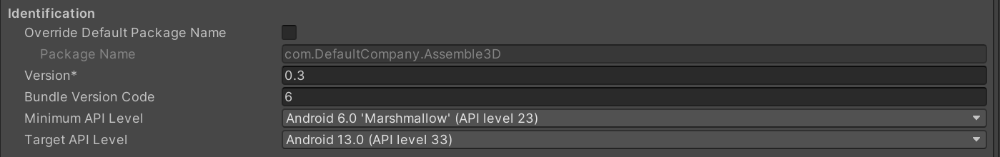

使用各种 Android 第三方插件（尤其是包含 dll 的那种）每次插件更新（添加或删除）都要执行 Assets/External Dependency Manager/Android Resolver/Resolve，更新 Android 构建的 xml。

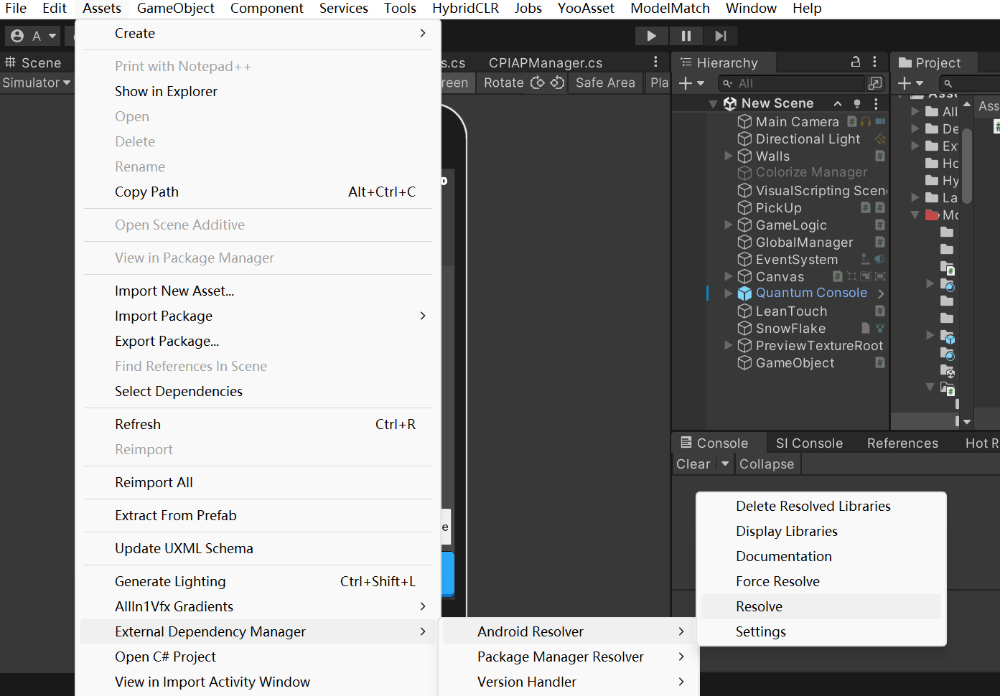

构建 Gooele Play Bundle 时需要创建一个 Publishing Key 用来给 bundle 签名。在 Unity Player Setting 的 Android tab 中，使用 Keystore Manager 创建一个 keystore，保存在 Project 目录下（与 Assets 同级），然后创建一个 key，并且选择它来给 bundle 签名。创建 KeyStore 和 Key 都需要设定密码。

此外 Minify 要设置为 Release。

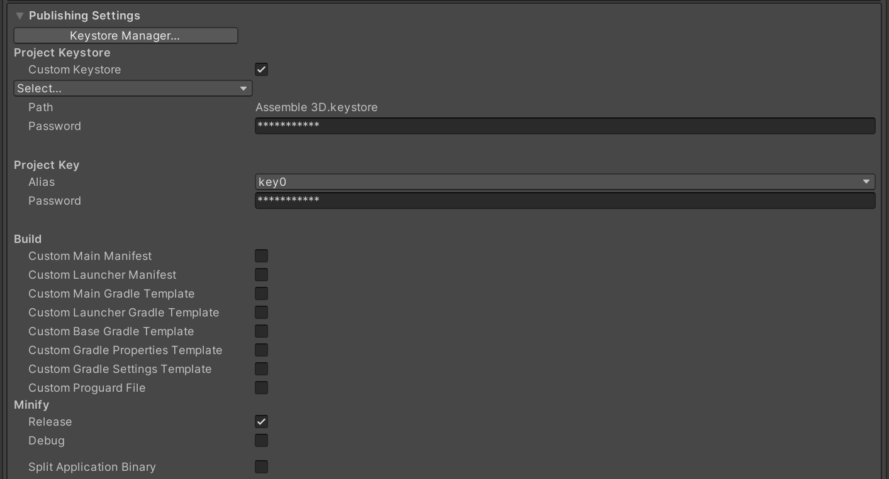

构建 Google Play Bundle 需要在 Android Player Setting 开启 Build App Bundle Google Play 选项，构建会生成 aab 包。

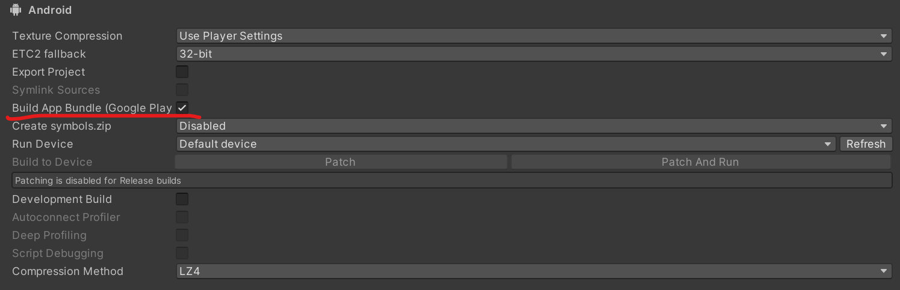

使用 CrossPlatformEssentialKit 进行 IAP 时，先在 Billing Setting 中添加好 Products 信息，这是本地信息，要和 Google Play Store 上的信息一样。使用 Unity UGS IAP 也是一样，都需要在本地构建 Product 信息，然后去 Store 上拉取。本地只需要指定各种 ID 和 Title/Desc 描述性信息就好，Price 在 Store 上取下来。

Unity UGS IAP 的 Catalog 对话框，可以创建 Product 信息，然后导出为 Google Play 可导入的 csv 文件。

但是 Unity 的 Catalog 只用于创建 Product 导出文件，在代码中还要手动创建要使用的 Product 列表，但是 CPEK（CrossPlaytformEssentialKit）直接使用 Setting 中填写的 Product 信息去 Store 拉取，不需要在 Code 中再次手动创建。

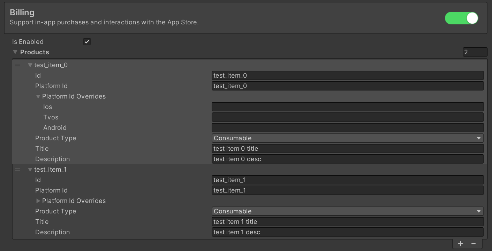

Products 中的 Id 是 code 中引用商品的标识符（BillingServices.BuyProduct）。PlatformId 则是商店平台上的商品的通用 id。Id 和 PlatformId 必须都正确设置。Id 可以自由设置，PlatformId 则必须与商店平台的商品 ID 相同。通常 PlatformId 没有特别限制，可以自由设置，因此绝大部分商店平台都可以使用相同 Platform Id。但是某些平台可能具有特殊要求，无法与其他商店平台共用相同的 Platform Id。

Unity 中（无论是 UGS IAP，还是 CPEK BillingSettings），需要设置 Google Play 上产品的 License Key，这可以在 Developer Console 上的 Monetization setup 中看到。

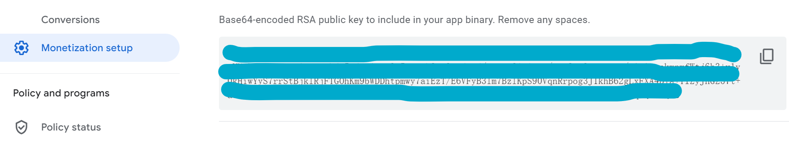

它在 Billing Settings 中的 Public Key 设置:

App Store Id's 设置为 package name:

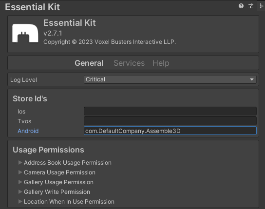

这可以在 Building Setting 中找到:

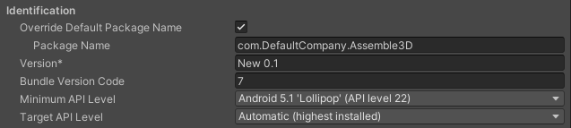

但似乎不设置这个值，测试也没问题。根据官方文档，这个值应设置为：

- iOS: Set the "Apple Id" value from Appstore Connect -> Select your App -> General  -> App Information -> General information (check below screenshot ). This is a numeric value. Ex: 1210072186
- Android: Android : Set the package name of app. Ex: com.voxelbusters.essentialkit

## Google Play Settings

Google Play 发布应用有一系列的流程（pipeline），从前到后将 pipeline 走完，应用才会发布到 Store。

第一步是创建 Application。创建的 Application 是无法删除的，但是可以修改所有信息（例如名字）。它代表一个发布的应用，但与具体发布的内容无关。

然后是一系列的 Test 步骤，包括 internal test，close test，open test，最后正式发布。

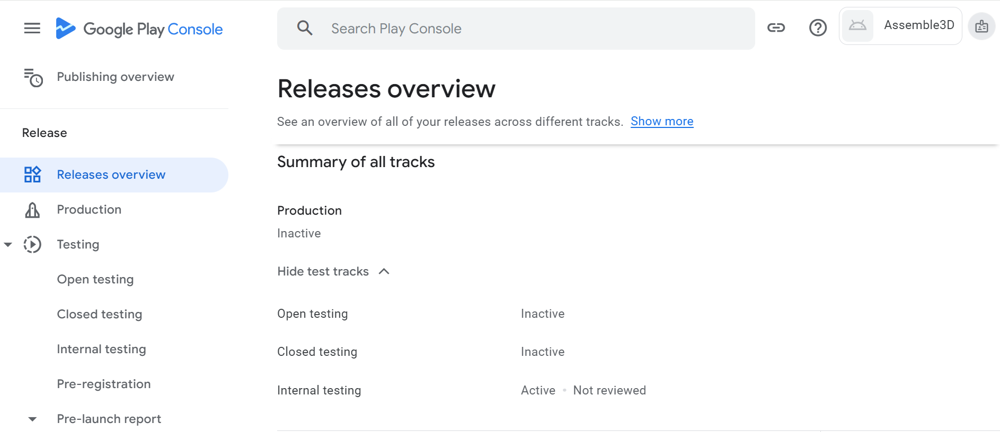

每个测试下 Promote release 可以将本次测试版本 promote 到下一个阶段，按照 Developer Console 指引执行即可。

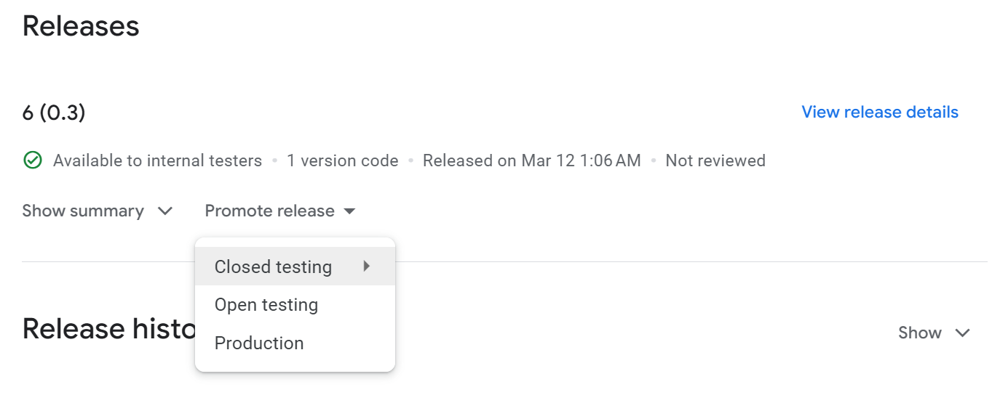

第一个测试步骤是 internal test。这是用于给开发者内部测试使用的。测试 IAP 首先要先创建一个 internal test。只有创建了任意 test track 的 release，才能创建 in-app product。

构建好一个 Google Play Bundle，然后再 internal test 中 Create 一个新的 Release，将 Bundle 上传。注意每次上传都需要一个新的 Bundle Version Code（整数）。Version 字符串只是描述性信息，显示在 Google Play Store 上。

不需要每次改动都要生成新的 bundle 并上传、下载才能测试。只要保证 bundle version code，app 签名，和 package 名字 与 test track 中已经上传的 bundle 一样，可以直接在 unity 构建 apk 然后再测试设备上更新即可，这称为 side-load。side-load 只能构建 apk，aab 是上传 Google Play Store 的格式，无法在设备上直接安装。

一旦上传了一个 test track bundle，就可以创建 in-app products 了。一个 product 主要包含 name，id，price，更具体的产品详情完全由客户端定义。

上传好 bundle 并设置好 in-app products 后，就可以开始测试了。

在 Test 的 Tester 页面，创建一个邮件列表，添加每个测试者的邮件地址并保存（具体作用还不清楚，不知道是否只允许这些邮件对应的 google play 账号才能测试，还是简单的每次有 bundle 更新只是通过这些邮件地址通知测试者）。

注意添加到 Feedback 的邮件地址不能添加在 Testers 的邮件列表中。

可以将开发者自己的邮件地址作为 Tester。

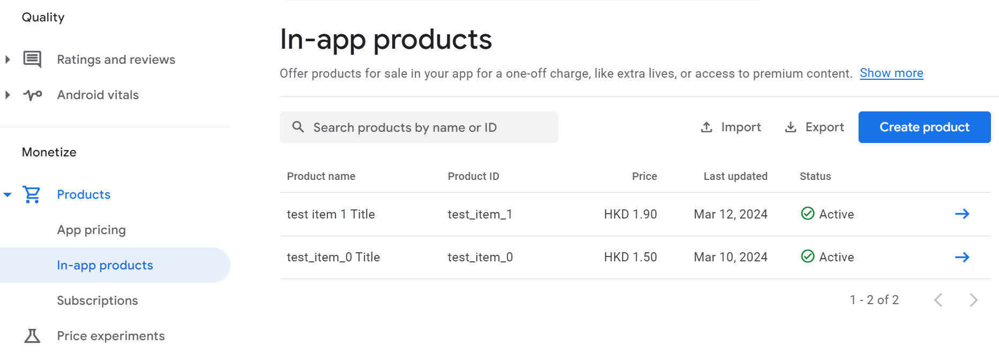

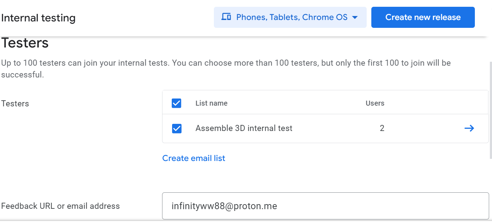

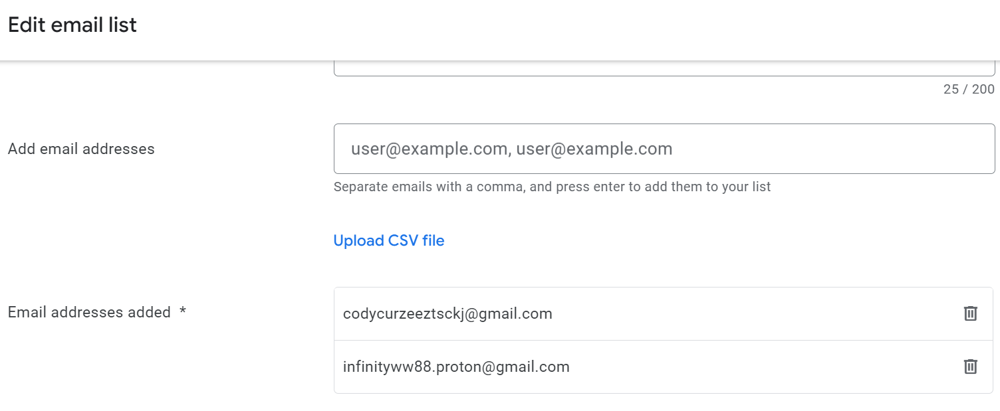

一个 Test Track 有两个页面。一个 Releases，用于管理上传的 bundle，每个 bundle 的 version 例如 6(0.3)，前面的整数是 bundle version code，后面的字符串是 version，对应 Unity Player Setting 中的设置。一个 Testers，用来设置测试者。

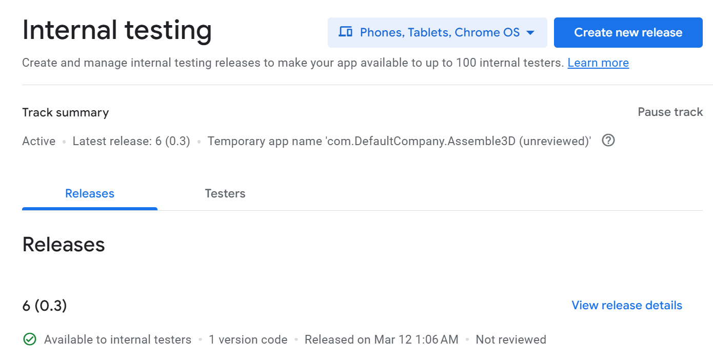

下面显示着历次上传的版本信息。

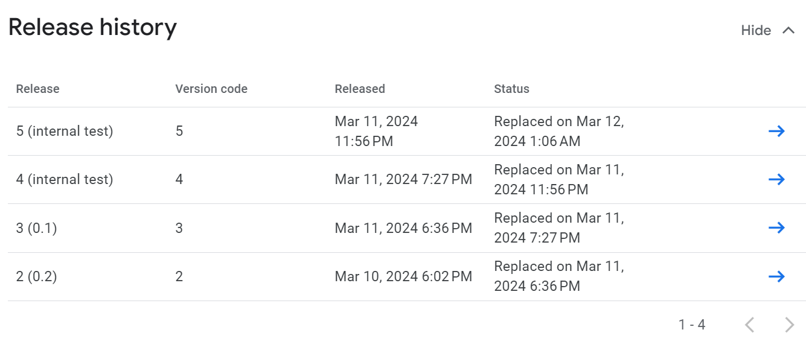

每个上传的 bundle 也是不能删除的，除非联系 Google Play 支持，人工删除。

最后在 Tester 测试页面下，将 Copy link 中的连接发送给测试者。

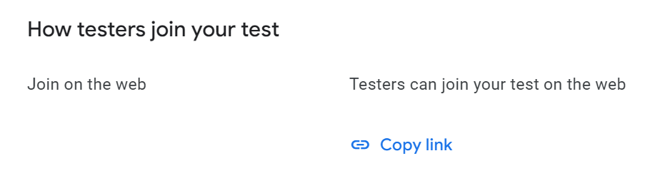

每次上传后，Google Play 说需要可能数小时的时间才能看到更新，实际测试时基本几分钟之内就可看到。为了确保知道 Google Play 上的 App 是否是新的版本，还是旧的，每次构建新的 Bundle 时，一定要设置新的 version（字符串），这样在 Google Play 上可以看到它，通过它就可以知道更新是否已经可见了。

## Device Settings

测试者受到 Opt-In link 后，在设备上的浏览器打开（注意开启 VPN），会显示接受测试页面。

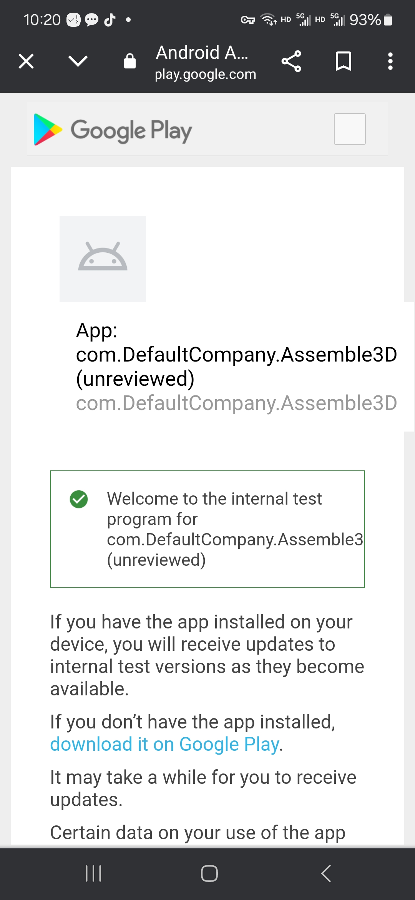

下面是一个非常关键的步骤：点击最上面的 Google Play 的 CheckBox，这会弹出账户选择界面，即这个测试使用哪个 Google Play 账户测试。必须要选择有支付方法（payment method）的账户，否则 IAP 初始化时会失败，报告 BILLING_UNAVAILABLE。

要在本地 Google Play 中添加好测试账号（可以是开发者自己的账户），并设置好测试账号的支付方法，确保能够购买 in-app product，然后还要选择这个账号来测试。

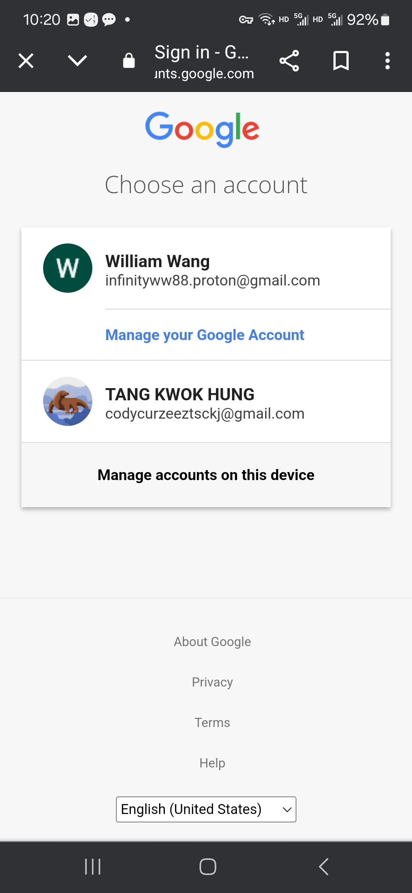

选择好账号后，就可以在设备上安装测试版本的 app 了。点击 download it on Goole Play 会打开 Google Play App，显示测试应用的界面。

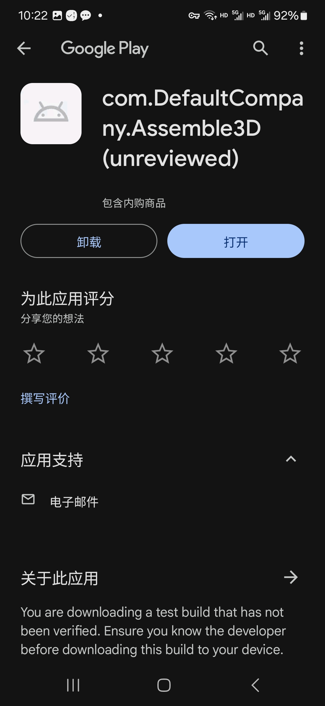

注意查看详细信息中的 version，确保最新 version 的 bundle 已经在 Google Play 上可见，否则就等待并刷新，直到看到最新的版本号。否则只会下载到就版本。

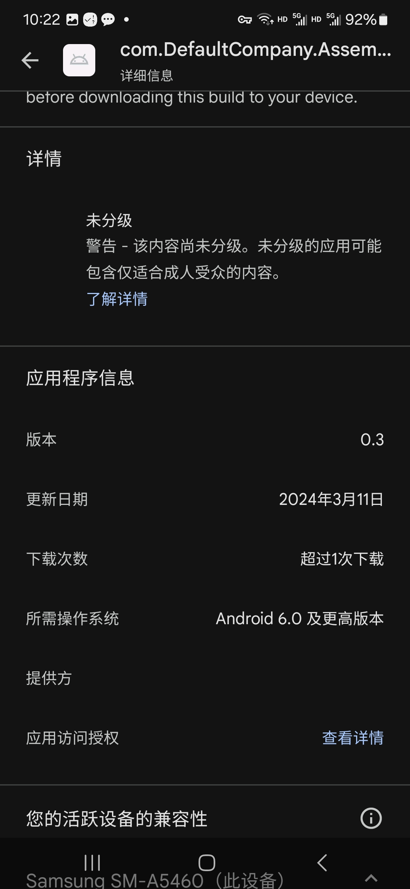

一切设置成功后，就可以在测试的 APP 中点开 Google Play Store 的支付页面了。

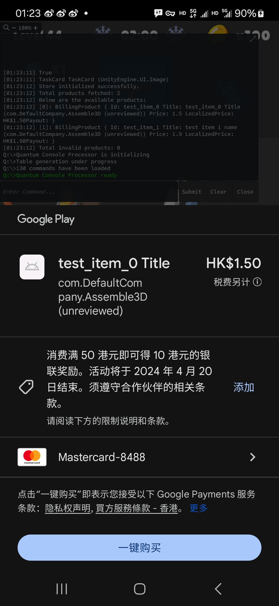

普通测试的支付是真实的支付，支付后 14 天后可以退款。

支付后，可以在 Google Play 的 Payments & subscriptions 页面中看到交易记录。注意是测试者的 Google Play 页面，不是开发者的 Developer Console。

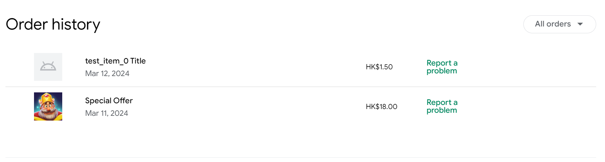

建议使用 License Testing，它可以免于真实支付，并且可以测试支付延迟、支付失败的情况。

要设置 License Testing，在 Google Play Console 中 Setting -> License Testing 勾选一个 Email List，这个 List 下面的所有 gmail 的 Google Play Account 都变成 License Tester。

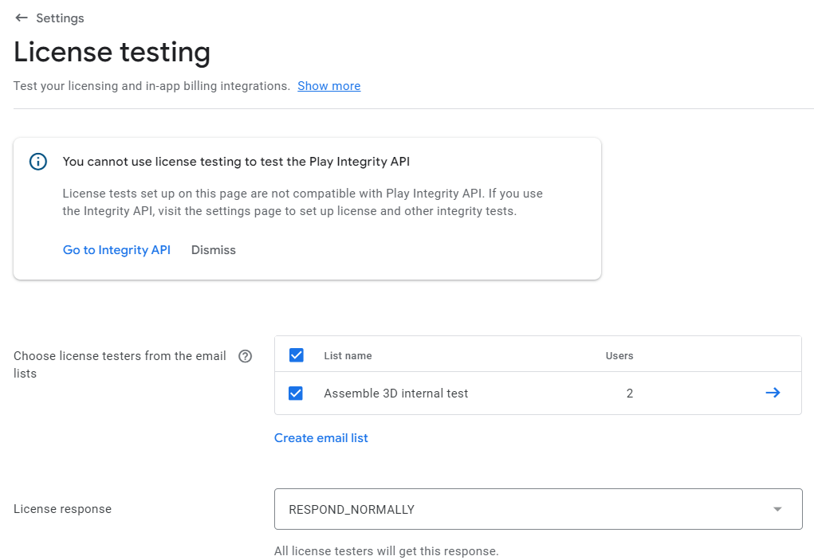

一旦设置了 License Testing，在 App 中进行 IAP 时，会显示测试卡

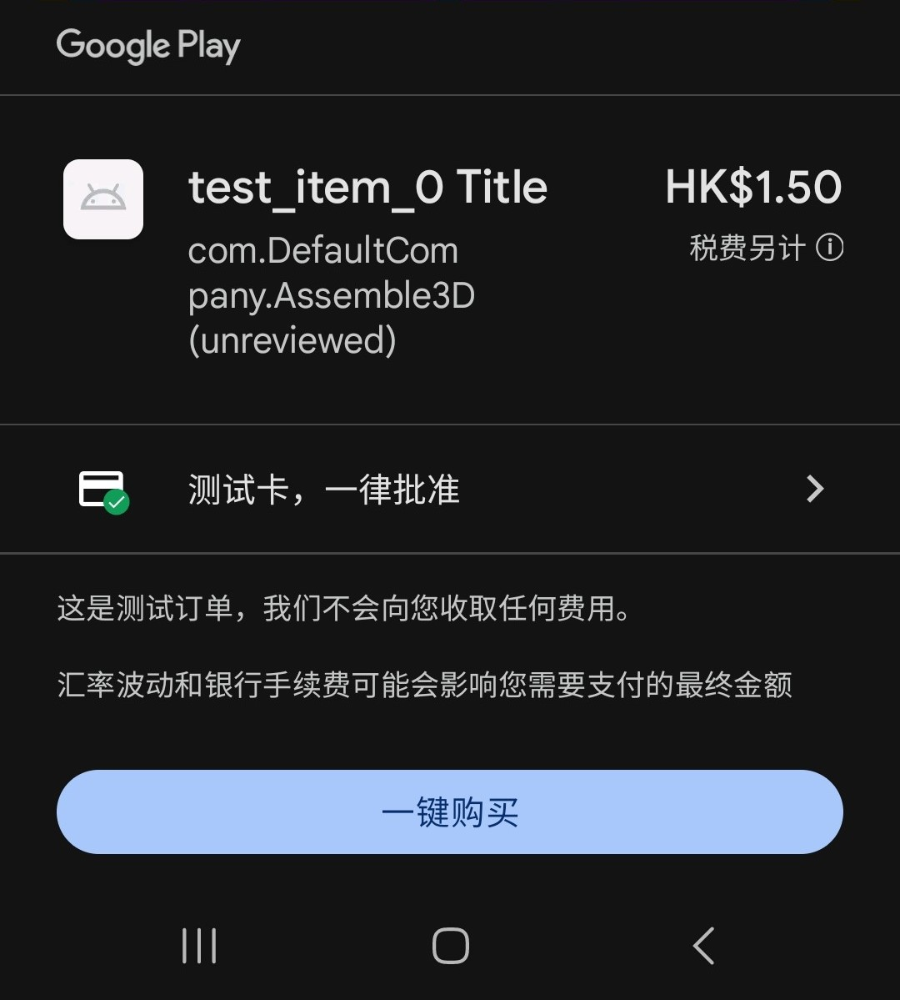

点开测试卡，可以选择不同的支付方法

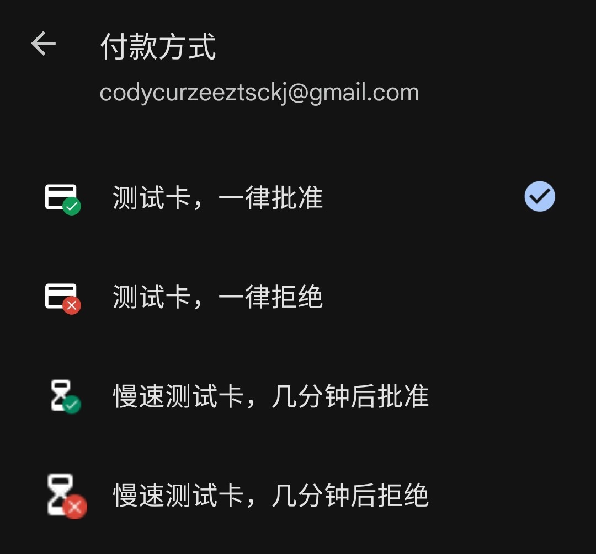

## Misc

BILLING_UNAVAILABLE（错误代码 3）:

- 此错误表示购买过程中发生了用户结算错误。可能出现此问题的示例包括：
- 用户设备上的 Play 商店应用已过期。
- 用户位于不受支持的国家/地区。
- 用户是企业用户，其企业管理员已禁止用户进行购买。
- Google Play 无法通过用户的付款方式扣款。例如，用户的信用卡可能已过期。

Google Play 发布应用时需要选择应用可见的国家或地区，但是测试时没有这个限制，即使不在选择可见的国家或地区的测试者，也可以参与测试。

尽管不需要登录，但是支付需要调用应用平台商店才能完成，而应用商店必须登录才可以支付，因此即使调用支付的游戏没有用户认证，仍然可以调用应用商店来确认用户是否进行过相关购买行为（因为应用商店必须是登录了的），然后进行 restore purchase（即如果用户购买过产品后，即使卸载游戏重装，或者在另一个设备上安装这个游戏，都不需要再次购买而直接使用）。Google Play 支持自动进行 restore purchase，App Store 要求必须有一个明确的按钮来让用户显式地 restore purchase。IAP 提供了查询是否进行过购买产品的接口。

JAVA_HOME
C:\Program Files\Unity\Hub\Editor\2022.3.17f1c1\Editor\Data\PlaybackEngines\AndroidPlayer\OpenJDK
PATH
%JAVA_HOME/bin%

激励广告只有用户点击才会开始播放，插页式激励广告则不同，它会自动展示，同时为用户提供跳过选项，不想观看广告换取奖励的用户可以选择跳过

side-load 是指将软件或应用程序通过非官方渠道安装到设备上，在这里就是指用 Unity 打包一个 apk 安装包，然后直接安装在设备上。对于测试与 Google Play 无关的功能，这是完全没问题的。但是要测试 Google Play 相关的功能（例如支付），必须包装 side-load 安装包的 version code, app signing 和 package name 与 test track 中的 bundle 的一致。

安装 side-load 之前先卸载从 google play store 上下载的测试版本，没办法用 side load 安装包更新通过 store 安装的程序。

Google Play 相关的功能涉及到要使用的 Google Play 账号，注意以下几点：

- 测试账号必须在测试设备上（通过 google 应用管理设备账号）
- 如果设备有超过一个账号，purchase 通过下载这个 app 的账号完成
- 如果应用程序不是经过任何账号下载的（例如 side load 程序），purchase 使用第一个账号完成

对于从 Opt-In link 中下载的应用，可以指定要使用的 google 账号。但是对于 side load 的安装包，没办法指定用哪个账号，属于第三种情况，即使用第一个账号进行支付。此时就要注意第一个账号是否有支付能力，如果没有，则商店初始化不能成功，无法测试支付。另外似乎中国区账号没法使用其他地区的信用卡（不知其他地区是否亦如此）。还要注意，设备上账号的顺序问题。如果第一个账号没有支付方法，即使第二个账号有，也无法使用它。Google 账号似乎是按照添加的顺序来排序的，第一个添加的账户就是第一个 google 账号，不知道如何在设备上管理 google 账号的顺序，现在唯一可行的方法就是删除前面账号，让后面的账户移动到前面，然后再重新添加刚刚删除的账号（排在最后）。通过此方法，将有支付方法的账户移动到第一个，side load 的程序就可以成功测试支付了。

Unity Documents 上面关于如何进行 IAP 测试的链接： https://docs.unity3d.com/Manual/UnityIAPGoogleConfiguration.html

Cross Platform Essential Kit 的 Billing Service 拉取的商品只能 Setting 中设置好（与商店平台对应），而 Unity IAP 则可以在 code 中（运行时）构建要拉取的商品。对于需要热更新商品的需求，前一种方法就很受限制，因为没有办法动态更新本地商品信息，Unity IAP 则更灵活。但是热更新商品可能是比较少的情况，如果需要，一是通过 App 大版本更新（而不是热更新），而是提前在 Billing Service 设置和商店平台上设置多个冗余商品，用于后续可能的商品扩展。设置的商品不一定显示，显示哪些商品则可以动态热更新，而且商品价格可以在商店平台上修改。

