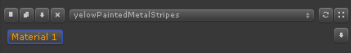

# Material Editor

在 Material Editor 中，切换 set 中的 materials，调整任何 material 的任何方面，例如 specular/glossiness，worn edges，paint layers，dirt，等等。顶部的 drop down 菜单用于在不同的 material sets 之间切换，允许同时在不同的 color schemes 上工作，或者快速找到合适的预定义 material set 用于进一步编辑。

还有，当 dropdown 没有打开时，你可以使用鼠标滚轮快速滚动它。右键点击它来重命名选择的 material set。第二个 dropdown 菜单允许在 set 中的 materials 之间切换，以及 emission，dirt 和 当前选择 Material Set 的 adjustments controls groups。你可以通过在响应的 texture area 上悬浮鼠标指针并按下 ctrl 键快速在 set 中的 materials 之间切换。

在 material editor 的顶部区域有一些功能按钮：

1. New material set.

   创建一个新的 material set，添加到 material set dropdown 菜单。

   Material sets 被保存到 scene 中，允许你有任意多个 texture 的 material variants。同时不同的 scene 有不同的 material sets。

2. Duplicate material set.

   创建当前激活的 material set 的一个副本。非常便于测试不同的设计变体，以及只需要在一个 scene 中创建你的工作阶段 work stages 的备份 backups。

3. Save material set.

   保存自定义 material set 到 Assets/CustomPresets/MaterialSets/ 目录中。现有 的同名 custom preset 将被更新（覆盖），因此为你的 custom presets 赋予合适的名字。保存的 custom sets 在下一次操作一个新的 texture 时将会和默认的 material sets 一起出现。

4. Delete material set.

   从当前 scene 中删除 material set。它不移除默认的和磁盘上保存的 custom presets。它们在新的 scene 还会出现。

5. Swap materials.

   在 set 中随机交互 materials。非常适合发现恰当的 material layouts。
 
6. Randomize materials.

   从一个 random set 中为这个 set 中的每个 material 赋予一个随机材质。

7. Save current material.

   保存当前选择的 material（而不是整个 set）到 Assets/CustomPresets/Materials/ 目录。然后你可以添加这些 materials 到 Materials tool panel 用于拖放。
