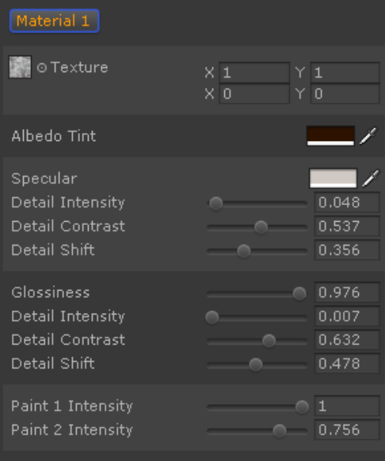
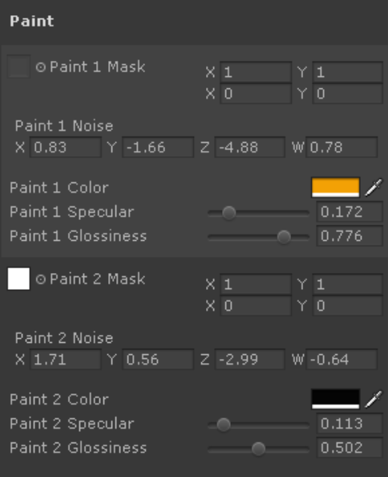
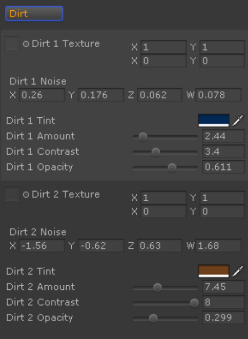
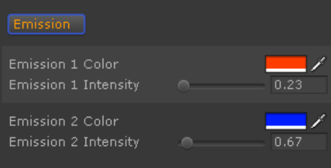
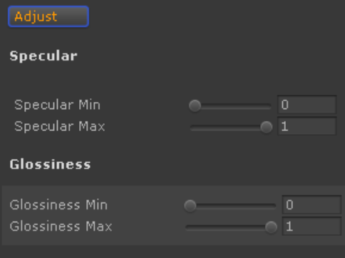
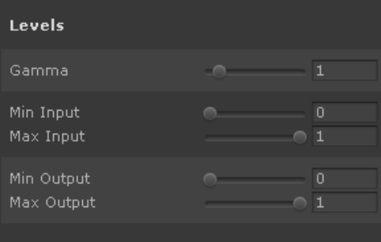
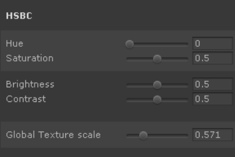

# Material Set properties

## Selected material properties

Material set 中 8 个可用 material 中的当前选择 material 的属性：

1. Texture.

   用于 albedo 的 RGB 纹理，和用于 specular 和 glossiness 细节提取的 source。可以选择自定义 texture，它有 tiling 和 offset 属性。

   RGB texture for albedo and source for specular and glossiness detail extraction. Custom texture can be selected, and it has the tiling and offset properties.

2. Albedo tint.

3. Specular tint.

   设置 material 的 specular 的 color tint。还有，设置 material specular base 的强度。

4. Specular detail intensity.

   控制 specular 从 texture 提取的细节的强度

5. Specular detail contrast.

   在 0.5 处，它具有最大 value，并且开始翻转 specular detail map。0 - 0.5 范围之间的 value 用于对比强度，0.5 - 1 范围之间的 value 用于 inverted map 对比强度。这允许得到一个广泛的提取自 main texture 的 specular map 细节。

6. Specular detail shift.

   和对比度一起，这个 slider 控制用于 specular 的提取自 texture 细节的范围。调整这个 value 将会改变 specular 细节 map 特征（features）的大小和形状。

7. Glossiness.

   material 的 base glossiness 的 value。

8. Glossiness detail intensity.

   控制提取自 texture 的 glossiness 细节的强度。

9. Glossiness detail contrast.

   在 0.5 处，它具有最大的 value，并开始翻转 glossiness detail map。0 - 0.5 范围之间的 value 用于对比强度，0.5 - 1 范围用于翻转 map 对比强度。

10. Glossiness detail shift.
   
    和 contrast 一起，这个 slider 控制用于 glossiness 的提取自 texture 的细节。调整这个 value 将会改变 glossiness detail map 特征（features）的大小和形状。

11. Paint intensity 1 and 2.

    控制 material base 上面 2 个 paint layers 的透明度。Paint layers controls 位于下面，并且包含 mask 和单独的 specular/glossiness settings。可以用于高度不透明的绘制，或者添加细节到 texture，当部分透明时。

12. Worn edges noise.

    控制 noise，用于磨损边缘。编辑 XYZW 来获得独特的 noise。（0，0，0，1） 为没有 noise 的实色 solid color，（0，0，0，0） 为完全透明，edges 将不可见。

13. Worn edges amount.

    边缘磨损效果的程度。更高的值使得 normal map 的 constrast parts 使用（底层 underlying）材质设置。通常和 painted materials 一起使用，使 edges 看起来磨损暴露出金属细节。此外，一个轻微程度效果对于绝大多数 material 看起来更好也更真实。

14. Worn edges opacity.

    控制 worn edges 的不同明度，而之前的 amount slider 控制效果的大小。

15. Worn edges contrast.

    控制 worn edges borders 是 sharp 还是 blurred

16. Worn edges border amount and color.

    用于使 worn edges border 更加显著并具有一个不同的颜色。老旧的磨损材质，例如时间久远的喷涂(paint) 通常具有这个效果（边缘生锈了）

17. Underlying diffuse, specular and glossiness controls.

    对透过 worn edges 看见的 material 的控制。对于金属外观 worn edges，你可能想要使它的 specular 和 glossiness values 很高，而保持 diffuse color 为黑色。你还可以设置这些 controls 和你的 main material 略微不同，例如用于模仿时间久远的木头或石头。

18. Normals strength.

    这个 value 添加提取自 material texture 的 tiny normal 细节到 Surforge 渲染的 base normal map。可以用于划痕，或一些粗糙的材质表面。现在可以只提取 tiny details，将来的版本会添加更多的 normal strength controls 用于不同频率的 texture detail。

## Paint layers controls

每个 material 有两个单独的 paint layers，可以在一个上应用另一个，或者用 paint intensity slider 混合。

1. Paint mask texture.

   用作 paint layer mask 的 RGB texture，来确定材质的哪个部分被 paint 覆盖。它有自己的 tiling 和 offset 控制。

2. Paint noise.

   控制噪声，应用到 paint mask。你可能想要将它用于 worn paint 效果。混合 XYZW 来获得独特的噪声。0，0，0，0 用于 solid paint，没有噪声。

3. Paint color, specular and glossiness controls.

   paint layer 的 Material 属性。

## Dirt Controls

用于改变整个 Material Set 的 dirt settings 的 Controls Group。有 2 个单独的 dirt layers，应用到 set 中所有的 materials 上。通过以不同 settings 合并 dirt layers，可以得到不同的有趣的效果。

你可以混合它们来生成低频和高频的 dirt，将它们混合到一起。例如，你可以在洞穴表面制造 contrast dark rust，并在大的深暗区域混合略微透明的 dust。

因为 dirt 同时用于 set 中所有材质，它被设计为具有 0 specular 和 glossiness。Dirt 根据 dirt layer 不透明度和对比度 blends 到 material 的 specular 和 glossiness values 上。
   

1. Dirt noise.

   混合 XYZW 得到独特的 noise，（0，0，0，0）为没有 dirt，（0，0，0，1）为 solid dirt 没有 noise。

2. Dirt tint.

   dirt layer 的颜色。

3. Dirt amount.

   设置 dirt 覆盖区域的大小。增加这个 value 使得 dirt 从凹处扩展到平坦区域。

4. Dirt contrast.

   设置 dirt 区域和 noise 特征 borders 的 对比度

5. Dirt opacity.

   dirt layer 的不透明度。

## Emission Controls

控制被赋予 emission masks 的纹理区域的 emission 颜色和强度。你可以使用具有不同 emission settings 的两个单独的 emission masks。当渲染 texture 时，Surforge 还在 emission areas 周围应用 texture backed 的 grow。这个 glow 依赖于 emission 强度设置，并可以实时调整。

1. Emission color.
2. Emission intensity.

## Adjustments

Controls group，同时应用到所有 materials。用它来对 texture 进行最终的 polish。

1. Specular min/max.

   全局 specular 调整。为所有 materials 的 specular value 设置限制，使它们从不超过这些限制。对于最终调整整个 material set 非常方便。此外，降低 max value 对于减少 specular flickering（高光闪烁） 非常有用。

2. Glossiness min/max.

   Global glossiness 调整。降低 max valkue 可以减少某些情况下的 specular flickering

   

3. Levels controls.

   类似 Photoshop 中的 Levels 调整（色阶调整）。包括 Gamma，min/max input 和 min/max output。当小心调整时，它可能限制改善 texture 的外观。此外，它允许你免于在外部应用程序中（例如 PS，GIMP）对纹理进行 post-processing。

   对于通用场景，你可能想要略微增加 gamma 和 min input，使得 texture 更加明显。

   

4. HSBC.

   Hue, Saturation, Brightness and Contrast 调整, 类似于 Photoshop.

5. Global texture scale.

   控制被 material 使用的 noise 的 scale。当操作很大 scale 的 textures（具有很大 surface 区域和很小的 UV islands，即 UV 区域过小，Mesh 表面过大，纹理被大大拉伸） 时，你可以降低这个 value。这使得基于噪声的 material 效果更好地使用 texture 的 scale。

   
