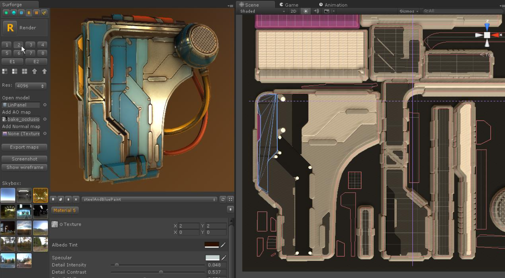

# Overview

Surforge 是 Unity Editor 的一个扩展，允许你直接在 Unity 中，使用一个非常直观和具有生产力的 workflow 来轻松制作 2d rendered PBR 纹理。

导出的 maps 和 Unity Standard Shader 完全兼容，就像你在 Surforge 中看到的完全一样。

它是一个 modeling toolset，kitbash library，map render，和 material composer。All in one，包含了你需要创建 great textures 的所有东西。

这个软件的主要目的保证是高效的。它被设计用来加速获得最终结果的过程，Surforge 节省你的时间和资源，这非常有利于独立项目。Surforge 允许以闪电速度获得大量纹理内容。

## Workflow

1. 创建一个新的 Unity Scene，打开 Surforge window（ Window > Surforge ），点击 New texture。

   

   拖放你的模型到相应的 field。 和 Texture Preview 一起，model UVs 将会被用于一些令人惊叹的功能，例如基于对称 symmetry 和对齐 snapping 的 UV island。

   如果模型 baked ambient occlusion 或 normal maps，将它们拖放进来，和 Surforge 一起使用，作为 base。
  
   如果你只想创建一个 square texture（ 不需要任何模型的 UVs，只需要默认的 0~1 纹理矩形），让 model field 为空即可。

   

2. 点击 Render button（R） 或者 按下 Space key 来渲染 texture。1024 分辨率 render 几乎是立刻渲染的。

   你可以在改变了 scene geometry 或赋予 material masks 之后使用这个功能来更新 Texture Preview。

   

3. 使用 Poly Lasso（多边形套索，就像 PS 中的套索工具，使用直线构造闭合的多边形确定一个区域）创建 texture base。创建好基础纹理后，可以在其基础上添加 Detail。

   使用 points，split，shrink/expand 构造。
   
   使用填充 UV island 功能。

   创建好的 poly lasso objects 就是普通的 gameobject，可以使用任何 gameobject 操作。可以选中 poly lasso 并在 Poly Lasso tool 中选择 profiles 改变它的外观。

   

4. 创建好 poly lasso objects 之后，为它们赋予 material 和 emission masks（材质索引，材质ID）。

   选中 poly lasso object，按下 numeric hotkeys。

   1-8 为常规材质 masks，9 和 0 为 emission masks。

   具有相同 mask 的 poly lasso objects 将被赋予相同的材质。

   

5. 创建 poly lasso objects 并赋予材质索引之后，使用丰富的 kitbash 库，Add Detail Tool 添加纹理细节。

   

6. 从 Materials 面板选择材质，拖拽到 texture preview 窗口中响应的区域，可以立即实时地看到效果，拖拽到的区域和所有具有相同 material mask 的区域也都会使用相同的材质。

   

   使用预定义 material sets，shuffle（洗牌）和 swap materials，调整材质的每个方面。调整 final polish 设置中影响所有材质的全局设置：Levels，Hue/Saturation，global Specular 和 Glossiness。

   

7. 以高分辨率渲染 texture，并导出。Albedo，Normal，Ambient Occlusion，Specular（Glossiness on alpha channel），Height 和 Emission maps 都会被保存。

   

   将它们拖拽到 Unity Standard Shader，可以得到和 Texture Preview 完全相同的结果。

   

8. 保存 Unity scene 以便将来使用。所有 texture 工作内容都会被保存到 scene 中，包括每个 material set 的修改。

## Interface

Tool Panel + Texture Panel

### Tool Panel

tab button 选择不同的 tool panel。

1. Poly Lasso

   主要的几何建模工具，用于绘制各种 panels，来创建 textures base。

   点击 Poly Lasso 按钮激活时，才能在 scene view 中绘制 poly lasso object。关闭时，回到正常的 scene view 操作。

   绘制完的 poly lasso object 选中时，在 tool panel 选择不同的 profile，可以直接切换不同的外观显示。

2. Add Detail

   添加纹理细节的工具，实际上是一个丰富的 model 和 label kitbash 库

3. Render

   渲染和模型预览设置，material mask 操作，材质导出，skybox 选择。

4. Greebles

   一个奇妙工具，不可思议的强大的 voxel-based micro detailing tool。它允许随机 scatter tiny details 来填充一个矩形区域。非常适合科幻风格。

5. Materials

   材质列表，用来拖拽到 texture preview 中。

6. Decals Deform Shatter

   Decals：印花

   Deform：变形

   Shatter：散落

   选择 Poly Lasso Object，选择一个 Decals，或者 Deform，或者 Shatter 的一个 pattern，然后点击相应的功能按钮，对 Poly Lasso Object 进行程序化变形，创建特殊效果。

   

Tool Panel 下面用来针对 Poly Lasso tool toggle grid modes，以及 snapping setting。

### Texture panel

1. Texture Preview

   预览选择 texture 如何显式在你选择的模型上，快速切换 materials set，materials 拖放，复制/粘贴 和 切换 materials。

   一个 material set 包含 10 个材质。每个 poly lasso object 赋予一个 mask，即 material id。Surforge 使用当前 material set 为每个 poly lasso object 选择材质。因此 material set 就像是材质调色板。

2. Material Editor

   切换材质，调整材质的方方面面。快速切换 material set，以发现何时的材质方案。

